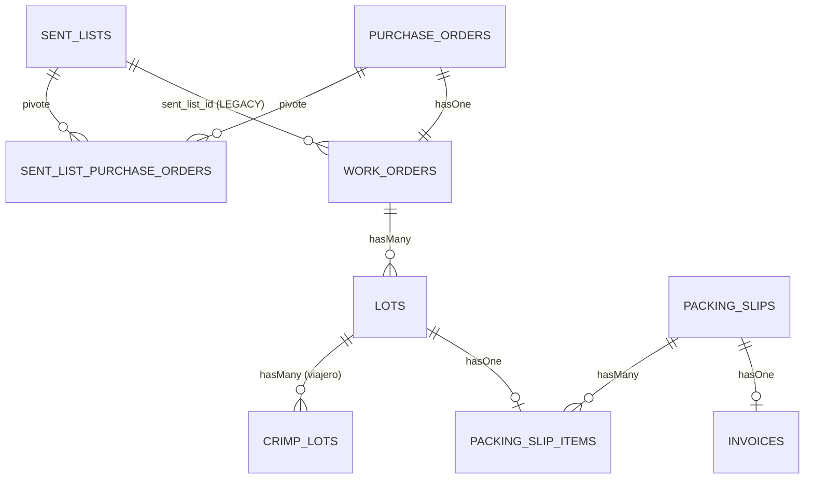
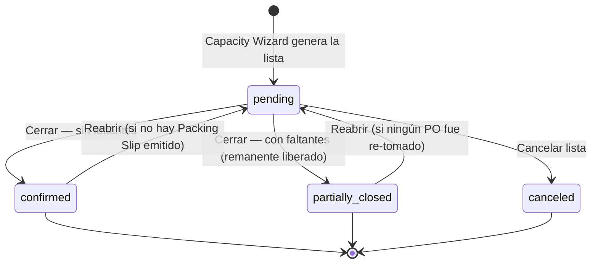
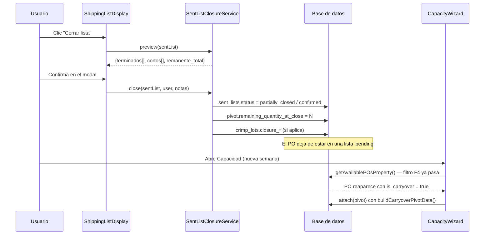
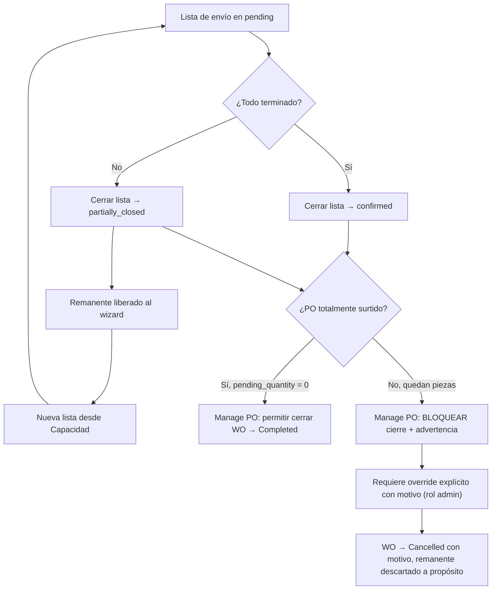

# Análisis Técnico: Botón "Cerrar Lista de Envío" con Remanentes Reutilizables

| Campo | Valor |
|---|---|
| **Fecha** | 2026-08-04 |
| **Autor** | Agent Architect |
| **Rama** | `main_jos` |
| **Estado** | Análisis / Diseño — NO implementado |
| **Versión** | 1.1 — actualizada con respuestas del cliente del 2026-08-04 |
| **Pantalla objetivo** | `http://flexcon-tracker.test:8088/admin/sent-lists/display` |
| **Componente objetivo** | `App\Livewire\Admin\SentLists\ShippingListDisplay` |

---

## Tabla de Contenidos

1. [Resumen Ejecutivo](#1-resumen-ejecutivo)
   - [1.5 Control de respuestas del cliente](#15-control-de-respuestas-del-cliente)
2. [Requerimiento del Cliente](#2-requerimiento-del-cliente)
3. [Estado Actual del Sistema](#3-estado-actual-del-sistema)
4. [Modelo de Datos Actual Involucrado](#4-modelo-de-datos-actual-involucrado)
5. [Análisis de Brechas](#5-análisis-de-brechas)
6. [Diseño Propuesto](#6-diseño-propuesto)
7. [Cambios Propuestos de Base de Datos](#7-cambios-propuestos-de-base-de-datos)
8. [Cambios Propuestos de Backend](#8-cambios-propuestos-de-backend)
9. [Cambios Propuestos de Frontend](#9-cambios-propuestos-de-frontend)
10. [Reglas de Validación y Casos Borde](#10-reglas-de-validación-y-casos-borde)
11. [Riesgos y Consideraciones](#11-riesgos-y-consideraciones)
12. [Plan de Implementación por Fases](#12-plan-de-implementación-por-fases)
13. [Plan de Pruebas](#13-plan-de-pruebas)
14. [Preguntas Abiertas para el Cliente](#14-preguntas-abiertas-para-el-cliente)

---

## 1. Resumen Ejecutivo

### 1.1 Hallazgo principal

**La infraestructura de datos para el "remanente reutilizable" YA EXISTE y está implementada.** El proyecto tiene un módulo de *carryover* semanal completo:

- Columnas de pivote `is_carryover`, `carryover_from_sent_list_id`, `pending_quantity_at_carryover` en `sent_list_purchase_orders` (`database/migrations/2026_05_18_100000_add_carryover_fields_to_sent_list_purchase_orders.php:11-24`).
- Servicio dedicado `App\Services\CarryoverService` (`app/Services/CarryoverService.php:1-85`).
- Scope de dominio `PurchaseOrder::scopeWithCarryover()` (`app/Models/PurchaseOrder.php:149-156`).
- El Capacity Wizard ya sabe re-tomar POs con piezas pendientes y marcarlas como carryover (`app/Livewire/Admin/CapacityWizard.php:460-502` y `:899-915`).
- Documento de diseño previo: `Diagramas_flujo/Estructura/docs/ANALISIS_PO_WO_carryover_semanal.md`.

### 1.2 Lo que realmente falta

El eslabón que falta **no es el remanente: es el disparador de cierre**. El Capacity Wizard sólo vuelve a ofrecer un PO cuando ese PO **ya no pertenece a ninguna `SentList` con `status = 'pending'`**:

```php
// app/Livewire/Admin/CapacityWizard.php:480-482
->whereDoesntHave('sentLists', function ($slQ) {
    $slQ->where('status', \App\Models\SentList::STATUS_PENDING);
});
```

Hoy, en la pantalla `/admin/sent-lists/display` **no existe ninguna acción que saque a la lista del estado `pending`**. Las tres únicas rutas que lo hacen viven en otras pantallas y no son accesibles desde el flujo diario del cliente:

| Ruta que cierra la lista | Archivo:línea | Problema |
|---|---|---|
| Botón "Cerrar lista" de Empaque | `app/Livewire/Admin/SentLists/SentListPackagingView.php:279-286` | Vive en la vista departamental de Empaque, requiere `ensureCanEditDepartment()`, y redirige fuera. No valida remanentes. |
| Aprobación del último departamento | `app/Livewire/Admin/SentLists/SentListDepartmentView.php:149` | Requiere recorrer todo el flujo de 5 departamentos. |
| Modal manual de estado | `app/Livewire/Admin/SentLists/SentListIndex.php:95-119` | Pantalla "Listas Preliminares"; cambio de estado crudo, sin lógica de remanentes ni trazabilidad. |

**Conclusión: el requerimiento es en gran parte un trabajo de exposición + validación + trazabilidad, no de reinvención del modelo de remanentes.** El riesgo principal está en la interacción con el cierre del WO/PO, no en el cierre de la lista.

### 1.3 Segundo hallazgo crítico — el cierre del PO destruye el remanente

El Capacity Wizard exige que el WO esté en estado `Open`:

```php
// app/Livewire/Admin/CapacityWizard.php:468-470
->whereHas('workOrder.status', function($q) {
    $q->where('name', 'Open');
})
```

Si el usuario cierra el PO desde Manage PO (marcando el WO como `Completed`), **el remanente desaparece silenciosamente del wizard y ya no puede recuperarse sin reabrir el WO**. Esto define la regla de precedencia: *cerrar la lista de envío NO debe cerrar el PO, y cerrar el PO debe estar bloqueado o advertido mientras existan piezas pendientes*.

### 1.4 Tercer hallazgo — no existe cierre de PO como tal

`PurchaseOrder` **no tiene un estado "cerrado"**. Sus estados son `pending`, `approved`, `rejected`, `pending_correction` (`app/Models/PurchaseOrder.php:44-50`). Además, la pantalla **Manage PO (`/admin/work-orders`, componente `WOList`) no tiene botón de cerrar**: sólo Ver / Editar / Eliminar (`resources/views/livewire/admin/work-orders/wo-list.blade.php`, columna Acciones). El método `WOList::updateStatus()` existe (`app/Livewire/Admin/WorkOrders/WOList.php:68-75`) pero **no está cableado en el Blade**. El "cierre de PO" hoy es, de facto, cambiar el estado del WO a `Completed` desde `/admin/work-orders/{id}/edit`.

**Confirmado por el cliente (2026-08-04):** *Manage PO es el único lugar donde existe un status por cada PO y por cada WO.* Desde ahí se cierra el PO y el WO **tal como está hoy**, o se decide mantenerlos abiertos hasta que se termine. Es una **decisión manual del usuario, no automática**. Esto valida la decisión D-03 (§6.6.3): no se introduce un estado nuevo en `purchase_orders`.

### 1.5 Control de respuestas del cliente

Registro de las preguntas abiertas de §14 y su estado tras la ronda de validación.

| ID | Pregunta (resumen) | Estado | Respuesta recibida | Fecha |
|---|---|---|---|---|
| **P-01** | ¿El botón exige reorganizar la pantalla para agrupar por lista de envío? | **RESUELTA — no aplica** | La vista `/display/sl/{sentList}` **se queda exactamente como está**. La pantalla sí agrupa por área de trabajo, pero eso es *"solamente una vista"* y **no debe influir en el diseño del cierre**. Se **descarta por completo** el rediseño de la vista. | 2026-08-04 |
| **P-02** | ¿Estado nuevo "Cerrada con faltantes" o único estado "Cerrada"? | PENDIENTE | — | — |
| **P-03** | ¿Trazabilidad del faltante por cada lote de CRIMP o basta el total del viajero? | **PENDIENTE — en revisión con el cliente** | Recomendación del análisis intacta como insumo: confirmar antes de la Fase 4. | — |
| **P-04** | ¿Qué significa "cerrar el PO"? | **PARCIAL** | Manage PO es el **único** lugar con status por PO y por WO. El cierre es **manual**, a criterio del usuario. **Confirma D-03**: no se crea `purchase_orders.status = 'closed'`. Queda abierta la sub-pregunta **P-12** (ver abajo). | 2026-08-04 |
| **P-05** | ¿Motivo/nota obligatorio al cerrar con faltantes? | PENDIENTE | — | — |
| **P-06** | ¿Los estados intermedios de lote **bloquean** el cierre o sólo **advierten**? | **PENDIENTE — en revisión con el cliente** | Recomendación del análisis intacta como insumo: B-01 y B-02 duros, B-03 advertencia. | — |
| **P-07** | ¿Quién puede cerrar una lista (permiso vs. rol)? | PENDIENTE | — | — |
| **P-08** | ¿Se puede reabrir una lista cerrada por error? | PENDIENTE | — | — |
| **P-09** | ¿Cómo tratar el sobre-envío (WO 2053510: 12,000 / 11,000)? | PENDIENTE | — | — |
| **P-10** | ¿Cerrar WO con piezas pendientes: bloqueo duro u override con motivo? | **PENDIENTE — en revisión con el cliente** | Recomendación del análisis intacta como insumo: bloquear; override sólo `admin` con motivo obligatorio. | — |
| **P-11** | ¿Cuántas iteraciones de carryover antes de escalar? | PENDIENTE | — | — |
| **P-12** | **NUEVA** — ¿Se puede cerrar un Lote/Viajero cuando ese Viajero todavía tiene lotes de CRIMP sin terminar? | **PENDIENTE — destacada** | Derivada de P-04. Bloquea el diseño de `CrimpLot` y las reglas B-04/B-05. Ver §14. | — |

**Impacto de esta ronda sobre el diseño:**

1. **P-01** elimina la contingencia de rediseño de la vista (que habría añadido ~13 pts). El botón se integra a la UI existente **sin reestructurarla**. Ver §9.1 y §12.
2. **P-04** confirma D-03 y refuerza D-02 (cierre de lista y cierre de PO/WO son ortogonales y manuales). Ver §6.6.
3. **P-12** es ahora el bloqueante principal del alcance CRIMP, por delante de P-03. Ver §7.4, §10.2 y §14.

---

## 2. Requerimiento del Cliente

### 2.1 Texto original (interpretado)

En la pantalla de listas de envío (`/admin/sent-lists/display`), dentro de cada lista de envío, se requiere un **botón nuevo ubicado al lado del campo "Buscar Orden"** que:

1. Permita **cerrar una lista de envío** con los WO y Lotes que **sí se terminaron**.
2. Contemple que algunos WO, Lotes y **Viajeros de Crimp** queden **cortos** (incompletos / con faltantes). Esos remanentes **no se pierden**: deben poder usarse en **otra lista de envío futura**, cuando el cliente decida incluirlos dentro de la Capacidad (porque la lista de envío se **crea desde la Capacidad / Capacity Wizard**).
3. Considere que el cliente **también puede cerrar el PO desde "Manage PO"**, por lo que hay que definir la interacción y precedencia entre "cerrar la lista de envío" y "cerrar el PO".

### 2.2 Traducción a requisitos técnicos

| ID | Requisito | Tipo |
|---|---|---|
| R-01 | Acción de cierre de `SentList` invocable desde `ShippingListDisplay`, junto al buscador. | Funcional |
| R-02 | El cierre debe distinguir **lo terminado** de **lo corto**, y persistir esa distinción. | Funcional |
| R-03 | Lo corto debe quedar disponible para el Capacity Wizard en una lista posterior. | Funcional |
| R-04 | El remanente debe cubrir tres granularidades: WO (piezas), Lote (viajero) y Lote de CRIMP. | Funcional |
| R-05 | Definir precedencia y validaciones entre cierre de lista y cierre de PO/WO. | Reglas de negocio |
| R-06 | Trazabilidad: quién cerró, cuándo, con qué remanente. | No funcional |
| R-07 | Idempotencia y reversibilidad controlada del cierre. | No funcional |

### 2.3 Alcance de la pantalla — RESUELTO (P-01, 2026-08-04)

> **Decisión del cliente:** la vista `/display/sl/{sentList}` **se queda exactamente como está**. La agrupación por área de trabajo es *"solamente una vista"* y **no influye en el diseño del cierre de lista**. El rediseño de la pantalla queda **descartado y fuera de alcance**; no se mantiene como alternativa.

La pantalla `/admin/sent-lists/display` **no agrupa por lista de envío**. Verificado en código (`app/Livewire/Admin/SentLists/ShippingListDisplay.php:2995-3000`) y en UI vía MCP Playwright: la vista general agrupa las Work Orders por **tipo de estación de trabajo** (`Mesa`, `Máquina`, `Semi-Automática`, `Sin Clasificar`):

```php
$workOrdersGrouped = $workOrders->groupBy($resolveWorkstation);
```

Existe, sin embargo, un **modo enfocado por lista** en la ruta `admin.sent-lists.display.sl`:

```
Route::get('/sent-lists/display/sl/{sentList}', ShippingListDisplay::class)
    ->name('sent-lists.display.sl');   // routes/admin.php:47
```

que activa `$focusedSentListId` (`ShippingListDisplay.php:276-287`) y filtra las WOs de esa lista (`ShippingListDisplay.php:2955-2965`).

**Diseño confirmado:** el botón vive en la barra de filtros junto a "Buscar orden", **se integra a la UI existente sin reestructurarla**, y su comportamiento depende del contexto:
- **Modo enfocado (`/display/sl/{id}`)**: el botón actúa sobre **esa** lista — caso principal.
- **Modo general (`/display`)**: el botón abre un selector de la lista a cerrar (ver §9.2), porque el destinatario es ambiguo.

La agrupación por área de trabajo se conserva intacta y no participa en la resolución del contenido de la lista: eso se hace por el **pivote** `sent_list_purchase_orders` (§6.4, RG-04).

---

## 3. Estado Actual del Sistema

### 3.1 Hallazgos de UI (verificados con MCP Playwright)

**Login exitoso** con `jjimenez@ensamblesformula.com`. Navegación y snapshots tomados en `/admin/sent-lists/display` y `/admin/work-orders`.

#### 3.1.1 Pantalla `/admin/sent-lists/display` — "Lista de envío"

Estructura observada:

- **Encabezado**: título "Lista de envío", subtítulo *"Consulta el avance de cada viajero y selecciona la acción pendiente en su semáforo"*, e indicador "Actualización automática · 30 s" (`wire:poll.30s="refreshDisplay"`).
- **Barra de filtros** (grid de 2 columnas): campo **"Buscar orden"** (placeholder *"Buscar por WO #, # parte o descripción..."*) y combo **"Área de trabajo"**.
- Paneles didácticos: "Cómo continuar un viajero" y "Qué significa cada recuadro".
- **Agrupación por área** (ej. encabezado `Mesa` con badge `3 WOS`).
- Por cada WO: tarjeta con `WO`, número de parte, descripción, y métricas **Cant. WO / Pz Enviadas / Cant. Pendiente / Pz Sobrantes**; fechas *Prog. A / Envío / Apertura*; `EG` y `PR`; y "Estado por Departamento" (Mat., Insp., Prod.).
- Por cada **Lote**: badge `Lote` + número (ej. `001`), cantidad en pz, y semáforo de 6 pasos: **Material → Inspección → Producción → Calidad → Empaque → Decisión**.
- Pie: "Última actualización", y contadores globales (`3 WOs`, `5 Lotes`).

**Dato revelador observado en la UI:** el WO `2053510` muestra `Cant. WO 11,000`, `Pz Enviadas 12,000`, `Cant. Pendiente -1,000`. Es decir, **hay sobre-envío y la UI lo expone en negativo**, mientras que el accessor de dominio lo recorta a cero (§3.2.4). Ver riesgo RG-05.

**No existe ningún botón de cierre de lista en esta pantalla.** Confirmado en snapshot completo del árbol de accesibilidad.

#### 3.1.2 Pantalla `/admin/work-orders` — "Manage PO"

Título real: *"Órdenes de trabajo — Gestión de órdenes de producción"*. Contiene:

- Tarjetas de conteo por estado: **Total, Open, In Progress, Completed, Cancelled, On Hold**.
- Filtros: Buscar (`WO#, PO# o parte...`), Estado, Desde, Hasta, Por página.
- Tabla con columnas `ID | WO | PO / Parte | Fecha apertura | Cantidad | Estado | Acciones`.
- Columna Cantidad en formato `sent_pieces / original_quantity` + `Pendiente: N`.
- **Acciones: sólo `Ver`, `Editar`, `Eliminar`.** No hay botón "Cerrar PO".

#### 3.1.3 Capacity Wizard

Enlace de menú **"Capacidad" → `/admin/capacity-wizard`**. Análisis realizado sobre el código (§3.2.5); no se ejecutó el asistente completo para no generar datos de prueba en la base real (ver nota de memoria sobre wipe de `flexcon_db`).

### 3.2 Hallazgos de código

#### 3.2.1 `SentList` — estados disponibles

`app/Models/SentList.php:58-62`:

```php
public const STATUS_PENDING   = 'pending';
public const STATUS_CONFIRMED = 'confirmed';
public const STATUS_CANCELED  = 'canceled';
```

Esquema real de BD (verificado con `DESCRIBE sent_lists`):

```
status | enum('pending','confirmed','canceled') | NOT NULL
```

**No existen** `closed_at`, `closed_by`, `partially_closed` ni ningún campo de cierre. Los únicos timestamps de flujo son los cinco pares `*_approved_at` / `*_approved_by` por departamento (`SentList.php:26-37`).

Métodos relevantes: `isConfirmed()` (`:214`), `isPending()` (`:341`), `canBeDeleted()` (`:349` — sólo si está pending y sin WOs), `canDepartmentEdit()` (`:298`), `moveToNextDepartment()` (`:221`), `moveToPreviousDepartment()` (`:271`).

#### 3.2.2 Relaciones de la lista con su contenido — dos caminos

`SentList` alcanza sus WOs por **dos rutas distintas**, y el propio código lo reconoce como deuda técnica:

```php
// app/Models/SentList.php:90-100
public function getEffectiveWorkOrders(): \Illuminate\Support\Collection
{
    $direct = $this->workOrders ?? collect();          // vía work_orders.sent_list_id (flujo nuevo)
    $pivot  = $this->purchaseOrders                     // vía pivot (flujo del wizard)
        ? $this->purchaseOrders->map->workOrder->filter()->values()
        : collect();
    return $direct->merge($pivot)->unique('id')->values();
}
```

El Capacity Wizard **usa exclusivamente el pivote** y nunca escribe `work_orders.sent_list_id` (`CapacityWizard.php:915`: sólo `attach()`). De hecho, el wizard **excluye** los WOs con `sent_list_id` no nulo por considerarlos legacy (`CapacityWizard.php:486-488`).

**Consecuencia de diseño:** cualquier lógica de cierre debe resolver el contenido de la lista por el pivote, no por `sent_list_id`.

#### 3.2.3 Los Lotes NO cuelgan de la lista

`Lot` pertenece a `WorkOrder` (`app/Models/Lot.php:159`), **no a `SentList`**. No existe `lots.sent_list_id`. La pertenencia de un lote a una lista es transitiva: `Lot → WorkOrder → PurchaseOrder → (pivot) → SentList`. La vista de Empaque resuelve esto con un helper privado `sentListLotIds()` (`app/Livewire/Admin/SentLists/SentListPackagingView.php`).

Lo mismo aplica a `CrimpLot`, que cuelga de `Lot` (`app/Models/CrimpLot.php:35-38`).

#### 3.2.4 `WorkOrder` — cantidades y el recorte a cero

```php
// app/Models/WorkOrder.php:221-232
public function getOriginalQuantityAttribute(): int { return $this->purchaseOrder->quantity ?? 0; }
public function getPendingQuantityAttribute(): int  { return max(0, $this->original_quantity - $this->sent_pieces); }
public function isComplete(): bool                   { return $this->pending_quantity === 0; }
```

`sent_pieces` se recalcula desde los lotes completados (`WorkOrder::updateSentPieces()`, `:283-298`), usando `getTotalCompletedPieces()` cuando el lote tuvo ciclos de cierre.

#### 3.2.5 Capacity Wizard — los tres filtros que gobiernan el remanente

`app/Livewire/Admin/CapacityWizard.php:460-502`, método `getAvailablePOsProperty()`. Un PO aparece como disponible sólo si cumple **todas** estas condiciones:

| # | Condición | Línea | Efecto sobre el remanente |
|---|---|---|---|
| F1 | `purchase_orders.status = 'approved'` | `:463` | PO rechazado o en corrección no reingresa. |
| F2 | La parte tiene un `Standard` activo con configuraciones | `:464-467` | Sin estándar no se puede calcular capacidad. |
| F3 | **`workOrder.status.name = 'Open'`** | `:468-470` | **Si se cierra el WO, el remanente se pierde.** |
| F4 | PO nunca estuvo en lista, **O** estuvo + `sent_pieces < quantity` + **no está en lista `pending`** | `:471-484` | **Éste es el gate del cierre.** |
| F5 | `workOrder.sent_list_id IS NULL` | `:486-488` | Exclusión de flujo legacy. |

Cuando el PO reingresa, `addSelectedPOs()` planifica sólo el pendiente:

```php
// app/Livewire/Admin/CapacityWizard.php:390-391
$isCarryover = $po->hasActiveCarryover();
$planningQty = $isCarryover ? $po->workOrder->pending_quantity : $po->quantity;
```

y `generateSentList()` marca el pivote vía `CarryoverService` (`CapacityWizard.php:899-915`).

`PurchaseOrder::hasActiveCarryover()` (`app/Models/PurchaseOrder.php:172-177`) devuelve `true` cuando hay WO, el WO no está completo y `sent_pieces > 0`.

#### 3.2.6 Ciclo de vida del Lote — maquinaria de cierre ya existente

`Lot` tiene un sistema de decisiones de cierre muy desarrollado (`app/Models/Lot.php:1003-1026`):

| Constante | Valor | Semántica |
|---|---|---|
| `CLOSURE_COMPLETE_LOT` | `complete_lot` | Reprocesar el faltante: reinicia el lote con `quantity = missing` y nuevo ciclo. |
| `CLOSURE_NEW_LOT` | `new_lot` | El sobrante se convierte en un lote nuevo. |
| `CLOSURE_CLOSE_AS_IS` | `close_as_is` | Se cierra aceptando el faltante. |
| `CLOSURE_COMPLETE_CRIMP` | `complete_crimp` | D2a — completar sólo CRIMP. |
| `CLOSURE_COMPLETE_PIECES` | `complete_pieces` | D2b — completar sólo piezas (manguitas). |
| `CLOSURE_COMPLETE_BOTH` | `complete_both` | D2c — completar piezas y CRIMP. |

Implementaciones en `ShippingListDisplay`: `decisionCompleteLot()` (`:1993`), `decisionNewLot()` (`:2071`), `decisionCompleteCrimp()` (`:2107`), `decisionCompletePieces()` (`:2121`), `decisionCompleteBoth()` (`:2135`), `decisionCloseAsIs()` (`:2151`), `reopenLot()` (`:2182`).

El `LotPackagingObserver` (`app/Observers/LotPackagingObserver.php:41-90`) marca `ready_for_shipping = true` y calcula `quantity_packed_final` cuando `closure_decision` pasa a uno de los **tres** tipos clásicos (`complete_lot`, `new_lot`, `close_as_is`, líneas `:51-59`). Para los tipos D2 de CRIMP la marca se **difiere** al Paso 7 en `markViajeroReceived()` (`ShippingListDisplay.php:1796-1801`).

`Lot::getProgressSummary()` (`app/Models/Lot.php:1152-1186`) ya devuelve fases `pending → production → quality → packaging → closed → shipping` — reutilizable para el resumen del cierre.

#### 3.2.7 `CrimpLot` — el eslabón más débil

`app/Models/CrimpLot.php` completo son **79 líneas**. Campos: `lot_id`, `crimp_lot_number`, `lote_fabricante`, `date_code`, `quantity`, `comments`. **No tiene `status`, ni `closure_decision`, ni `ready_for_shipping`, ni ninguna marca de cierre o remanente.** Sólo expone `getPackagedPiecesTotal()` y `getPackagedCrimpTotal()` (`:67-78`).

**Esto es la brecha más grande** frente al requisito R-04 ("Viajeros de Crimp cortos").

#### 3.2.8 Permisos

Existen permisos Spatie específicos (`database/seeders/PermissionSeeder.php:103-106`):

```
ordenes.view-sent-lists, ordenes.create-sent-lists,
ordenes.edit-sent-lists, ordenes.delete-sent-lists
```

Sin embargo, `ShippingListDisplay` **no los usa**: implementa control por **roles** vía `ROLE_DEPARTMENT_MAP` + `canAccessDepartment()` + `guardDepartment()` (`ShippingListDisplay.php:44-69`). `admin` pasa siempre.

**No existe** un permiso de cierre de lista.

---

## 4. Modelo de Datos Actual Involucrado

### 4.1 `sent_lists`

| Campo | Tipo | Nota |
|---|---|---|
| `id` | bigint PK | |
| `po_id` | bigint FK nullable | **Obsoleto** — el wizard lo escribe como `null` (`CapacityWizard.php:860`) |
| `shift_ids` | longtext (cast array) | |
| `num_persons` | int | |
| `start_date` / `end_date` | date | Ventana de capacidad |
| `total_available_hours` / `used_hours` / `remaining_hours` | decimal(10,2) | |
| `status` | **enum('pending','confirmed','canceled')** | Sin estado de cierre parcial |
| `current_department` | varchar | `materiales → inspeccion → produccion → calidad → envios` |
| `department_history` | longtext (cast array) | Bitácora de transiciones |
| `materials/inspection/production/quality/shipping_approved_at` `_by` | timestamp / bigint | 5 pares |
| `notes` | text | |
| `created_at` / `updated_at` / `deleted_at` | timestamp | SoftDeletes |

### 4.2 `sent_list_purchase_orders` (pivote — el corazón del carryover)

| Campo | Tipo | Rol |
|---|---|---|
| `id` | bigint PK | |
| `sent_list_id` | bigint FK | |
| `purchase_order_id` | bigint FK | |
| `quantity` | int | **Cantidad planificada en ESTA lista** (no la del PO) |
| `required_hours` | decimal(10,2) | Horas de capacidad consumidas |
| `lot_number` | varchar | String concatenado de números de lote |
| `is_carryover` | tinyint(1), indexado | Marca de remanente entrante |
| `carryover_from_sent_list_id` | bigint FK nullable, indexado | Lista de origen |
| `pending_quantity_at_carryover` | int nullable | Snapshot del pendiente al momento de reingresar |

**Observación clave:** `pending_quantity_at_carryover` es el *snapshot de entrada*. **No existe el simétrico de salida** (cuánto quedó corto al cerrar). Ver brecha G-03.

### 4.3 `purchase_orders`

Campos relevantes: `po_number`, `wo` (número externo, con normalización `trim` en el mutator `PurchaseOrder.php:59-62`), `part_id`, `workstation_type`, `quantity`, `unit_price`, `status`.

Estados: `pending | approved | rejected | pending_correction`. **Sin estado "closed".**

### 4.4 `work_orders`

Campos relevantes: `wo_number`, `external_wo_number`, `purchase_order_id`, `sent_list_id` (legacy), `status_id` → `statuses_wo`, `sent_pieces`, `scheduled_send_date`, `actual_send_date`, `opened_date`.

Catálogo `statuses_wo` (verificado en BD):

| id | name | color |
|---|---|---|
| 1 | Open | `#3B82F6` |
| 2 | In Progress | `#F59E0B` |
| 3 | Completed | `#10B981` |
| 4 | Cancelled | `#EF4444` |
| 5 | On Hold | `#6B7280` |

### 4.5 `lots`

Bloques de campos (verificado con `DESCRIBE lots`):

- **Identidad/cantidad**: `work_order_id`, `lot_number`, `description`, `quantity`, `quantity_packed_final`
- **Shipping**: `ready_for_shipping`, `ready_for_shipping_at`, `closed_by_type`
- **Flujo**: `status`, `material_status`, `inspection_status`, `packaging_status`, `final_inspection_status`
- **Viajero**: `viajero_received`, `viajero_received_at`, `viajero_received_by`
- **Cierre**: `closure_decision`, `closure_decided_by`, `closure_decided_at`, `completion_count`
- **Sobrantes**: `surplus_delivered(_at/_by)`, `surplus_received(_at/_by)`
- **CRIMP**: `complete_crimp_qty`, `complete_pieces_qty`
- **Retorno**: `returned_to_packaging_at/_by/_reason`

**No tiene `sent_list_id`.**

### 4.6 `crimp_lots`

`lot_id`, `crimp_lot_number`, `lote_fabricante`, `date_code`, `quantity`, `comments`, timestamps, `deleted_at`. **Sin campos de estado ni de cierre.**

### 4.7 Diagrama de relaciones relevante



---

## 5. Análisis de Brechas

| ID | Brecha | Severidad | Evidencia |
|---|---|---|---|
| **G-01** | No existe acción de cierre en `ShippingListDisplay`. El botón pedido no tiene backend. | **Alta** | Sin `closeList`/`close*` en el listado de métodos públicos de `ShippingListDisplay.php` |
| **G-02** | El enum `sent_lists.status` no tiene estado de "cierre parcial". `confirmed` significa hoy "todo salió bien". | **Alta** | `DESCRIBE sent_lists` |
| **G-03** | No hay snapshot **de salida** del remanente. El pivote sólo guarda `pending_quantity_at_carryover` (entrada). No se sabe cuánto quedó corto al cerrar. | **Alta** | Migración `2026_05_18_100000...:11-24` |
| **G-04** | `CrimpLot` no tiene ningún campo de estado, cierre ni remanente. Un "viajero de crimp corto" no es representable. | **Alta** | `app/Models/CrimpLot.php` completo (79 líneas) |
| **G-05** | Cerrar el WO desde Manage PO expulsa el PO del wizard (filtro F3 `name = 'Open'`), destruyendo el remanente sin aviso. | **Alta** | `CapacityWizard.php:468-470` |
| **G-06** | Manage PO no tiene botón de cerrar; `WOList::updateStatus()` existe pero está sin cablear en el Blade. La precedencia pedida no tiene UI donde vivir. | **Media** | `WOList.php:68-75` vs `wo-list.blade.php` |
| **G-07** | No existe validación que impida cerrar una lista dejando lotes en estados intermedios (sin decisión de cierre, sin material recibido). | **Media** | `SentListPackagingView::closeList()` sólo hace `update(['status' => CONFIRMED])` |
| **G-08** | No hay permiso ni rol específico para cerrar listas; `ShippingListDisplay` usa roles departamentales, no los permisos `ordenes.*-sent-lists`. | **Media** | `ShippingListDisplay.php:44-58` vs `PermissionSeeder.php:103-106` |
| **G-09** | `pending_quantity` se recorta con `max(0, ...)`, ocultando el sobre-envío que la UI sí muestra en negativo (WO 2053510: −1,000). | **Media** | `WorkOrder.php:229-232` |
| **G-10** | La pantalla no agrupa por lista de envío, sólo por área de trabajo. El botón "dentro de cada lista" no tiene contenedor natural en modo general. | **Media** | `ShippingListDisplay.php:2999` |
| **G-11** | El cierre actual no es reversible ni auditable: `SentListIndex::saveStatus()` sólo permite cambiar si `isPending()`, luego es irreversible. | **Baja** | `SentListIndex.php:107-115` |
| **G-12** | Dualidad `sent_list_id` vs pivote sin unificar; riesgo de que el cierre "vea" un subconjunto distinto del que ve el wizard. | **Baja** | `SentList::getEffectiveWorkOrders()` `:90-100` |

---

## 6. Diseño Propuesto

### 6.1 Principio rector

> **Cerrar la lista es un evento de la lista, no de la orden.** Cerrar una `SentList` libera el remanente; **nunca** cierra ni completa el PO/WO. El cierre del PO es una decisión comercial separada, posterior, y bloqueada mientras haya remanente vivo.

Esto preserva intacta la maquinaria de carryover existente y evita tocar el `LotPackagingObserver` y el flujo D2 CRIMP.

### 6.2 Máquina de estados de la Lista de Envío

#### 6.2.1 Estados propuestos

Se propone **extender** el enum `sent_lists.status` con dos valores, manteniendo los tres actuales por compatibilidad:

| Estado | Valor | Semántica | ¿Libera remanente al wizard? |
|---|---|---|---|
| Pendiente | `pending` | En producción. Bloquea sus POs en el wizard (F4). | No |
| **Cerrada parcial** | **`partially_closed`** | **Nuevo.** Cerrada con faltantes reconocidos y liberados. | **Sí** |
| Confirmada / Cerrada total | `confirmed` | Cerrada sin faltantes. Semántica actual preservada. | Sí (ya lo hace) |
| Cancelada | `canceled` | Anulada. | Sí (ya lo hace) |
| **Reabierta** | *(vuelve a `pending`)* | Reversión controlada del cierre. | No |

**Decisión de diseño D-01:** se prefiere `partially_closed` como estado nuevo en lugar de un booleano `has_remnants`, porque el filtro F4 del wizard (`CapacityWizard.php:480-482`) ya opera sobre `status`, y así **no hay que tocar la consulta del wizard en absoluto**: cualquier estado distinto de `pending` libera el PO automáticamente.

> **SUPUESTO / POR CONFIRMAR:** que el cliente acepte ver dos etiquetas de cierre distintas ("Cerrada" vs "Cerrada con faltantes"). Alternativa más barata: reutilizar `confirmed` y guardar el matiz sólo en campos nuevos. Ver §14 P-02.

#### 6.2.2 Diagrama de estados



#### 6.2.3 Condición de guarda del cierre

```
puedeCerrarse(SentList $l):
    l.status == 'pending'
    AND l no tiene lotes en estado bloqueante (ver §10.2)
    AND usuario tiene permiso ordenes.close-sent-lists
```

El estado resultante se **calcula**, no se elige:

```
remanenteTotal = Σ (pivot.quantity − piezasCerradasEnEstaLista(po))  ... sobre todos los POs de la lista
estadoFinal = remanenteTotal > 0 ? 'partially_closed' : 'confirmed'
```

### 6.3 Concepto de "remanente" / cantidad corta

Se define el remanente en **tres granularidades**, cada una con su fórmula.

#### 6.3.1 Nivel WO / PO (piezas) — el que alimenta al wizard

```
remanente_wo = MAX(0, pivot.quantity − piezas_cerradas_en_esta_lista)
```

donde `piezas_cerradas_en_esta_lista` se deriva de los lotes del WO que quedaron `ready_for_shipping = true` con `quantity_packed_final` acumulado durante la ventana de la lista.

> **SUPUESTO / POR CONFIRMAR:** dado que `Lot` no guarda `sent_list_id`, atribuir piezas a *esta* lista concretamente exige o bien (a) snapshotear `work_orders.sent_pieces` al abrir/cerrar la lista, o bien (b) añadir `lots.sent_list_id`. Se recomienda **(a)** por ser menos invasivo (ver §7, campo `sent_pieces_at_close`).

**Importante:** el remanente a nivel WO **no requiere nada nuevo para funcionar en el wizard**. El wizard recalcula `pending_quantity = quantity − sent_pieces` en tiempo real (`CapacityWizard.php:391`). Los campos nuevos son para **trazabilidad y reporte**, no para funcionalidad.

#### 6.3.2 Nivel Lote (viajero)

Un lote se considera **corto** al cerrar la lista si:

```
lote_corto  ⟺  lot.ready_for_shipping == false
             OR lot.closure_decision ∈ {complete_lot, complete_crimp, complete_pieces, complete_both}
             OR lot.quantity_packed_final < lot.quantity
```

Los tipos `complete_*` son por definición "queda trabajo pendiente" (documentado en `Lot::CLOSURE_COMPLETION_TYPES`, `app/Models/Lot.php:1020-1026`).

**El lote corto NO se cancela ni se borra.** Permanece vivo, ligado a su WO, y continúa su ciclo. Al ser re-tomado el PO en una lista nueva, el lote ya existente se reutiliza — el wizard es idempotente en esto:

```php
// app/Livewire/Admin/CapacityWizard.php:937-963
$existingLot = Lot::where('work_order_id', $workOrder->id)
    ->where('lot_number', $lotNumber)->first();
if (!$existingLot) { /* crea */ } else { /* reutiliza */ }
```

#### 6.3.3 Nivel Lote de CRIMP (viajero de crimp)

Aquí **hay que construir desde cero** (brecha G-04). Definición propuesta:

```
crimp_corto  ⟺  crimpLot.getPackagedCrimpTotal()  < crimpLot.quantity
              OR crimpLot.getPackagedPiecesTotal() < crimpLot.quantity
```

(Regla 1:1 confirmada por la nota de proyecto: 1 pieza = 1 manguita + 1 crimp.)

Se propone añadir a `crimp_lots` campos mínimos de cierre (§7.4) para poder marcarlo, sin replicar toda la maquinaria de `Lot`.

> **BLOQUEADO POR P-12.** La pregunta *"¿se puede cerrar un Viajero cuando todavía tiene lotes de CRIMP sin terminar?"* determina si este nivel de remanente **existe siquiera**:
> - **Si la respuesta es NO** (bloqueo duro): un viajero nunca llega al cierre con CRIMP pendiente, luego **no hay remanente de CRIMP que persistir**. La fórmula de arriba se usa sólo como *predicado de bloqueo* evaluado en vuelo, no como dato guardado.
> - **Si la respuesta es SÍ** (cierre corto permitido): el remanente de CRIMP es un dato de primera clase que debe persistirse y volver a Capacidad, y la Migración 4 pasa a ser obligatoria.
>
> Ver §10.2 (reglas B-04/B-05) y §14 P-12.

### 6.4 Cómo el Capacity Wizard vuelve a tomar los remanentes

**Sin cambios en el wizard.** El flujo funciona automáticamente una vez que la lista sale de `pending`:



El `CarryoverService::buildCarryoverPivotData()` (`app/Services/CarryoverService.php:50-66`) ya escribe `carryover_from_sent_list_id` apuntando a la última lista, cerrando el círculo de trazabilidad.

### 6.5 Reglas para Lotes vs Viajeros de Crimp

Se respeta la regla de naming ya establecida en el proyecto:

> **"Lote" se llama "Viajero" SOLO si `parts.is_crimp = true`; sin CRIMP sigue siendo "Lote".**

Verificado en el código como `Lot::isViajero()` (`app/Models/Lot.php:184`) y usado por el observer (`LotPackagingObserver.php:75`).

| Aspecto | Parte NO-CRIMP | Parte CRIMP (`is_crimp = true`) |
|---|---|---|
| Nombre en UI | **Lote** | **Viajero** |
| Unidad de remanente | El `Lot` | El `Lot` (viajero) **y** cada `CrimpLot` hijo |
| Decisiones válidas | `complete_lot`, `new_lot`, `close_as_is` | + `complete_crimp`, `complete_pieces`, `complete_both` |
| Origen de piezas empacadas | `packaging_records.packed_pieces` | `packaging_piece_weighings` (manguitas) |
| Marca `ready_for_shipping` | Observer, al fijar `closure_decision` | Diferida a `markViajeroReceived()` (Paso 7) |

**Regla de etiquetado para el modal de cierre:** el texto debe resolverse por item, no globalmente, porque una misma lista puede mezclar partes CRIMP y no-CRIMP. Fuente de verdad: `$lot->workOrder->purchaseOrder->part->is_crimp` — el mismo camino que usa `getPostQualityLifecycle()` (`app/Models/Lot.php:1073`).

### 6.6 Interacción con el cierre de PO desde Manage PO

#### 6.6.1 Precedencia propuesta



#### 6.6.2 Matriz de precedencia

| Acción | Precondición | Efecto sobre la otra entidad |
|---|---|---|
| **Cerrar lista** con remanente | Lista `pending` | **Ninguno sobre PO/WO.** El WO sigue `Open`. |
| **Cerrar lista** sin remanente | Lista `pending` | Ninguno automático. Se **sugiere** cerrar el PO (no se hace solo). |
| **Cerrar PO/WO** con `pending_quantity = 0` | WO no en lista `pending` | Permitido. |
| **Cerrar PO/WO** con `pending_quantity > 0` | — | **Bloqueado.** Mensaje: *"Quedan N piezas pendientes; ciérralas o cancela el remanente explícitamente."* |
| **Cerrar PO/WO** mientras está en lista `pending` | — | **Bloqueado.** Mensaje: *"Este WO está en la lista de envío #X, aún abierta."* |
| **Reabrir lista** | Ningún PO re-tomado en otra lista `pending` | — |

#### 6.6.3 Decisiones de diseño — CONFIRMADAS por el cliente (P-04, 2026-08-04)

> **Respuesta del cliente:** *"Manage PO es el único lugar donde existe un status por cada PO y por cada WO. Desde ahí se puede cerrar el PO y el WO tal como está hoy, o bien decidir mantenerlo abierto hasta que se termine."*
>
> Dos consecuencias explícitas:
> 1. **Manage PO es la única superficie de cierre de PO/WO.** El cierre de lista de envío no es, ni debe convertirse en, un segundo lugar donde se cierre un PO.
> 2. **El cierre de PO/WO es una decisión manual del usuario, nunca automática.** Ni el cierre de la lista, ni la ausencia de remanente, ni ningún evento del sistema debe cerrar un PO/WO por su cuenta.

**Decisión de diseño D-02 — CONFIRMADA.** El cierre del PO **no** cierra la lista, ni viceversa. Son ejes ortogonales. La única dependencia es la de **bloqueo** descrita en §6.6.2. Cuando una lista se cierra sin remanente, el sistema **sugiere** cerrar el PO (aviso informativo con enlace a Manage PO), pero **no lo hace**.

**Decisión de diseño D-03 — CONFIRMADA.** **No** se introduce un `purchase_orders.status = 'closed'`. El cierre operativo del PO y del WO se representa con **el status que ya existe hoy en Manage PO** (`work_orders.status_id → statuses_wo`, con `Completed` / `Cancelled` / `On Hold`). `WOList::updateStatus()` ya existe (`app/Livewire/Admin/WorkOrders/WOList.php:68-75`), sólo falta cablearlo en el Blade (§9.6). Introducir un estado nuevo en `purchase_orders` duplicaría la verdad y crearía dos fuentes de "cerrado".

**Consecuencia sobre el alcance de BD:** las tablas `purchase_orders` y `work_orders` **no reciben ningún campo nuevo** (§7.6). Sólo se añaden métodos de guarda de lectura (`canBeClosed()`, `getClosureBlockReason()`, §8.3).

### 6.7 Impacto en Packing Slips e Invoices (FPL-12)

**Impacto esperado: nulo o mínimo.** Razones verificadas:

1. **Packing Slip no depende de `SentList`.** `PackingSlip` (`app/Models/PackingSlip.php`) se relaciona con `PackingSlipItem`, que apunta a `lot_id`. No hay FK a `sent_lists`.
2. **La cola de shipping se alimenta de `lots.ready_for_shipping`**, no del estado de la lista (`app/Livewire/Admin/Shipping/ShippingQueue.php:238`). Cerrar la lista **no** debe tocar `ready_for_shipping` — hacerlo rompería la cola.
3. **Invoice cuelga de PackingSlip** (`PackingSlip::invoice()` → `hasOne`, `app/Models/PackingSlip.php:160`), un nivel más abajo. El cierre de lista es transparente.
4. El número de WO en el Packing Slip sigue viniendo de `purchaseOrder->wo` vía `getEffectiveWoNumber()` / `hasExternalWoNumber()` (`app/Models/WorkOrder.php:96-134`), independiente del cierre.

**Regla de protección obligatoria (RP-01):** el cierre de lista **NO** debe modificar `lots.ready_for_shipping`, `quantity_packed_final` ni `closed_by_type`. Sólo escribe en `sent_lists`, en el pivote y (opcionalmente) en `crimp_lots`. Esto mantiene el aislamiento con Packing Slips / Invoices.

**Único punto de contacto:** el guardia de reapertura debe consultar `Lot::isInPackingSlip()` (`app/Models/Lot.php:270`) — si un lote de la lista ya está en un Packing Slip, la reapertura de la lista debe bloquearse o advertirse, replicando la protección ya usada en `reopenLot()` (`ShippingListDisplay.php:2209`).

---

## 7. Cambios Propuestos de Base de Datos

### 7.1 Migración 1 — extender el enum de `sent_lists.status`

| Operación | Detalle |
|---|---|
| Tabla | `sent_lists` |
| Cambio | `MODIFY status ENUM('pending','confirmed','partially_closed','canceled') NOT NULL DEFAULT 'pending'` |
| Reversible | Sí — requiere primero remapear `partially_closed → confirmed` |
| Riesgo | Bajo. `ALTER` de enum en MySQL sobre tabla pequeña. |

### 7.2 Migración 2 — campos de cierre en `sent_lists`

| Campo | Tipo | Null | Índice | Propósito |
|---|---|---|---|---|
| `closed_at` | `timestamp` | Sí | — | Momento del cierre |
| `closed_by` | `bigint unsigned` FK → `users.id` | Sí | FK `nullOnDelete` | Autoría |
| `closure_notes` | `text` | Sí | — | Motivo / observaciones del cierre |
| `remnant_total_pieces` | `int unsigned` | Sí | — | Total de piezas cortas al cerrar (denormalizado, para reporte) |
| `reopened_at` | `timestamp` | Sí | — | Última reapertura |
| `reopened_by` | `bigint unsigned` FK → `users.id` | Sí | FK `nullOnDelete` | Autoría de la reapertura |
| — | índice compuesto | — | `(status, closed_at)` | Consultas de listas cerradas por fecha |

### 7.3 Migración 3 — snapshot de salida en el pivote

Tabla `sent_list_purchase_orders` (complementa los tres campos de *entrada* ya existentes):

| Campo | Tipo | Null | Índice | Propósito |
|---|---|---|---|---|
| `remaining_quantity_at_close` | `int` | Sí | — | Piezas que quedaron cortas de este PO en esta lista |
| `sent_pieces_at_close` | `int` | Sí | — | Snapshot de `work_orders.sent_pieces` al cerrar (permite atribuir piezas por lista) |
| `closed_at` | `timestamp` | Sí | idx | Cierre a nivel item |
| `is_short` | `tinyint(1)` default `0` | No | idx | Marca rápida de "quedó corto" |

> **Justificación de `sent_pieces_at_close`:** resuelve la imposibilidad actual de atribuir piezas a una lista concreta (§6.3.1) sin añadir `lots.sent_list_id`. La fórmula de atribución queda: `piezas_de_esta_lista = sent_pieces_at_close(lista_actual) − sent_pieces_at_close(lista_previa del mismo PO)`.

### 7.4 Migración 4 — cierre mínimo en `crimp_lots`

| Campo | Tipo | Null | Índice | Propósito |
|---|---|---|---|---|
| `status` | `varchar(32)` default `'pending'` | No | idx | `pending / in_progress / completed / short` |
| `closure_decision` | `varchar(32)` | Sí | — | Espejo reducido de `lots.closure_decision` |
| `closed_at` | `timestamp` | Sí | — | |
| `closed_by` | `bigint unsigned` FK → `users.id` | Sí | FK `nullOnDelete` | |
| `remaining_quantity` | `int` | Sí | — | Crimps/piezas cortas de este lote de CRIMP |

> **PENDIENTE — bloqueado por DOS preguntas abiertas.** Esta migración no debe ejecutarse hasta resolver ambas:
>
> - **P-12 (destacada, bloqueante):** ¿se puede cerrar un Lote/Viajero cuando todavía tiene lotes de CRIMP sin terminar? Si la respuesta es **NO**, el cierre es un **bloqueo duro** y basta un campo derivado calculado en vuelo — los campos `closure_decision`, `closed_at`, `closed_by` y `remaining_quantity` de esta tabla **dejan de ser necesarios** y la migración se reduce a `status` (o desaparece). Si la respuesta es **SÍ**, la migración es **obligatoria y completa**, porque el faltante de CRIMP debe persistirse para volver a Capacidad. Ver §14 P-12.
> - **P-03 (en revisión):** granularidad de la trazabilidad — por cada lote de CRIMP, o agregada a nivel viajero. Si basta el viajero, esta migración se omite por completo y se ahorra ~30 % del esfuerzo de la Fase 4.
>
> **Orden de resolución: primero P-12, luego P-03.** P-12 determina *si* hacen falta campos; P-03 determina *cuántos*.

### 7.5 Migración 5 (opcional) — permiso de cierre

Insertar en `permissions` (Spatie), siguiendo el patrón de `PermissionSeeder.php:103-106`:

```
ordenes.close-sent-lists
ordenes.reopen-sent-lists
```

y asignarlos a los roles `admin` y (a confirmar) `Empaques` / `Producción`.

### 7.6 Resumen de impacto en BD

| Tabla | Campos nuevos | Índices nuevos | Migración destructiva |
|---|---|---|---|
| `sent_lists` | 6 + enum ampliado | 1 compuesto | No (enum es aditivo) |
| `sent_list_purchase_orders` | 4 | 2 | No |
| `crimp_lots` | **0 ó 5** *(condicionado a P-12)* | 0 ó 1 | No |
| `permissions` | 2 filas | — | No |
| **`lots`** | **0** | **0** | **No se toca** (RP-01) |
| **`purchase_orders`** | **0** | **0** | **No se toca** — D-03 confirmada (P-04) |
| **`work_orders`** | **0** | **0** | **No se toca** — D-03 confirmada (P-04) |

**Notas de alcance tras la ronda de respuestas (2026-08-04):**

- **P-04 confirma D-03:** `purchase_orders` y `work_orders` quedan **fuera del alcance de migraciones**. El cierre de PO/WO se hace con el status que ya existe en Manage PO, de forma manual. Sólo se añaden métodos de guarda de **lectura** (§8.3).
- **P-12 gobierna `crimp_lots`:** si la respuesta es **NO** (no se puede cerrar un viajero con CRIMP pendiente), la Migración 4 **no se ejecuta** y la tabla queda intacta; el predicado `isShort()` se calcula en vuelo. Si es **SÍ**, la migración es obligatoria y completa.

---

## 8. Cambios Propuestos de Backend

### 8.1 Nuevo servicio: `App\Services\SentListClosureService`

Servicio de dominio, sin estado, inyectable. Se coloca junto a `CarryoverService` para simetría (uno abre el remanente, el otro lo cierra).

| Método | Firma | Responsabilidad |
|---|---|---|
| `preview` | `preview(SentList $l): ClosurePreviewDTO` | **Sólo lectura.** Calcula qué está terminado, qué quedó corto y el remanente total. Alimenta el modal. |
| `close` | `close(SentList $l, User $u, ?string $notes, array $overrides = []): SentList` | Ejecuta el cierre en una transacción. |
| `canClose` | `canClose(SentList $l): bool` | Guarda de estado. |
| `getBlockReason` | `getBlockReason(SentList $l): ?string` | Mensaje humano de por qué no se puede cerrar (patrón ya usado en `PurchaseOrder::getDeletionBlockReason()`, `app/Models/PurchaseOrder.php:233-260`). |
| `reopen` | `reopen(SentList $l, User $u, string $reason): SentList` | Reversión controlada. |
| `getReopenBlockReason` | `getReopenBlockReason(SentList $l): ?string` | Bloquea si hay Packing Slip o PO re-tomado. |
| `resolveListContent` | `resolveListContent(SentList $l): Collection` | Resuelve WOs + Lotes + CrimpLots de la lista por el **pivote** (no por `sent_list_id`). |
| `calculateRemnants` | `calculateRemnants(SentList $l): array` | Las tres granularidades de §6.3. |

**Pseudocódigo de `close()`:**

```
DB::transaction:
    guard: l.status == 'pending'                     → si no, excepción
    guard: getBlockReason(l) == null                 → si no, excepción
    contenido = resolveListContent(l)
    remanentes = calculateRemnants(l)

    foreach (po, pivot) de l.purchaseOrders:
        pivot.remaining_quantity_at_close = remanentes.porPo[po.id]
        pivot.sent_pieces_at_close        = po.workOrder.sent_pieces
        pivot.is_short                    = remanentes.porPo[po.id] > 0
        pivot.closed_at                   = now()

    foreach crimpLot corto:                          // sólo si se aprueba la Migración 4
        crimpLot.status             = 'short'
        crimpLot.remaining_quantity = ...
        crimpLot.closed_at/by       = now()/user

    l.status               = remanentes.total > 0 ? 'partially_closed' : 'confirmed'
    l.closed_at            = now()
    l.closed_by            = user.id
    l.closure_notes        = notes
    l.remnant_total_pieces = remanentes.total
    l.department_history[] = {action: 'closed', ...}   // reusa el patrón existente

    // NO se toca: lots.ready_for_shipping, quantity_packed_final, closed_by_type  (RP-01)
    // NO se toca: work_orders.status_id, purchase_orders.status                   (D-02)

    event(new SentListClosed(l, remanentes))
```

### 8.2 DTO: `App\DataTransferObjects\ClosurePreviewDTO`

Estructura devuelta a la UI (evita lógica de negocio en el Blade):

```
- workOrders: array<{ wo, po_number, part_number, part_description, is_crimp,
                      planned_qty, closed_qty, remnant_qty, is_short }>
- lots:       array<{ lot_number, label ('Lote'|'Viajero'), quantity,
                      packed_final, closure_decision, is_short, blocking_reason }>
- crimpLots:  array<{ crimp_lot_number, parent_lot, quantity,
                      packed_crimp, packed_pieces, is_short }>
- totals:     { planned, closed, remnant, lots_ok, lots_short, crimp_short }
- blockers:   array<string>       // impiden cerrar
- warnings:   array<string>       // no impiden, pero se muestran
```

### 8.3 Cambios en modelos

#### `App\Models\SentList`

| Cambio | Detalle |
|---|---|
| Constante | `public const STATUS_PARTIALLY_CLOSED = 'partially_closed';` |
| `getStatuses()` (`:183-190`) | Añadir `'partially_closed' => 'Cerrada con faltantes'` |
| `getStatusColorAttribute()` (`:322-330`) | Añadir `partially_closed => 'amber'` |
| `$fillable` (`:19-40`) | + `closed_at`, `closed_by`, `closure_notes`, `remnant_total_pieces`, `reopened_at`, `reopened_by` |
| `$casts` (`:42-56`) | + `closed_at`, `reopened_at` → `datetime`; `remnant_total_pieces` → `integer` |
| Nuevos métodos | `isClosed(): bool` (confirmed OR partially_closed), `isPartiallyClosed(): bool`, `hasRemnants(): bool`, `closedByUser(): BelongsTo`, `reopenedByUser(): BelongsTo` |
| Nuevos scopes | `scopePartiallyClosed()`, `scopeClosed()`, `scopeWithRemnants()` |
| **Revisar** | `canDepartmentEdit()` (`:298-303`) debe rechazar también `partially_closed` |

#### `App\Models\PurchaseOrder`

| Cambio | Detalle |
|---|---|
| `sentLists()` (`:83-95`) | Añadir al `withPivot` los 4 campos nuevos del pivote |
| `getDeletionBlockReason()` (`:233-260`) | Incluir `partially_closed` en el `whereIn` de listas activas — **o no**, según si una lista cerrada parcial debe seguir bloqueando el borrado del PO (recomendado: **no** bloquear) |
| Nuevo | `getClosureBlockReason(): ?string` — motivo por el que **no** se puede cerrar el WO (usado por Manage PO) |
| **NO se toca** | `$fillable`, `$casts`, constantes de `status`. **D-03 confirmada (P-04):** sin `STATUS_CLOSED`, sin migración sobre `purchase_orders`. |

#### `App\Models\SentList` — relación con el pivote

Añadir `shortPurchaseOrders(): BelongsToMany` = `purchaseOrders()->wherePivot('is_short', true)`, simétrico al ya existente `carryoverPurchaseOrders()` (`SentList.php:135-138`).

#### `App\Models\CrimpLot`

| Cambio | Detalle |
|---|---|
| `$fillable` | + `status`, `closure_decision`, `closed_at`, `closed_by`, `remaining_quantity` |
| `$casts` | + `closed_at` → `datetime`; `remaining_quantity` → `integer` |
| Nuevos | `isShort(): bool`, `getRemainingQuantity(): int`, `closedByUser(): BelongsTo`, `scopeShort()` |

> **Condicionado a P-12.** Si el cliente responde **NO** (no se puede cerrar un viajero con CRIMP pendiente), de esta tabla sobrevive **únicamente** `isShort(): bool` — implementado como predicado calculado sobre `getPackagedCrimpTotal()` / `getPackagedPiecesTotal()`, **sin ningún campo nuevo en BD**. El resto de la fila (fillable, casts, `closedByUser`, `scopeShort`) desaparece junto con la Migración 4.

#### `App\Models\WorkOrder`

| Cambio | Detalle |
|---|---|
| Nuevo | `getOverShippedQuantity(): int` = `max(0, sent_pieces − original_quantity)` — expone el sobre-envío hoy oculto por el `max(0,…)` de `pending_quantity` (brecha G-09). **No** se modifica `pending_quantity` para no romper el wizard ni `withCarryover`. |
| Nuevo | `canBeClosed(): bool` y `getClosureBlockReason(): ?string` |

### 8.4 Evento y listener

| Artefacto | Propósito |
|---|---|
| `App\Events\SentListClosed` | Payload: `SentList`, resumen de remanentes, usuario |
| `App\Events\SentListReopened` | Payload: `SentList`, motivo, usuario |
| `App\Listeners\LogSentListClosure` | Persiste en `audit_trails` (ya existe `App\Models\AuditTrail` y `Lot::auditTrail()` como `MorphMany`, `app/Models/Lot.php:208`) |

**Ventaja:** desacopla la auditoría del servicio y permite añadir después notificaciones sin tocar el cierre.

### 8.5 Cambios en componentes Livewire existentes

#### `App\Livewire\Admin\SentLists\ShippingListDisplay`

Componente de **3,071 líneas** — ya muy grande. **Recomendación fuerte:** no añadir la lógica de cierre aquí. Extraer a un **trait** `App\Livewire\Concerns\ClosesSentList` (patrón ya usado en el proyecto: `App\Livewire\Concerns\GuardsSentListDepartment`).

Superficie nueva mínima en el componente:

| Miembro | Tipo |
|---|---|
| `$showCloseListModal` | `bool` |
| `$closeTargetSentListId` | `?int` |
| `$closurePreview` | `array` |
| `$closureNotes` | `string` |
| `$availableSentListsToClose` | `array` (sólo en modo general) |
| `openCloseListModal(?int $sentListId = null)` | método |
| `closeCloseListModal()` | método |
| `confirmCloseList()` | método |
| `canCloseSentList(): bool` | método (para el `@if` del botón) |

#### `App\Livewire\Admin\WorkOrders\WOList` (Manage PO)

| Cambio | Detalle |
|---|---|
| Cablear `updateStatus()` | Ya existe (`:68-75`), falta el botón en el Blade |
| Nuevo `closeWorkOrder(int $id)` | Aplica los guardias de §6.6.2 antes de pasar a `Completed` |
| Nuevo `getCloseBlockReason(WorkOrder $wo)` | Mensaje humano |

#### `App\Livewire\Admin\SentLists\SentListPackagingView`

`closeList()` (`:279-286`) debe **delegar** en `SentListClosureService::close()` en vez de hacer `update(['status' => CONFIRMED])` directo, para que ambos caminos produzcan la misma trazabilidad. Cambio pequeño, alto valor.

#### `App\Livewire\Admin\SentLists\SentListIndex`

`saveStatus()` (`:95-119`) debe aceptar `partially_closed` en su regla de validación (`:98`) o, mejor, **bloquear** el cambio manual a estados de cierre y remitir al flujo nuevo.

### 8.6 Lo que explícitamente NO se toca

| Artefacto | Motivo |
|---|---|
| `App\Livewire\Admin\CapacityWizard` | El filtro F4 ya funciona con cualquier estado ≠ `pending`. **Cero cambios.** |
| `App\Services\CarryoverService` | Sigue siendo el lado de entrada. Cero cambios. |
| `App\Observers\LotPackagingObserver` | Tocarlo rompería la cola de shipping (RP-01). |
| `App\Livewire\Admin\Shipping\ShippingQueue` | Depende de `lots.ready_for_shipping`, que no se modifica. |
| `App\Models\PackingSlip` / `PackingSlipItem` / `Invoice` | Sin acoplamiento con `SentList`. |
| Métodos `decision*()` de `ShippingListDisplay` | El cierre de lista **lee** `closure_decision`, no lo escribe. |

---

## 9. Cambios Propuestos de Frontend

> **Restricción de alcance confirmada (P-01, 2026-08-04):** el botón **se integra a la UI existente sin reestructurarla**. La vista `/display/sl/{sentList}` se queda exactamente como está: se conservan la agrupación por área de trabajo, las tarjetas de WO, los semáforos por lote y los paneles didácticos. **No se reorganiza la pantalla para agrupar por lista de envío.** Los únicos cambios estructurales admitidos son: (a) ampliar el grid de filtros de 2 a 3 columnas para alojar el botón, y (b) añadir un modal nuevo como partial independiente. Todo lo demás son cambios aditivos (chips, badges, banner).

### 9.1 Ubicación exacta del botón

Archivo: `resources/views/livewire/admin/sent-lists/shipping-list-display.blade.php`

La barra de filtros está en un grid de dos columnas (línea **54**):

```blade
<div class="grid grid-cols-1 gap-3 sm:max-w-2xl sm:grid-cols-[minmax(0,1fr)_14rem]">
    {{-- Buscador "Buscar orden" --}}   ← líneas 56-77
    {{-- Filtro "Área de trabajo"  --}} ← líneas 80-90
</div>
```

**Cambio propuesto:** ampliar el grid a tres columnas y añadir el botón como tercer hijo, alineado al pie de los labels:

```blade
{{-- Línea 54 — grid ampliado --}}
<div class="grid grid-cols-1 gap-3 sm:max-w-4xl sm:grid-cols-[minmax(0,1fr)_14rem_auto]">
    ...  {{-- Buscar orden (sin cambios, líneas 56-77) --}}
    ...  {{-- Área de trabajo (sin cambios, líneas 80-90) --}}

    {{-- NUEVO: acción de cierre, al lado de "Buscar orden" --}}
    <div class="flex items-end">
        @if ($this->canCloseSentList())
            <button type="button" wire:click="openCloseListModal"
                    class="inline-flex items-center gap-2 h-[38px] px-4 ...">
                {{-- icono candado/check --}}
                Cerrar lista
            </button>
        @endif
    </div>
</div>
```

**Justificación del `max-w`:** el contenedor actual es `sm:max-w-2xl`; con una tercera columna se queda estrecho. Se propone `sm:max-w-4xl`. En móvil el grid colapsa a una columna y el botón queda a ancho completo bajo los filtros — comportamiento aceptable.

### 9.2 Comportamiento según contexto

| Contexto | URL | Comportamiento del botón |
|---|---|---|
| **Enfocado en lista** | `/admin/sent-lists/display/sl/{id}` | Etiqueta: **"Cerrar lista #{id}"**. Abre el modal directo sobre esa lista. |
| **Enfocado en WO** | `/admin/sent-lists/display/wo/{id}` | Botón **oculto** (el destinatario no es una lista). |
| **General** | `/admin/sent-lists/display` | Etiqueta: **"Cerrar lista de envío"**. Abre el modal con un **paso 0: selector de lista** entre las `pending` visibles. |
| Sin permiso | cualquiera | Botón **no renderizado**. |
| Sin listas `pending` | cualquiera | Botón **deshabilitado** con tooltip *"No hay listas abiertas para cerrar"*. |

### 9.3 Modal de confirmación — estructura

Nuevo partial: `resources/views/livewire/admin/sent-lists/partials/modal-close-list.blade.php` (junto a los ya existentes `modal-viajero.blade.php` y `modal-confirm-empaque.blade.php`).

**Bloque A — Encabezado / resumen**

```
Cerrar Lista de Envío #{id}
Semana {start_date} — {end_date} · {N} WOs · {M} Lotes

┌───────────┬───────────┬───────────┬───────────┐
│ Planeado  │  Cerrado  │ Remanente │ % Cumpl.  │
│  45,000   │  38,500   │   6,500   │   85.6 %  │
└───────────┴───────────┴───────────┴───────────┘
```

**Bloque B — Tabla "Se cierra como terminado"** (verde)

| WO | Parte | Lote/Viajero | Planeado | Cerrado | Estado |
|---|---|---|---|---|---|

**Bloque C — Tabla "Queda corto → pasa a remanente"** (ámbar)

| WO | Parte | Lote/Viajero | Planeado | Cerrado | **Falta** | Motivo |
|---|---|---|---|---|---|---|

En esta tabla, la columna "Lote/Viajero" muestra la etiqueta correcta según `is_crimp`, y los lotes de CRIMP se anidan bajo su viajero padre:

```
Viajero 003 ................ falta 1,200 pz
  └ CRIMP C-88231 ......... falta   700
  └ CRIMP C-88232 ......... falta   500
```

> **Condicionado a P-12.** Este anidado sólo aparece en el **Bloque C (queda corto)** si el cliente responde **SÍ**. Si responde **NO**, los viajeros con CRIMP pendiente **no llegan al Bloque C**: aparecen en el **Bloque D (bloqueos)** con el detalle de qué lotes de CRIMP faltan y un enlace al viajero, y el botón Confirmar queda deshabilitado (regla B-04, §10.2).

**Bloque D — Bloqueos** (rojo, si los hay)

Lista de motivos que impiden cerrar, con enlace directo al lote (`/display/wo/{wo}`). Si hay bloqueos, el botón Confirmar queda deshabilitado.

**Bloque E — Notas y confirmación**

- Textarea `closureNotes` (opcional, o requerida si hay remanente — ver §14 P-05).
- Checkbox obligatorio: *"Entiendo que las piezas faltantes quedarán disponibles para una lista futura desde Capacidad."*
- Botones: `Cancelar` | `Cerrar lista` (primario, con `wire:loading.attr="disabled"`).

**Nota de implementación:** el modal debe usar `wire:key` estables en cada fila. Es un problema ya conocido y documentado en el proyecto (fix previo de `wire:key` en el modal "Cargar desde WOs" del Capacity Wizard).

### 9.4 UX de selección de qué se cierra y qué queda corto

**Decisión de diseño D-04: el reparto es CALCULADO, no editable.**

El sistema deriva "terminado vs corto" de los datos reales de producción (`quantity_packed_final`, `closure_decision`, pesadas de empaque). El usuario **confirma**, no captura. Razones:

1. Permitir editar cantidades abriría una vía de descuadre contra `packaging_records` y `packing_slip_items`.
2. La corrección de cantidades ya tiene su lugar propio: el modal de Decisión del lote (`decisionCompleteLot`, `decisionCloseAsIs`, etc.).
3. Reduce drásticamente la superficie de validación.

**Excepción propuesta (`$overrides`):** permitir marcar un lote corto como *"no reprocesar — descartar remanente"* mediante un checkbox por fila, sólo para rol `admin`. Ese lote no genera remanente y su WO puede cerrarse después sin bloqueo.

### 9.5 Estados visuales

| Elemento | Estado | Tratamiento |
|---|---|---|
| Badge de lista (modo enfocado) | `pending` | Ámbar — "Abierta" |
| | `partially_closed` | Naranja — "Cerrada con faltantes" + contador de remanente |
| | `confirmed` | Verde — "Cerrada" |
| | `canceled` | Rojo — "Cancelada" |
| Botón | habilitado | Sólido, primario |
| | sin listas `pending` | Deshabilitado + tooltip |
| | con bloqueos | Habilitado (abre el modal, que explica los bloqueos) |
| Fila de WO en la tarjeta | remanente > 0 | Borde izquierdo ámbar + chip "Remanente: N pz" |
| Fila de WO | proviene de carryover | Chip "Carryover" (dato ya disponible en el pivote) |
| Banner superior | lista cerrada | Banner informativo con `closed_at`, `closed_by` y botón "Reabrir" si procede |

**Reutilización:** el banner de vista enfocada ya existe (`shipping-list-display.blade.php:97-122`) y puede extenderse con la información de cierre sin crear un componente nuevo.

### 9.6 Cambio en Manage PO

> **Confirmado (P-04, 2026-08-04):** Manage PO es el **único** lugar con status por PO y por WO, y el cierre es una **decisión manual** del usuario. Por tanto: (a) el botón se añade **aquí y sólo aquí**; (b) **no** se dispara ningún cierre automático desde el flujo de la lista de envío; (c) se cablea el `updateStatus()` que ya existe en lugar de crear un mecanismo de estado paralelo.

Archivo: `resources/views/livewire/admin/work-orders/wo-list.blade.php`, columna **Acciones** (junto a Ver / Editar / Eliminar):

```blade
@if ($wo->canBeClosed())
    <button wire:click="closeWorkOrder({{ $wo->id }})"
            wire:confirm="¿Cerrar este WO? Ya no podrá incluirse en nuevas listas de capacidad."
            title="Cerrar WO">…</button>
@else
    <span title="{{ $wo->getClosureBlockReason() }}" class="… opacity-40 cursor-not-allowed">…</span>
@endif
```

El patrón `@if(...canBe...)` con tooltip de motivo ya se usa en esa misma vista para `canBeDeleted()`.

---

## 10. Reglas de Validación y Casos Borde

### 10.1 Validaciones de entrada

| # | Regla | Mensaje |
|---|---|---|
| V-01 | La lista debe existir y no estar soft-deleted | "Lista de envío no encontrada." |
| V-02 | `status` debe ser `pending` | "Esta lista ya fue cerrada el {fecha} por {usuario}." |
| V-03 | El usuario debe tener `ordenes.close-sent-lists` o rol `admin` | "No tienes permiso para cerrar listas de envío." |
| V-04 | `closureNotes` ≤ 2,000 caracteres | "Las notas no pueden exceder 2,000 caracteres." |
| V-05 | El checkbox de confirmación debe estar marcado | "Debes confirmar que entiendes el manejo del remanente." |
| V-06 | Revalidación en servidor tras abrir el modal (la lista pudo cambiar) | Patrón ya usado en `SentListIndex::saveStatus()` (`:107-113`) |

### 10.2 Estados de lote que BLOQUEAN el cierre

| # | Condición bloqueante | Racional |
|---|---|---|
| B-01 | Lote con `closure_decision = NULL` y con piezas empacadas > 0 | Materiales aún debe decidir; cerrar ahora perdería la decisión |
| B-02 | Lote con decisión `complete_*` (CRIMP) y `viajero_received = false` | Paso 7 pendiente; `ready_for_shipping` aún no se marcó |
| B-03 | Lote con `surplus_delivered = true` y `surplus_received = false` | Sobrante en tránsito hacia Materiales |
| **B-04** | **Viajero (`is_crimp = true`) con al menos un `CrimpLot` sin terminar** | **Condicionado a P-12.** Sólo aplica si el cliente responde **NO** a P-12. |
| **B-05** | *(rama alternativa de B-04)* Viajero con CRIMP pendiente **se permite cerrar corto** | **Condicionado a P-12.** Sólo aplica si el cliente responde **SÍ**. No es bloqueo: es advertencia + generación de remanente de CRIMP. |

> **P-06 — PENDIENTE, en revisión con el cliente.** Falta definir si B-01/B-02/B-03 son **bloqueos duros** o sólo **advertencias**. Recomendación del análisis, intacta como insumo para esa conversación: **B-01 y B-02 duros; B-03 advertencia**. Ver §14 P-06.

> **B-04 / B-05 — PENDIENTE, bloqueado por P-12.** Las dos filas son **mutuamente excluyentes**: sólo una de ellas sobrevivirá según la respuesta del cliente. Implicaciones de cada rama:
>
> | Rama | Regla resultante | Efecto en `CrimpLot` | Efecto en el cierre de lista |
> |---|---|---|---|
> | **NO** — no se puede cerrar un viajero con CRIMP pendiente | **B-04 = bloqueo duro.** El modal lista los viajeros afectados y deshabilita Confirmar. | **Sin migración.** Basta `isShort()` calculado en vuelo (§8.3). Brecha G-04 se cierra sin tocar BD. | Más restrictivo: una lista con un solo CRIMP pendiente no se puede cerrar hasta resolverlo. |
> | **SÍ** — se puede cerrar corto | **B-05 = advertencia.** El viajero se cierra corto y el faltante de CRIMP **debe volver a Capacidad**. | **Migración 4 obligatoria** (§7.4): `status`, `closure_decision`, `closed_at`, `closed_by`, `remaining_quantity`. | Más permisivo, pero exige una tercera granularidad de remanente y su reingreso al wizard. |
>
> **Riesgo de la rama SÍ:** el remanente de CRIMP **no tiene hoy ningún camino de reingreso al Capacity Wizard**. El wizard re-toma **POs** (§6.4), no lotes de CRIMP. Un faltante de CRIMP volvería a Capacidad únicamente si su PO padre también tiene piezas pendientes; si el PO ya está completo en piezas pero corto en CRIMP, **el remanente quedaría huérfano**. Esto exigiría trabajo adicional no contemplado en la estimación actual (ver §12, Fase 4).

### 10.3 Casos borde

| # | Caso | Comportamiento propuesto |
|---|---|---|
| C-01 | **Lista vacía** (sin POs en el pivote) | Permitir cerrar → `confirmed`, `remnant_total_pieces = 0`. Advertencia informativa. Nota: `canBeDeleted()` (`SentList.php:349`) sugiere que borrar sería más apropiado. |
| C-02 | **Todo quedó corto** (0 piezas cerradas) | Permitir → `partially_closed` con remanente = planeado. Advertencia fuerte y sugerencia de **cancelar** en lugar de cerrar. |
| C-03 | **PO ya cerrado** (WO `Completed`) dentro de una lista que se cierra con remanente para ese PO | **Advertencia dura**: ese remanente NO reaparecerá en el wizard (filtro F3). Ofrecer reabrir el WO. |
| C-04 | **Lote ya en otra lista** (mismo PO en dos listas) | El wizard lo previene (F4). Si por datos legacy ocurriera: el cierre atribuye piezas por `sent_pieces_at_close` diferencial. |
| C-05 | **Cierre parcial repetido** (mismo PO corto en N listas seguidas) | Soportado nativamente. Cadena rastreable por `carryover_from_sent_list_id`. Se propone alertar a partir de la 3.ª iteración. |
| C-06 | **Sobre-envío** (`sent_pieces > quantity`, ej. WO 2053510: 12,000/11,000) | `remanente = max(0, …) = 0` → la lista cierra como `confirmed` para ese PO. Registrar el excedente en `closure_notes`. Ver G-09. |
| C-07 | **Lote sin ningún registro de producción** | Cuenta como 100 % corto. `remnant = planned`. |
| C-08 | **Lote ya en un Packing Slip** al reabrir la lista | **Bloqueo duro** de reapertura (`Lot::isInPackingSlip()`, `app/Models/Lot.php:270`). |
| C-09 | **Concurrencia**: dos usuarios cierran a la vez | `DB::transaction` + `lockForUpdate()` sobre la `SentList` + revalidación de `status`. Patrón de bloqueo ya usado en `WorkOrder::generateWONumber()` (`:155`). |
| C-10 | **Parte CRIMP sin lotes de CRIMP creados** | El viajero se evalúa por `packaging_piece_weighings`. Sin CrimpLots, no hay remanente de CRIMP que reportar. |
| C-11 | **PO con `status != approved`** dentro de una lista que se cierra | El remanente se calcula igual, pero se advierte que el filtro F1 impedirá su reingreso. |
| C-12 | **Parte sin `Standard` activo** | Igual que C-11, con el filtro F2. |
| C-13 | **Reabrir una lista cuyos POs ya fueron re-tomados** en otra lista `pending` | **Bloqueo duro**: se duplicaría la planificación. |
| C-14 | **Lista en `current_department` intermedio** (ej. `produccion`) | Permitir el cierre (es una acción de excepción), pero advertir que los departamentos posteriores no la verán. |

### 10.4 Permisos y roles

| Acción | Permiso propuesto | Roles sugeridos |
|---|---|---|
| Ver el botón | `ordenes.view-sent-lists` (ya existe) | Todos los operativos |
| Cerrar lista | **`ordenes.close-sent-lists`** (nuevo) | `admin`, `Empaques` *(por confirmar)* |
| Reabrir lista | **`ordenes.reopen-sent-lists`** (nuevo) | `admin` únicamente |
| Marcar "descartar remanente" | `admin` | `admin` únicamente |
| Cerrar WO en Manage PO | `ordenes.edit-work-orders` *(POR CONFIRMAR que exista)* | `admin` |

**Nota de coherencia:** `ShippingListDisplay` usa hoy control por **roles** (`ROLE_DEPARTMENT_MAP`, `:44-58`), no por permisos Spatie. Introducir un permiso aquí crea un modelo mixto. Alternativa: extender `ROLE_DEPARTMENT_MAP` con un pseudo-departamento `closure`. Ver §14 P-07.

---

## 11. Riesgos y Consideraciones

| ID | Riesgo | Prob. | Impacto | Mitigación |
|---|---|---|---|---|
| **RG-01** | **Cerrar el WO destruye el remanente** (filtro F3, `CapacityWizard.php:468-470`). El usuario cierra el PO "para ordenar" y pierde piezas pendientes sin darse cuenta. | Alta | **Crítico** | Bloqueo + advertencia en Manage PO (§6.6.2). Es el riesgo #1 del requerimiento. |
| **RG-02** | **Tocar `ready_for_shipping` al cerrar** rompería la cola de Shipping y los Packing Slips. | Media | Crítico | Regla RP-01: el cierre no escribe en `lots`. Test de regresión obligatorio. |
| **RG-03** | **`ShippingListDisplay` tiene 3,071 líneas.** Añadir el cierre ahí lo vuelve inmantenible y sube el riesgo de conflicto de merge con el trabajo de otros. | Alta | Medio | Extraer a trait `ClosesSentList` + servicio. |
| **RG-04** | **Dualidad `sent_list_id` vs pivote** (G-12): el cierre podría "ver" un conjunto distinto de WOs que el wizard. | Media | Alto | `resolveListContent()` debe usar el **pivote** exclusivamente, igual que el wizard. |
| **RG-05** | **Sobre-envío oculto**: `pending_quantity` recorta a 0 mientras la UI muestra −1,000 (caso real WO 2053510). Los totales del modal podrían no cuadrar con la pantalla. | Media | Medio | `getOverShippedQuantity()` + mostrar el excedente explícitamente en el modal. |
| **RG-06** | **`CrimpLot` sin estado**: el requisito "viajeros de crimp cortos" no es representable sin migración. | Alta | Medio | **Resolver P-12 primero** (§14.3): si la respuesta es NO, el riesgo se **elimina sin tocar BD** (predicado calculado + bloqueo B-04); si es SÍ, Migración 4 (§7.4) + P-03 para la granularidad. |
| **RG-11** | **Remanente de CRIMP huérfano** (sólo en la rama SÍ de P-12): el wizard re-toma **POs**, no lotes de CRIMP. Un PO completo en piezas pero corto en CRIMP no tendría camino de reingreso a Capacidad. | Media | **Alto** | Es un argumento a favor de la rama NO de P-12. Si el cliente elige SÍ, hay que diseñar el reingreso — trabajo **no contemplado** en la estimación actual. |
| **RG-07** | **Enum ALTER en producción**: modificar `sent_lists.status` bloquea la tabla brevemente. | Baja | Bajo | Tabla pequeña. Ejecutar en ventana de mantenimiento. Rollback documentado. |
| **RG-08** | **Migración de datos histórica**: listas ya `confirmed` no tienen `closed_at` ni saben si tuvieron remanente. | Alta | Bajo | Backfill: `closed_at = updated_at`, `remnant_total_pieces = NULL` (desconocido). Documentar que NULL ≠ 0. |
| **RG-09** | **Livewire 4 / endpoint ofuscado**: tras desplegar, pestañas abiertas dan 404 en `wire:model.live` y clics. | Media | Bajo | Comunicar "hard refresh" tras el despliegue. Es un problema ya conocido y documentado en el proyecto. |
| **RG-10** | **Tests destructivos**: correr `php artisan test` con la config cacheada aplica `RefreshDatabase` sobre `flexcon_db` real y la vacía. | Media | **Crítico** | `php artisan config:clear` **antes** de cualquier test. Riesgo conocido y documentado. |

### 11.1 Trabajo de terceros — NO TOCAR

> **Hueco D2 CRIMP → cola de shipping (asignado a Mau).**
> Existe un hueco conocido en el que `ready_for_shipping` no se marcaba para las decisiones `complete_crimp` / `complete_pieces` / `complete_both`. Está **asignado a otra persona (Mau)** y **este diseño NO lo toca**.
>
> **Observación de la inspección (informativa, no accionable aquí):** el código actual **sí** marca `ready_for_shipping = true` para esos tres tipos, pero de forma diferida al Paso 7, en `ShippingListDisplay::markViajeroReceived()` (`app/Livewire/Admin/SentLists/ShippingListDisplay.php:1796-1801`), no en el `LotPackagingObserver` (que sólo cubre los tres tipos clásicos, `LotPackagingObserver.php:51-59`). Es decir, el hueco parece **parcialmente cubierto**, condicionado a que Empaque ejecute el Paso 7.
>
> **Impacto sobre este diseño:** un viajero CRIMP con decisión `complete_*` y `viajero_received = false` **nunca llegará a la cola de shipping**. Por eso se define B-02 como **bloqueo duro** del cierre (§10.2): así el cierre de lista no puede "enterrar" un viajero atrapado en ese hueco. **No se propone ninguna modificación al código de Mau.**

> **Lock M7 — Capacity Wizard CRIMP (Kit → CrimpLot).**
> Existe la regla de no mergear a producción el Capacity Wizard CRIMP hasta que `Lot::canBeInspected` (M7) se actualice.
>
> **Observación de la inspección:** `Lot::canBeInspected()` (`app/Models/Lot.php:518-521`) **ya fue actualizado** y evalúa `material_status === 'released'` a nivel viajero, con el comentario explícito *"El Kit dejó de ser el gate del flujo CRIMP … (M1/M7 reajuste CRIMP)"*.
>
> **SUPUESTO / POR CONFIRMAR:** que esto signifique que el lock M7 está levantado. **Este diseño no depende de M7 y no propone tocarlo.** Si el lock sigue vigente, la Fase 4 (CRIMP, §12) debe esperar; las Fases 1–3 son independientes y pueden avanzar.

### 11.2 Consideraciones de performance

| Punto | Consideración |
|---|---|
| `preview()` | Recorre WOs → Lotes → CrimpLots → pesadas. Con eager loading es 1 consulta por nivel (~5). El `render()` actual ya carga 9 relaciones anidadas (`ShippingListDisplay.php:2925-2938`), así que el coste es comparable. |
| `wire:poll.30s` | El modal abierto no debe refrescarse por el poll. Añadir guarda `@if(!$showCloseListModal)` o `wire:poll` condicional. |
| `close()` | O(N POs + M lotes) en una transacción. Con listas de decenas de items es despreciable. |
| Índices | `(status, closed_at)` en `sent_lists` e `is_short` en el pivote soportan los reportes de remanente. |

---

## 12. Plan de Implementación por Fases

Estimación **relativa** (puntos de complejidad, no horas).

### Fase 0 — Preparación y validación con el cliente · 0.5 pt *(era 1 pt)*

1. ~~Confirmar la interpretación del §2.3 (modo enfocado vs general).~~ → **CERRADO por P-01 (2026-08-04).** La vista no se reestructura; el rediseño queda descartado.
2. ~~Confirmar qué significa "cerrar el PO".~~ → **CERRADO por P-04 (2026-08-04).** Manage PO, status existente, decisión manual (D-02/D-03 confirmadas).
3. **Resolver P-12** (¿cerrar un viajero con lotes de CRIMP sin terminar?) — **bloqueante de la Fase 4**.
4. Congelar el alcance de CRIMP: P-03, después de P-12.
5. Resolver P-06 y P-10 (reglas de bloqueo) — afectan §10.2 y la Fase 5.
6. Resolver el resto de §14 (P-02, P-05, P-07, P-08, P-09, P-11).

### Fase 1 — Cimientos de datos · 3 pts

1. Migración 1: extender enum `sent_lists.status`.
2. Migración 2: campos de cierre en `sent_lists`.
3. Migración 3: snapshot de salida en el pivote.
4. Migración 5: permisos.
5. Actualizar `SentList` (constantes, `$fillable`, `$casts`, scopes, helpers).
6. Actualizar `PurchaseOrder::sentLists()` con los nuevos `withPivot`.
7. Script de backfill para listas históricas.
8. **Entregable verificable:** tests unitarios de modelo en verde; sin cambios de UI.

### Fase 2 — Servicio de dominio · 5 pts

1. `ClosurePreviewDTO`.
2. `SentListClosureService`: `resolveListContent`, `calculateRemnants`, `preview`, `canClose`, `getBlockReason`.
3. `close()` transaccional con `lockForUpdate`.
4. `reopen()` + `getReopenBlockReason()`.
5. Eventos `SentListClosed` / `SentListReopened` + listener de auditoría.
6. Refactor de `SentListPackagingView::closeList()` para delegar en el servicio.
7. **Entregable verificable:** suite de feature tests sobre el servicio, sin UI.

### Fase 3 — UI del cierre · 5 pts

1. Trait `App\Livewire\Concerns\ClosesSentList`.
2. Integración en `ShippingListDisplay` (propiedades + métodos).
3. Botón junto a "Buscar orden" (grid a 3 columnas, línea 54 del Blade).
4. Partial `modal-close-list.blade.php` con los bloques A–E.
5. Selector de lista para el modo general.
6. Estados visuales y banner de lista cerrada.
7. Guarda del `wire:poll` con el modal abierto.
8. **Entregable verificable:** flujo completo NO-CRIMP funcionando de punta a punta.

### Fase 4 — CRIMP (viajeros de crimp) · 3 pts *(rango real: 1 – 6 pts según P-12)*

> **Depende de**: **P-12 (bloqueante)**, luego P-03, y de que el lock M7 no aplique.
>
> | Respuesta a P-12 | Alcance de la fase | Estimación |
> |---|---|---|
> | **NO** (bloqueo duro) | Sin Migración 4. Sólo `isShort()` calculado + bloqueo B-04 en el modal. | **~1 pt** |
> | **SÍ** (cierre corto) | Migración 4 completa + remanente de CRIMP + **camino de reingreso al wizard** (hoy inexistente, §10.2). | **~6 pts** |
>
> Los 3 pts de la tabla son el punto medio; **la estimación no se puede cerrar hasta responder P-12.**

1. Migración 4: campos de cierre en `crimp_lots`.
2. Actualizar el modelo `CrimpLot`.
3. Cálculo de remanente de CRIMP en el servicio.
4. Anidado visual CrimpLot bajo su viajero en el modal.
5. Etiquetado "Lote" vs "Viajero" según `is_crimp`.

### Fase 5 — Interacción con Manage PO · 3 pts

1. `WorkOrder::canBeClosed()` + `getClosureBlockReason()`.
2. `WOList::closeWorkOrder()` con los guardias de §6.6.2.
3. Botón "Cerrar WO" en `wo-list.blade.php` (cablear el `updateStatus()` existente).
4. Advertencia cuando hay remanente vivo.
5. Advertencia recíproca en el modal de cierre de lista (caso C-03).

### Fase 6 — Pruebas, documentación y despliegue · 3 pts

1. Suite E2E con Playwright (§13.3).
2. Tests de regresión de Packing Slip / Shipping Queue (RP-01).
3. Actualizar `Diagramas_flujo/Estructura`.
4. Nota de despliegue sobre el hard refresh (RG-09).

### Estimación consolidada (actualizada 2026-08-04)

| Fase | Antes | Ahora | Nota |
|---|---|---|---|
| 0 — Preparación | 1 | **0.5** | P-01 y P-04 cerradas |
| 1 — Cimientos de datos | 3 | 3 | Sin cambios |
| 2 — Servicio de dominio | 5 | 5 | Sin cambios |
| 3 — UI del cierre | 5 | 5 | Sin cambios — P-01 confirma que se integra sin reestructurar |
| 4 — CRIMP | 3 | **3** *(1 – 6)* | Rango abierto hasta responder P-12 |
| 5 — Manage PO | 3 | 3 | Sin cambios |
| 6 — Pruebas y despliegue | 3 | 3 | Sin cambios |
| **Total** | **23** | **22.5** *(20.5 – 25.5)* | |

**Ruta crítica: Fases 1 → 2 → 3 = 13 pts, sin cambios.** Las Fases 4 y 5 siguen siendo paralelizables entre sí una vez cerrada la Fase 2.

**Efecto real de cerrar P-01:** el ahorro nominal es de 0.5 pt, pero el valor principal es **eliminar la contingencia**: la opción (c) de P-01 —reorganizar la pantalla para agrupar por lista de envío— habría implicado rehacer una vista de 2,902 líneas y un componente de 3,071, con un coste estimado de **~13 pts adicionales** y un riesgo alto de regresión en los semáforos por lote. Esa rama queda **descartada y cerrada**, no diferida.

**Incertidumbre restante:** concentrada en la Fase 4. El rango total 20.5 – 25.5 pts se colapsa a un número firme en cuanto se responda P-12.

---

## 13. Plan de Pruebas

> **ADVERTENCIA OPERATIVA (RG-10):** ejecutar `php artisan config:clear` **antes** de cualquier `php artisan test`. Con la configuración cacheada, `RefreshDatabase` se aplica sobre `flexcon_db` real y la vacía.

### 13.1 Tests unitarios

| Archivo sugerido | Casos |
|---|---|
| `tests/Unit/SentListClosureStatesTest.php` | `isClosed()`, `isPartiallyClosed()`, `hasRemnants()`, etiquetas y colores de `partially_closed` |
| `tests/Unit/SentListRemnantCalculationTest.php` | Remanente = 0 / parcial / total; sobre-envío (C-06); lote sin producción (C-07) |
| `tests/Unit/CrimpLotShortTest.php` | `isShort()` con crimp faltante, con piezas faltantes, con ambos, con ninguno. **Válido en ambas ramas de P-12** — es el único artefacto CRIMP que sobrevive si la respuesta es NO |
| `tests/Unit/WorkOrderClosureGuardTest.php` | `canBeClosed()` con pendiente > 0, = 0, y con lista `pending` |

### 13.2 Tests de feature

| Archivo sugerido | Casos |
|---|---|
| `tests/Feature/SentListClosureServiceTest.php` | `close()` sin remanente → `confirmed`; con remanente → `partially_closed`; escribe pivote; emite evento; es transaccional (rollback ante fallo) |
| `tests/Feature/SentListClosureBlockersTest.php` | B-01, B-02, B-03; lista ya cerrada (V-02); sin permiso (V-03) |
| `tests/Feature/CrimpPendingClosureTest.php` | **Condicionado a P-12.** Rama **NO**: cerrar una lista con un viajero que tiene CRIMP sin terminar → bloqueado con motivo (B-04). Rama **SÍ**: se cierra corto, se persiste `remaining_quantity` en `crimp_lots` y el faltante es recuperable (B-05). **Escribir el test sólo tras responder P-12.** |
| `tests/Feature/SentListReopenTest.php` | Reapertura OK; bloqueada por Packing Slip (C-08); bloqueada por PO re-tomado (C-13) |
| `tests/Feature/CarryoverAfterClosureTest.php` | **El más importante.** Cerrar lista con remanente → el PO reaparece en `CapacityWizard::getAvailablePOsProperty()` con `hasActiveCarryover() === true` y `planningQty === pending_quantity` |
| `tests/Feature/ClosureDoesNotAffectShippingTest.php` | **Regresión RP-01.** Antes/después del cierre, `lots.ready_for_shipping`, `quantity_packed_final` y `closed_by_type` no cambian; `ShippingQueue` devuelve el mismo conjunto |
| `tests/Feature/ClosureDoesNotAffectPackingSlipTest.php` | Un `PackingSlip` existente y su `Invoice` quedan intactos tras cerrar la lista |
| `tests/Feature/WorkOrderCloseBlockedByRemnantTest.php` | Cerrar WO con `pending_quantity > 0` → bloqueado con motivo |
| `tests/Feature/ShippingListDisplayCloseButtonTest.php` | Livewire: el botón aparece/desaparece según contexto y permiso; `openCloseListModal` puebla el preview; `confirmCloseList` cambia el estado |
| `tests/Feature/ClosureConcurrencyTest.php` | C-09: dos cierres simultáneos, sólo uno gana |

**Tests existentes a revisar por regresión:** `tests/Feature/SentListPdfExportTest.php`, `tests/Feature/CapacityWizardCrimpLotTest.php`.

### 13.3 Pruebas E2E con Playwright

| # | Escenario |
|---|---|
| E2E-01 | Login → `/admin/sent-lists/display` → verificar que el botón aparece junto a "Buscar orden" y que el buscador sigue funcionando |
| E2E-02 | `/display/sl/{id}` → clic en "Cerrar lista" → el modal muestra las tablas de terminado y corto con totales correctos |
| E2E-03 | Confirmar el cierre → banner de éxito → badge cambia a "Cerrada con faltantes" |
| E2E-04 | Ir a `/admin/capacity-wizard` → paso de POs → **el PO con remanente aparece marcado como carryover con la cantidad pendiente** |
| E2E-05 | Generar la lista nueva → verificar que el pivote tiene `is_carryover = 1` y `carryover_from_sent_list_id` = lista cerrada |
| E2E-06 | Intentar cerrar una lista con un viajero CRIMP en `complete_*` sin recibir → el modal muestra el bloqueo y Confirmar está deshabilitado |
| E2E-07 | `/admin/work-orders` → intentar cerrar un WO con pendiente > 0 → bloqueado con tooltip |
| E2E-08 | Cerrar la lista sin faltantes → estado `confirmed` → cerrar el WO en Manage PO → permitido |
| E2E-09 | Verificar que `/admin/shipping-list` (cola) muestra los mismos lotes antes y después del cierre |
| E2E-10 | Responsive: a 375 px el grid colapsa y el botón sigue accesible |
| E2E-11 | **Condicionado a P-12.** Viajero con lotes de CRIMP sin terminar → rama **NO**: aparece en el Bloque D (bloqueos) y Confirmar deshabilitado; rama **SÍ**: aparece anidado en el Bloque C con su faltante de CRIMP |
| E2E-12 | **Regresión P-01:** tras añadir el botón, la pantalla conserva intactas la agrupación por área, las tarjetas de WO, los semáforos por lote y los paneles didácticos |

**Limpieza obligatoria:** todo dato de prueba creado por E2E debe eliminarse al final. Es una práctica ya establecida en el proyecto (cabos sueltos de sesiones previas: capturas y datos `WIRETEST`).

---

## 14. Preguntas Abiertas para el Cliente

> Estado consolidado en §1.5. Las recomendaciones se conservan **intactas** en las preguntas pendientes, para que sirvan de insumo en la conversación con el cliente.

### 14.1 Preguntas cerradas

| # | Pregunta | Estado | Respuesta / decisión |
|---|---|---|---|
| **P-01** | La pantalla `/admin/sent-lists/display` agrupa por **área de trabajo**, no por lista de envío. ¿El botón debe (a) cerrar la lista del modo enfocado `/display/sl/{id}`, (b) abrir un selector de lista, o (c) **reorganizar la pantalla**? | **RESUELTA — no aplica** *(2026-08-04)* | **(a) + (b).** La vista se queda **exactamente como está**; la agrupación es *"solamente una vista"* y no influye en el diseño. **La opción (c) queda descartada, no diferida** (habría costado ~13 pts extra). Ver §2.3, §9 y §12. |
| **P-04** | ¿"Cerrar el PO" significa marcar el **WO como `Completed`**, o quiere un estado **"Cerrado" nuevo en el PO**? | **PARCIAL** *(2026-08-04)* | **Manage PO es el único lugar con status por PO y por WO.** El cierre se hace con el status **existente**, y es una **decisión manual** del usuario, nunca automática. **Confirma D-02 y D-03**: sin `purchase_orders.status = 'closed'`, sin migración sobre `purchase_orders` ni `work_orders`. Ver §6.6.3. **Queda abierta la sub-pregunta P-12** (§14.3). |

### 14.2 Preguntas pendientes

| # | Pregunta | Estado | Por qué importa | Recomendación *(insumo, sin cambios)* |
|---|---|---|---|---|
| **P-02** | ¿Quiere ver un estado nuevo **"Cerrada con faltantes"** distinto de "Cerrada", o prefiere un único estado "Cerrada" con un indicador de remanente? | PENDIENTE | Determina si se altera el enum de `sent_lists.status`. | Estado nuevo (`partially_closed`) — cero cambios en el wizard |
| **P-03** | Para los **Viajeros de Crimp**, ¿necesita trazabilidad del faltante **por cada lote de CRIMP** o basta con el total del viajero? | **PENDIENTE — en revisión con el cliente** | Es la Migración 4 completa vs. cero. `crimp_lots` hoy no tiene ningún campo de estado. **Resolver DESPUÉS de P-12.** | Confirmar antes de la Fase 4 |
| **P-05** | Al cerrar con faltantes, ¿debe ser **obligatorio** capturar un motivo/nota? | PENDIENTE | Trazabilidad vs. fricción operativa. | Obligatorio sólo si hay remanente |
| **P-06** | ¿Los estados intermedios de lote (§10.2: sin decisión de cierre, viajero CRIMP no recibido, sobrante en tránsito) deben **impedir** el cierre o sólo **advertir**? | **PENDIENTE — en revisión con el cliente** | Un bloqueo duro puede frenar la operación diaria; una advertencia puede enterrar trabajo pendiente. | **B-01 y B-02 duros; B-03 advertencia** |
| **P-07** | ¿Quién puede cerrar una lista? Hoy la pantalla usa roles departamentales, no los permisos `ordenes.*-sent-lists`. | PENDIENTE | Define si se crea un permiso nuevo o se extiende el mapa de roles. | Permiso `ordenes.close-sent-lists` para `admin` + `Empaques` |
| **P-08** | ¿Debe poder **reabrirse** una lista cerrada por error? ¿Con qué rol? | PENDIENTE | Añade `reopen()` + guardias (Packing Slip, PO re-tomado). | Sí, sólo `admin` |
| **P-09** | Caso real de **sobre-envío**: WO 2053510 con 12,000 enviadas contra 11,000 ordenadas (la UI muestra "Cant. Pendiente: −1,000"). ¿Remanente 0, o alerta explícita? | PENDIENTE | El accessor `pending_quantity` lo recorta a 0 y el dato desaparece del cálculo. | Remanente 0 + alerta visible en el modal |
| **P-10** | Si el usuario cierra un WO en Manage PO teniendo piezas pendientes, ¿se **bloquea** o se permite con **override + motivo**? | **PENDIENTE — en revisión con el cliente** | Es el riesgo RG-01, el mayor del requerimiento: destruye el remanente de forma silenciosa. | **Bloquear; override sólo `admin` con motivo obligatorio** |
| **P-11** | ¿Cuántas veces puede un mismo PO arrastrarse de una lista a otra antes de escalar? (C-05) | PENDIENTE | Define si se implementa una alerta de "PO estancado". | Alertar a partir de la 3.ª iteración |

### 14.3 P-12 — DESTACADA · Cierre de Viajeros con lotes de CRIMP sin terminar

> **PENDIENTE — el usuario debe validarla con el cliente.** Derivada de P-04.

#### Enunciado

> **¿Se puede cerrar un Lote o un Viajero dentro de la Lista de Envío cuando ese Viajero todavía tiene lotes de CRIMP SIN TERMINAR?**

#### Por qué es la pregunta más importante que queda abierta

1. **Es la única que puede cambiar el modelo de datos.** Determina si la Migración 4 (`crimp_lots`, §7.4) existe o desaparece.
2. **Es la única con estimación abierta.** La Fase 4 oscila entre **1 y 6 pts** según la respuesta (§12).
3. **Toca la brecha G-04**, la más grande detectada: `CrimpLot` son 79 líneas **sin `status`, sin `closure_decision`, sin ninguna marca de cierre ni de remanente** (`app/Models/CrimpLot.php`).
4. **Bloquea a P-03**, que sólo tiene sentido si la respuesta es **SÍ**.

#### Implicaciones de cada respuesta

| | **Rama NO** — no se puede cerrar con CRIMP pendiente | **Rama SÍ** — se cierra corto y el faltante vuelve a Capacidad |
|---|---|---|
| **Regla de validación** | **B-04 = bloqueo duro.** El modal lista los viajeros afectados, muestra qué CRIMP faltan y **deshabilita Confirmar**. | **B-05 = advertencia.** Se permite cerrar; el viajero queda marcado como corto en CRIMP. |
| **Diseño de `CrimpLot`** | **Sin migración.** Basta `isShort(): bool` calculado en vuelo sobre `getPackagedCrimpTotal()` / `getPackagedPiecesTotal()`. **Cero campos nuevos en BD.** | **Migración 4 obligatoria y completa:** `status`, `closure_decision`, `closed_at`, `closed_by`, `remaining_quantity` + índices. |
| **Remanente** | El remanente de CRIMP **no existe como concepto persistido**: por definición nunca se cierra un viajero con CRIMP pendiente. | Tercera granularidad de remanente, además de WO y Lote (§6.3.3). |
| **Reingreso a Capacidad** | No aplica. | **Problema no resuelto:** el wizard re-toma **POs**, no lotes de CRIMP. Si el PO ya está completo en piezas pero corto en CRIMP, **el remanente queda huérfano** y no vuelve a Capacidad. Exige trabajo adicional no estimado. |
| **Riesgo operativo** | Una lista con un solo CRIMP pendiente **no se puede cerrar** hasta resolverlo. Puede frenar el cierre semanal. | Se puede cerrar de más y perder trazabilidad del CRIMP faltante si no se construye el camino de reingreso. |
| **Estimación Fase 4** | **~1 pt** | **~6 pts** |

#### Interacción con el hueco D2 CRIMP (asignado a Mau — no se toca)

Existe una restricción independiente ya documentada en §11.1: un viajero con decisión `complete_crimp` / `complete_pieces` / `complete_both` y `viajero_received = false` **nunca llega a la cola de shipping**, porque `ready_for_shipping` se marca de forma diferida en `ShippingListDisplay::markViajeroReceived()` (`:1796-1801`).

Por eso **B-02 se propone como bloqueo duro con independencia de la respuesta a P-12**: aunque el cliente responda **SÍ**, el cierre de lista no debe poder enterrar un viajero atrapado en ese hueco. Las dos reglas son ortogonales:

- **B-02** protege contra el hueco D2 (Paso 7 no ejecutado) — **decisión de Mau, no se toca**.
- **B-04 / B-05** deciden qué hacer con el CRIMP faltante — **es lo que P-12 debe responder**.

#### Recomendación del análisis

**Rama NO (bloqueo duro).** Razones: (a) evita la Migración 4 completa y el problema sin resolver del reingreso del remanente de CRIMP al wizard; (b) es coherente con la regla 1:1 del proyecto (1 pieza = 1 manguita + 1 crimp), donde un CRIMP faltante equivale a una pieza no entregable; (c) es reversible — si más adelante resulta demasiado restrictivo, relajar un bloqueo es barato, mientras que retirar campos de BD ya poblados no lo es.

**Esta recomendación no sustituye la validación con el cliente: la operación real puede exigir la rama SÍ.**

---

## Apéndice A — Índice de archivos relevantes

| Archivo | Rol |
|---|---|
| `app/Livewire/Admin/SentLists/ShippingListDisplay.php` | Pantalla objetivo (3,071 líneas) |
| `resources/views/livewire/admin/sent-lists/shipping-list-display.blade.php` | Vista objetivo (2,902 líneas); "Buscar orden" en líneas 56-77 |
| `app/Models/SentList.php` | Estados y flujo departamental |
| `app/Models/PurchaseOrder.php` | `scopeWithCarryover()` `:149`, `hasActiveCarryover()` `:172` |
| `app/Models/WorkOrder.php` | `pending_quantity` `:229`, `updateSentPieces()` `:283` |
| `app/Models/Lot.php` | Decisiones de cierre `:1003-1026`, `isViajero()` `:184`, `canBeInspected()` `:518` |
| `app/Models/CrimpLot.php` | Sin campos de estado (brecha G-04) |
| `app/Services/CarryoverService.php` | Lado de **entrada** del remanente |
| `app/Livewire/Admin/CapacityWizard.php` | `getAvailablePOsProperty()` `:460`, `generateSentList()` `:828` |
| `app/Livewire/Admin/WorkOrders/WOList.php` | Manage PO; `updateStatus()` `:68` sin cablear |
| `resources/views/livewire/admin/work-orders/wo-list.blade.php` | Tabla de Manage PO |
| `app/Livewire/Admin/SentLists/SentListPackagingView.php` | `closeList()` `:279` |
| `app/Livewire/Admin/SentLists/SentListIndex.php` | `saveStatus()` `:95` |
| `app/Observers/LotPackagingObserver.php` | Marca `ready_for_shipping` `:41-90` |
| `app/Livewire/Admin/Shipping/ShippingQueue.php` | Consume `ready_for_shipping` `:238` |
| `database/migrations/2026_05_18_100000_add_carryover_fields_to_sent_list_purchase_orders.php` | Pivote de carryover |
| `Diagramas_flujo/Estructura/docs/ANALISIS_PO_WO_carryover_semanal.md` | Diseño previo del carryover |
| `routes/admin.php` | Rutas de sent-lists `:43-53`, work-orders `:133-135` |

---

*Fin del documento — Análisis técnico, no implementación.*
