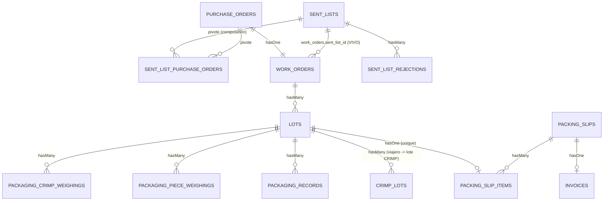
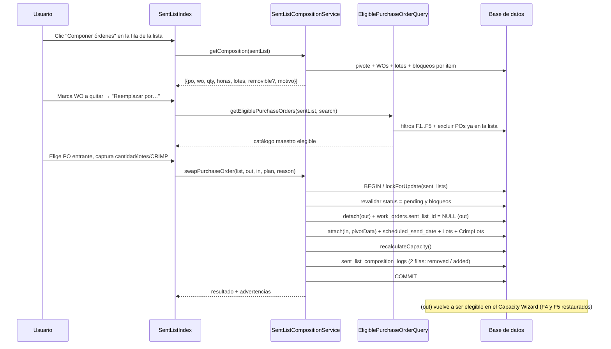
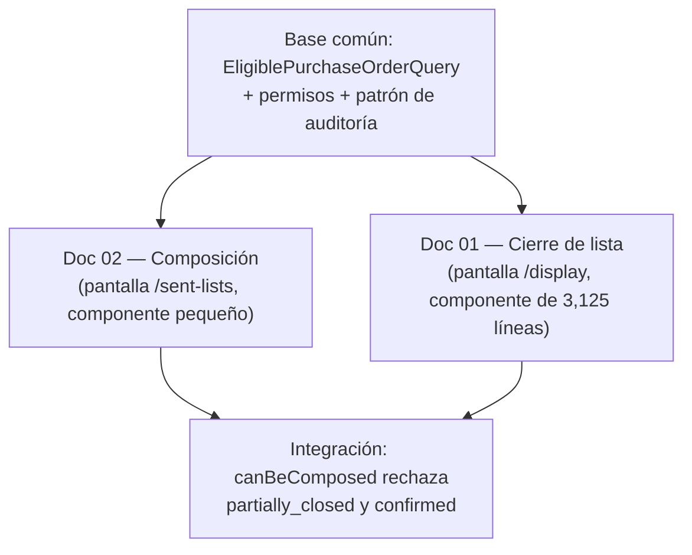

# Análisis Técnico: Composición de la Lista de Envío — Quitar/Reemplazar un WO y Agregar un WO desde el Master PO

| Campo | Valor |
|---|---|
| **Fecha** | 2026-08-07 |
| **Autor** | Agent Architect |
| **Rama** | `main_jos` |
| **Estado** | Análisis / Diseño — NO implementado |
| **Versión** | 1.0 |
| **Pantalla objetivo** | `http://flexcon-tracker.test:8088/admin/sent-lists` |
| **Componente objetivo** | `App\Livewire\Admin\SentLists\SentListIndex` (columna **Acciones**) |
| **Documento hermano** | [`01_BOTTON_CERRADO_LISTA_ENVIO.md`](./01_BOTTON_CERRADO_LISTA_ENVIO.md) |

---

## Tabla de Contenidos

1. [Resumen Ejecutivo](#1-resumen-ejecutivo)
2. [Requerimiento del Cliente](#2-requerimiento-del-cliente)
3. [Estado Actual del Sistema](#3-estado-actual-del-sistema)
4. [Modelo de Datos Involucrado](#4-modelo-de-datos-involucrado)
5. [Análisis de Brechas](#5-análisis-de-brechas)
6. [Diseño Propuesto](#6-diseño-propuesto)
7. [Cambios Propuestos de Base de Datos](#7-cambios-propuestos-de-base-de-datos)
8. [Cambios Propuestos de Backend](#8-cambios-propuestos-de-backend)
9. [Cambios Propuestos de Frontend](#9-cambios-propuestos-de-frontend)
10. [Análisis de Impacto en Cascada](#10-análisis-de-impacto-en-cascada)
11. [Reglas de Validación y Casos Borde](#11-reglas-de-validación-y-casos-borde)
12. [Riesgos y Consideraciones](#12-riesgos-y-consideraciones)
13. [Relación con el Documento 01 (Cierre de Lista)](#13-relación-con-el-documento-01-cierre-de-lista)
14. [Plan de Implementación por Fases](#14-plan-de-implementación-por-fases)
15. [Plan de Pruebas](#15-plan-de-pruebas)
16. [Preguntas Abiertas para el Cliente](#16-preguntas-abiertas-para-el-cliente)
17. [Apéndice A — Índice de archivos verificados](#apéndice-a--índice-de-archivos-verificados)

---

## 1. Resumen Ejecutivo

### 1.1 Hallazgo principal — la composición de una lista de envío es **inmutable por construcción**

El contenido de una `SentList` se escribe **una sola vez en todo el proyecto**, dentro de la transacción del Capacity Wizard:

```php
// app/Livewire/Admin/CapacityWizard.php:915
$sentList->purchaseOrders()->attach($item['po_id'], $pivotData);
```

Una búsqueda exhaustiva de `attach` / `detach` / `sync` sobre `purchaseOrders()` y sobre la tabla `sent_list_purchase_orders` devuelve exactamente **tres** ocurrencias de escritura en todo el código de aplicación:

| Ubicación | Operación | Contexto |
|---|---|---|
| `app/Livewire/Admin/CapacityWizard.php:915` | `attach()` | Generación inicial de la lista |
| `app/Models/PurchaseOrder.php:288` | `detach()` | `forceDeleteWithRelations()` — borrado destructivo del PO completo |
| `tests/Feature/SentListPdfExportTest.php:445` | `attach()` | Fixture de prueba |

**No existe ninguna ruta de código que quite, reemplace o agregue un PO a una lista de envío ya creada.** El requerimiento del cliente no es "exponer una capacidad existente": es **construir una operación de dominio que hoy no existe**, sobre una tabla pivote diseñada como *write-once*.

### 1.2 Segundo hallazgo — CRÍTICO: la "dualidad legacy" **no es legacy y está viva**

El documento 01 (§3.2.2, §11 RG-04) asume que `work_orders.sent_list_id` es un flujo legacy muerto y que "el cierre debe resolver el contenido por el pivote, no por `sent_list_id`". **Esa premisa es incorrecta y debe corregirse en ambos documentos.**

`SentListMaterialsView::saveLots()` **estampa activamente** `work_orders.sent_list_id` cada vez que Materiales guarda los lotes de un WO:

```php
// app/Livewire/Admin/SentLists/SentListMaterialsView.php:108-111
// Bind WO to this SentList if not already linked
if ($wo->sent_list_id !== $this->sentList->id) {
    $wo->update(['sent_list_id' => $this->sentList->id]);
}
```

Y el Capacity Wizard **excluye para siempre** cualquier PO cuyo WO tenga `sent_list_id` no nulo:

```php
// app/Livewire/Admin/CapacityWizard.php:486-488
->whereDoesntHave('workOrder', function($q) {
    $q->whereNotNull('sent_list_id');
});
```

Las consecuencias sobre el requerimiento son severas y **definen el diseño**:

1. **Un "quitar WO" implementado sólo con `detach()` del pivote sería un no-op visual.** El WO seguiría apareciendo en la lista porque las cuatro rutas de resolución de contenido consultan **ambos** caminos con un `OR`:
   - `SentList::getEffectiveWorkOrders()` — `app/Models/SentList.php:96-104`
   - `GuardsSentListDepartment::sentListWorkOrderIds()` — `app/Livewire/Concerns/GuardsSentListDepartment.php:66-68`
   - `SentListController::exportPdf()` (PDF FPL-02) — `app/Http/Controllers/SentListController.php:43-46`
   - `ShippingListDisplay` (modo enfocado) — `app/Livewire/Admin/SentLists/ShippingListDisplay.php:3011-3016`
2. **Un WO al que Materiales ya le cargó lotes queda expulsado del Capacity Wizard de forma permanente.** Si se lo quita de la lista sin limpiar `sent_list_id`, ese PO **nunca volverá a estar disponible** para ninguna lista futura — fuga silenciosa del catálogo.

> **Regla de diseño derivada (RD-01):** toda operación de quitar/reemplazar debe ser **doble**: `detach()` del pivote **y** `work_orders.sent_list_id = NULL` cuando apunte a esta lista. Ambas dentro de la misma transacción.

### 1.3 Tercer hallazgo — "Master PO" no existe como entidad en el código

Un `grep` insensible a mayúsculas de `Master PO` / `master_po` / `MasterPO` sobre todo el proyecto (`*.php`, `*.blade.php`, `*.md`) devuelve **cero resultados**. El término es de negocio, no de sistema. Hay **tres** candidatos reales y la elección cambia el alcance:

| Candidato | Ruta | Componente |
|---|---|---|
| (a) Catálogo de Órdenes de Compra | `/admin/purchase-orders` | `App\Livewire\Admin\PurchaseOrders\POList` (`routes/admin.php:127`) |
| (b) "Manage PO" / Órdenes de trabajo | `/admin/work-orders` | `App\Livewire\Admin\WorkOrders\WOList` (`routes/admin.php:133`) |
| (c) Catálogo **elegible** que ya calcula el wizard | — | `CapacityWizard::getAvailablePOsProperty()` (`app/Livewire/Admin/CapacityWizard.php:460-502`) |

**Recomendación técnica: (c).** Es la única fuente que aplica los cinco filtros que garantizan que un PO puede entrar a una lista sin romper invariantes. Ver §16 P-13.

### 1.4 Cuarto hallazgo — agregar un PO no es sólo `attach()`

`generateSentList()` hace **seis** cosas por cada PO dentro de la misma transacción (`app/Livewire/Admin/CapacityWizard.php:877-998`), no una:

| # | Acción | Línea |
|---|---|---|
| 1 | Calcular horas requeridas y cantidad de planeación (carryover vs. nueva) | `:390-391`, `:407-417` |
| 2 | Construir el pivote vía `CarryoverService` | `:899-913` |
| 3 | `attach()` al pivote | `:915` |
| 4 | Escribir `work_orders.scheduled_send_date` | `:918-922` |
| 5 | Crear los registros `Lot` (idempotente por `work_order_id` + `lot_number`) | `:927-966` |
| 6 | Crear los `CrimpLot` colgando de su viajero (idempotente) | `:968-996` |

Además, las horas de la lista (`used_hours`, `remaining_hours`) se fijan al crearla (`:866-867`) y **nadie las recalcula después**. Un "agregar WO" que sólo haga `attach()` deja la lista con capacidad mentida, sin lotes y sin fecha programada.

### 1.5 Riesgo mayor

**RG-01 (§12): la fuga permanente del catálogo por `sent_list_id` huérfano.** Es silenciosa, no genera error, y sólo se detecta cuando alguien nota semanas después que un PO "desapareció" del Capacity Wizard. Es exactamente el mismo tipo de riesgo que el RG-01 del documento 01 (cerrar el WO destruye el remanente), y comparte causa raíz: **el Capacity Wizard es la única puerta de reingreso y tiene cinco filtros que nadie más conoce**.

### 1.6 Conclusión

El requerimiento es **más caro de lo que aparenta** y toca la parte más frágil del sistema: la frontera entre planeación (pivote) y ejecución (WO/Lot/CrimpLot). Estimación: **21 – 29 pts** (§14), con la horquilla gobernada por P-14 (¿se puede quitar un WO con trabajo en piso?) y P-18 (¿se capturan lotes al agregar?).

---

## 2. Requerimiento del Cliente

### 2.1 Texto original (interpretado)

En la pantalla **Lista de Envío** (`/admin/sent-lists`), en la **columna de Acciones de cada lista**, se necesita:

1. **Quitar un WO y reemplazarlo por otro** (swap/intercambio dentro de una lista de envío existente).
2. **Agregar un nuevo WO a la lista**, jalándolo desde el **Master PO** (catálogo maestro de POs/WOs).

### 2.2 Traducción a requisitos técnicos

| ID | Requisito | Tipo |
|---|---|---|
| **R-01** | Acción de composición invocable desde la columna Acciones de `SentListIndex`. | Funcional |
| **R-02** | Quitar un PO/WO de una lista existente, desligándolo de **ambos** caminos (pivote + `sent_list_id`). | Funcional |
| **R-03** | Agregar un PO/WO desde el catálogo maestro, respetando los cinco filtros de elegibilidad. | Funcional |
| **R-04** | Swap = quitar + agregar como **una sola operación atómica**. | Funcional |
| **R-05** | Recalcular la capacidad de la lista (`used_hours`, `remaining_hours`) tras cualquier cambio. | Funcional |
| **R-06** | Preservar la invariante F4 del wizard: un PO no puede estar en dos listas `pending`. | Reglas de negocio |
| **R-07** | No destruir producción ya registrada (lotes, pesadas, empaques, packing slips, invoices). | Reglas de negocio |
| **R-08** | Trazabilidad: quién quitó/agregó/reemplazó qué, cuándo y por qué. | No funcional |
| **R-09** | Transaccionalidad y control de concurrencia. | No funcional |
| **R-10** | Control de permisos: hoy cualquier rol departamental entra a esta pantalla. | Seguridad |

### 2.3 Interpretación de "WO" en el requerimiento

El cliente dice "WO", pero la unidad que compone una lista de envío en la base de datos es el **PurchaseOrder** (el pivote es `sent_list_purchase_orders`). La relación es `PurchaseOrder hasOne WorkOrder` (`app/Models/PurchaseOrder.php:75-78`), de modo que la correspondencia es 1:1 y hablar de "quitar el WO" equivale operativamente a "quitar el PO del pivote". **En la UI debe seguir diciendo WO** (es el lenguaje del cliente); en el modelo la clave es `purchase_order_id`.

---

## 3. Estado Actual del Sistema

### 3.1 La pantalla `/admin/sent-lists` — "Listas preliminares"

Ruta: `routes/admin.php:43` → `App\Livewire\Admin\SentLists\SentListIndex`.
Vista: `resources/views/livewire/admin/sent-lists/sent-list-index.blade.php` (321 líneas).

**Título real de la pantalla:** *"Listas preliminares — Listas generadas desde el wizard de capacidad. Cada una agrupa las órdenes de una semana."* (`sent-list-index.blade.php:7-8`).

#### 3.1.1 Contenido actual de la columna Acciones — VERIFICADO

La columna se construye con el componente `<x-ui.row-actions>` (`sent-list-index.blade.php:192-210`), definido en `resources/views/components/ui/row-actions.blade.php`:

| # | Acción | Condición para mostrarse | Evidencia |
|---|---|---|---|
| 1 | **Tablero de piso** (icono verde) | siempre | `sent-list-index.blade.php:199-202` |
| 2 | **Descargar PDF** (icono rojo, FPL-02) | siempre | `sent-list-index.blade.php:205-208` |
| 3 | **Ver** | siempre | `row-actions.blade.php:17-22`, prop `show` |
| 4 | **Editar** | sólo si `$sl->isPending()` | `sent-list-index.blade.php:195` |
| 5 | **Eliminar** | sólo si `$sl->canBeDeleted()` | `sent-list-index.blade.php:196` |

Adicionalmente, la **celda de Estado** es un botón que abre el modal de cambio de estado (`sent-list-index.blade.php:185-189` → `openStatusModal()`).

#### 3.1.2 Qué significa hoy "Editar" una lista — **sólo el estado**

El botón Editar apunta a `route('admin.sent-lists.edit', $sl)` → `SentListController::edit()` (`app/Http/Controllers/SentListController.php:97-107`) → vista `resources/views/sent-lists/edit.blade.php`.

Esa vista contiene **un único campo editable**: tres radios de estado (`edit.blade.php:60-78`). El `update()` valida exactamente eso:

```php
// app/Http/Controllers/SentListController.php:120-124
$validated = $request->validate([
    'status' => 'required|in:pending,confirmed,canceled',
]);
$sentList->update($validated);
```

**No hay ninguna pantalla en el sistema donde se pueda alterar la composición de una lista de envío.** La palabra "Editar" en la columna Acciones es engañosa: el usuario que la pulse esperando cambiar órdenes no encontrará nada.

#### 3.1.3 Estados de una `SentList`

`app/Models/SentList.php:61-63`:

```php
public const STATUS_PENDING   = 'pending';
public const STATUS_CONFIRMED = 'confirmed';
public const STATUS_CANCELED  = 'canceled';
```

Reglas asociadas verificadas:

| Método | Línea | Regla |
|---|---|---|
| `isPending()` | `SentList.php:363-366` | `status === 'pending'` |
| `canBeDeleted()` | `SentList.php:371-375` | `isPending()` **Y** `workOrders()->count() === 0` |
| `canDepartmentEdit()` | `SentList.php:308-313` | departamento actual coincide **Y** status ∉ {confirmed, canceled} |
| `getRunningWorkOrders()` | `SentList.php:390-419` | WOs con actividad real en piso (ver §3.4) |

> **Bug latente detectado (B-L1):** `canBeDeleted()` cuenta `workOrders()` — la relación por `sent_list_id` (`SentList.php:85-88`) — **no el pivote**. Una lista generada por el wizard con 10 POs y sin ninguna intervención de Materiales tiene `workOrders()->count() === 0` y por tanto **es borrable**, aunque tenga contenido. Cualquier trabajo sobre composición agrava este desalineamiento y debería corregirlo.

### 3.2 El pivote — la única fuente de composición

`app/Models/SentList.php:117-129`:

```php
public function purchaseOrders(): BelongsToMany
{
    return $this->belongsToMany(PurchaseOrder::class, 'sent_list_purchase_orders')
        ->withPivot([
            'quantity', 'required_hours', 'lot_number',
            'is_carryover', 'carryover_from_sent_list_id', 'pending_quantity_at_carryover',
        ])
        ->withTimestamps();
}
```

Restricciones de la tabla (`database/migrations/2026_01_20_061024_create_sent_list_purchase_orders_table.php:14-29`):

- `unique(['sent_list_id','purchase_order_id'], 'sent_list_po_unique')` — **línea 24**
- `foreignId('sent_list_id')->onDelete('cascade')` — línea 16
- `foreignId('purchase_order_id')->onDelete('cascade')` — línea 17
- índices en ambas FKs — líneas 27-28

Campos de carryover añadidos después (`database/migrations/2026_05_18_100000_add_carryover_fields_to_sent_list_purchase_orders.php:11-24`): `is_carryover`, `carryover_from_sent_list_id` (FK `nullOnDelete`), `pending_quantity_at_carryover`, más índices en las dos primeras.

**La tabla no tiene soft-delete.** Un `detach()` borra la fila físicamente y con ella toda la cadena de carryover (§10.6).

### 3.3 Los cinco filtros de elegibilidad del Capacity Wizard

`CapacityWizard::getAvailablePOsProperty()` (`app/Livewire/Admin/CapacityWizard.php:460-502`). Un PO aparece como disponible sólo si cumple **todos**:

| # | Condición | Línea | Relevancia para el swap/add |
|---|---|---|---|
| **F1** | `purchase_orders.status = 'approved'` | `:463` | El PO a agregar debe estar aprobado |
| **F2** | La parte tiene un `Standard` activo **con configuraciones** | `:464-467` | Sin estándar no hay cálculo de horas |
| **F3** | `workOrder.status.name = 'Open'` | `:468-470` | Un WO `Completed` no puede agregarse |
| **F4** | PO nunca estuvo en lista, **O** estuvo + `sent_pieces < quantity` + **no está en lista `pending`** | `:471-484` | **La invariante que el add debe preservar** |
| **F5** | `workOrder.sent_list_id IS NULL` | `:486-488` | **La invariante que el remove debe restaurar** |

El bloque exacto de F4 (`:480-482`):

```php
->whereDoesntHave('sentLists', function ($slQ) {
    $slQ->where('status', \App\Models\SentList::STATUS_PENDING);
});
```

### 3.4 Qué significa "el WO ya está corriendo" — la definición ya existe

`SentList::getRunningWorkOrders()` (`app/Models/SentList.php:390-419`) ya define con precisión el predicado que el swap necesita para decidir si un WO puede quitarse:

```php
return $wo->lots->contains(function ($lot) {
    return ($lot->material_status ?? 'pending') !== 'pending'
        || ($lot->inspection_status ?? 'pending') !== 'pending'
        || $lot->weighings->isNotEmpty()
        || $lot->qualityWeighings->isNotEmpty()
        || $lot->packagingRecords->isNotEmpty()
        || $lot->packagingPieceWeighings->isNotEmpty()
        || $lot->packagingCrimpWeighings->isNotEmpty();
});
```

**Este método es reutilizable tal cual** y evita reinventar el predicado. Hoy se usa sólo para decidir si una lista cancelada se borra (`SentListIndex::saveStatus()`, `app/Livewire/Admin/SentLists/SentListIndex.php:108-131`).

### 3.5 Permisos y control de acceso — el estado actual es permisivo

Ruta protegida por rol, no por permiso (`routes/admin.php:41`):

```php
Route::middleware(['auth','verified','role:admin|Materiales|Produccion|Calidad|Empaques'])->group(...)
```

`SentListIndex` **no aplica ningún guard adicional**: ni `authorize()`, ni `can()`, ni el trait `GuardsSentListDepartment`. Cualquier usuario con rol `Calidad` puede hoy cambiar el estado de cualquier lista (`saveStatus()`, `:95-137`) y borrarla (`deleteSentList()`, `:139-157`).

Existen permisos Spatie declarados y **no utilizados** (`database/seeders/PermissionSeeder.php:103-106`):

```
ordenes.view-sent-lists, ordenes.create-sent-lists,
ordenes.edit-sent-lists, ordenes.delete-sent-lists
```

**Añadir composición sin permiso propio significa que Calidad podrá reconfigurar la planeación de la semana.** Ver §16 P-21.

### 3.6 Capacidad: se calcula una vez y nunca se recalcula

`generateSentList()` fija (`app/Livewire/Admin/CapacityWizard.php:865-867`):

```php
'total_available_hours' => $this->totalAvailableHours,
'used_hours'            => $this->totalRequiredHours,
'remaining_hours'       => max(0, $this->remainingHours),
```

No hay ningún otro escritor de esos tres campos en el proyecto.

> **Bug latente detectado (B-L2):** por el `max(0, …)` de la línea 867, `remaining_hours` **nunca puede ser negativo**. Sin embargo la vista del índice tiene una rama que sólo se dispara con valor negativo:
> ```blade
> {{-- resources/views/livewire/admin/sent-lists/sent-list-index.blade.php:171-175 --}}
> @if ($sl->remaining_hours < 0)
>     Sobrepasada por {{ number_format(abs($sl->remaining_hours), 1) }} h
> @endif
> ```
> Esa rama es **código muerto hoy**. Si el recálculo del add/remove decide almacenar el valor real (negativo), la rama revive — hay que decidirlo conscientemente. Ver §16 P-17.

---

## 4. Modelo de Datos Involucrado

### 4.1 Grafo de dependencias — verificado



### 4.2 Puntos de corte y su severidad

| Frontera | ¿La corta el swap? | Consecuencia |
|---|---|---|
| `sent_lists` ↔ pivote | **Sí, por diseño** | Es la operación pedida |
| `sent_lists` ↔ `work_orders.sent_list_id` | **Debe cortarla** (RD-01) | Si no, no-op + fuga de catálogo |
| `work_orders` ↔ `lots` | **No** | Los lotes cuelgan del WO, no de la lista. Sobreviven al swap |
| `lots` ↔ `crimp_lots` | **No** | Igual |
| `lots` ↔ `packing_slip_items` | **No** | El PS es lot-based, ajeno a `sent_lists` |
| `packing_slips` ↔ `invoices` | **No** | Un nivel más abajo aún |

**Consecuencia estructural:** el swap **no puede corromper** Packing Slips ni Invoices por integridad referencial. Lo que sí produce es una **incoherencia documental** (§10.3-10.5).

### 4.3 Ausencias relevantes verificadas

| Ausencia | Evidencia | Impacto en el diseño |
|---|---|---|
| `lots` **no** tiene `sent_list_id` | `database/migrations/2025_12_28_202009_create_lots_table.php:15-44` | La pertenencia de un lote a una lista es transitiva vía WO |
| `sent_lists` **no** tiene fecha programada de envío | `$fillable` en `app/Models/SentList.php:18-41` | Al agregar un WO no hay de dónde copiar `scheduled_send_date` (§11.3 C-07) |
| `packing_slips` **no** tiene FK a `sent_lists` | `$fillable` en `app/Models/PackingSlip.php:33-42` | Aislamiento confirmado |
| `crimp_lots` **no** tiene estado ni cierre | `app/Models/CrimpLot.php` completo (79 líneas) | Brecha G-04 del doc 01, se hereda aquí |
| El pivote **no** tiene soft-delete ni histórico | Migraciones `2026_01_20_061024` y `2026_05_18_100000` | Un `detach()` destruye la trazabilidad de carryover |

---

## 5. Análisis de Brechas

| ID | Brecha | Severidad | Evidencia |
|---|---|---|---|
| **GA-01** | No existe operación de quitar/reemplazar/agregar POs en una lista existente. Cero métodos, cero rutas, cero UI. | **Alta** | Único `attach()` en `CapacityWizard.php:915`; `detach()` sólo en `PurchaseOrder.php:288` |
| **GA-02** | El "Editar" de la columna Acciones sólo cambia el estado; no hay dónde alojar la nueva funcionalidad. | **Alta** | `SentListController.php:120-124`; `resources/views/sent-lists/edit.blade.php:60-78` |
| **GA-03** | La composición se resuelve por **dos** caminos con `OR`. Quitar del pivote no quita de la lista. | **Alta** | `SentList.php:96-104`; `GuardsSentListDepartment.php:66-68`; `SentListController.php:43-46`; `ShippingListDisplay.php:3011-3016` |
| **GA-04** | `work_orders.sent_list_id` se estampa en tiempo de ejecución y expulsa el PO del wizard para siempre (F5). | **Alta** | `SentListMaterialsView.php:108-111` vs `CapacityWizard.php:486-488` |
| **GA-05** | El catálogo de POs elegibles vive **dentro** de un componente Livewire; no es reutilizable sin duplicar los 5 filtros. | **Alta** | `CapacityWizard::getAvailablePOsProperty()` `:460-502` |
| **GA-06** | Agregar un PO exige replicar 6 pasos del wizard (horas, pivote, fecha, lotes, crimp lots, carryover), no sólo `attach()`. | **Alta** | `CapacityWizard.php:877-998` |
| **GA-07** | `used_hours` / `remaining_hours` no tienen recalculador. Cualquier cambio de composición las descuadra. | **Media** | Único escritor: `CapacityWizard.php:865-867` |
| **GA-08** | El pivote no guarda histórico. Un `detach()` borra `is_carryover` y `carryover_from_sent_list_id`. | **Media** | Migración `2026_05_18_100000...:11-24`; sin `SoftDeletes` |
| **GA-09** | No hay permiso ni guard para componer. Cualquier rol departamental accede a `/admin/sent-lists`. | **Media** | `routes/admin.php:41`; `SentListIndex.php` sin `authorize()` |
| **GA-10** | No hay auditoría de cambios de composición. `AuditTrail` existe (`app/Models/AuditTrail.php`) pero no se usa aquí. | **Media** | `department_history` sólo registra transiciones de departamento (`SentList.php:259-267`) |
| **GA-11** | `canBeDeleted()` mide el contenido por `workOrders()` (sent_list_id) y no por el pivote → una lista con POs puede ser borrable. | **Media** | `SentList.php:371-375` |
| **GA-12** | `SentListIndex` no tiene ningún control de concurrencia; `saveStatus()` ni siquiera revalida antes de escribir. | **Baja** | `SentListIndex.php:95-137` |
| **GA-13** | El PDF FPL-02 se genera on-demand y clasifica "Atrasados" por `is_carryover` **global** (cualquier lista), no por esta lista. | **Baja** | `SentListController.php:51-54` |

---

## 6. Diseño Propuesto

### 6.1 Principio rector

> **Componer una lista de envío es una operación de planeación, no de producción.** Sólo puede alterarse lo que todavía no ha producido evidencia física. En el momento en que un WO genera trabajo real (material liberado, pesadas, empaque, packing slip), deja de ser removible: pasa a ser historia y la vía correcta es **cerrar la lista con remanente** (documento 01), no reescribirla.

Este principio traza la línea entre los dos documentos y evita que se solapen:

| Situación | Herramienta correcta |
|---|---|
| Me equivoqué al planear; ese WO no debía estar aquí | **Este documento** — quitar/reemplazar |
| El WO estaba bien planeado pero no se alcanzó a terminar | **Documento 01** — cerrar con remanente |

### 6.2 Operaciones de dominio propuestas

| Operación | Semántica | Atomicidad |
|---|---|---|
| `addPurchaseOrder(SentList, PurchaseOrder, array $plan)` | Agrega un PO desde el catálogo maestro, con su cantidad, configuración, lotes y (si CRIMP) lotes de CRIMP | 1 transacción |
| `removePurchaseOrder(SentList, PurchaseOrder, string $reason)` | Quita el PO del pivote **y** limpia `work_orders.sent_list_id` | 1 transacción |
| `swapPurchaseOrder(SentList, PurchaseOrder $out, PurchaseOrder $in, array $plan, string $reason)` | `remove` + `add` en **una sola** transacción; si el `add` falla, el `remove` se revierte | 1 transacción |
| `recalculateCapacity(SentList)` | Recalcula `used_hours` / `remaining_hours` desde `SUM(pivot.required_hours)` | idempotente |
| `getEligiblePurchaseOrders(SentList, ?string $search)` | Catálogo maestro filtrado por F1-F5, **excluyendo** los POs ya presentes en esta lista | sólo lectura |
| `getRemovalBlockReason(SentList, PurchaseOrder)` | Motivo humano por el que no se puede quitar; `null` si se puede | sólo lectura |
| `getAdditionBlockReason(SentList, PurchaseOrder)` | Ídem para agregar | sólo lectura |

### 6.3 Flujo del swap



### 6.4 Extracción del catálogo maestro — refactor obligatorio

`getAvailablePOsProperty()` está **enterrado dentro de un componente Livewire** (`CapacityWizard.php:460-502`). Duplicar sus cinco filtros en la pantalla de composición es la vía más rápida a la divergencia (dos catálogos que se contradicen).

**Propuesta:** extraer a una clase de consulta reutilizable y hacer que **el wizard la consuma también**:

```
App\Queries\EligiblePurchaseOrderQuery
  ├─ forWizard(): Builder                          // F1..F5, comportamiento actual
  ├─ forSentList(SentList $l): Builder             // F1..F5 + excluir POs ya en $l
  └─ withSearch(?string $term): self               // el bloque :490-499
```

**Criterio de aceptación del refactor:** `CapacityWizard::getAvailablePOsProperty()` debe reducirse a una llamada, y `tests/Feature/CapacityWizardPoSelectionTest.php` debe pasar sin modificación. Ésa es la garantía de que no cambió el comportamiento.

### 6.5 Reglas de negocio para quitar un WO

Se propone una escala de tres niveles, evaluada por `getRemovalBlockReason()`:

| Nivel | Condición | Comportamiento propuesto |
|---|---|---|
| **N1 — Bloqueo duro (irreversible)** | Algún lote del WO está en un Packing Slip (`Lot::isInPackingSlip()`, `app/Models/Lot.php:270-273`) | No se puede quitar. El documento físico ya salió |
| **N1** | Algún lote tiene `ready_for_shipping = true` (está en la cola de despacho: `Lot::scopeReadyForShipping()`, `app/Models/Lot.php:231-234`) | No se puede quitar |
| **N1** | `work_orders.sent_pieces > 0` | No se puede quitar: ya hay piezas contabilizadas como enviadas |
| **N1** | Algún lote tiene `closure_decision` no nulo (decisión de cierre tomada, `Lot::CLOSURE_*` en `app/Models/Lot.php:1169-1189`) | No se puede quitar |
| **N2 — Advertencia dura (requiere confirmación + motivo)** | `SentList::getRunningWorkOrders()` incluye este WO (`SentList.php:390-419`): hay material liberado, inspección, pesadas o empaque | Se permite con motivo obligatorio. **Sujeto a P-14** |
| **N3 — Libre** | Ninguna de las anteriores | Se quita con confirmación simple |

> **SUPUESTO / POR CONFIRMAR (P-14):** que N2 sea "advertencia con motivo" y no bloqueo duro. La alternativa conservadora (bloqueo duro en N2) es más segura pero puede volver la funcionalidad inútil en la práctica: en cuanto Materiales libera material, el WO ya no sería removible.

### 6.6 Qué se hace con los lotes del WO removido

**Decisión de diseño DA-01: los lotes NO se borran.** Razones:

1. `Lot` pertenece a `WorkOrder`, no a `SentList`. Borrarlos destruiría trazabilidad que no pertenece a la lista.
2. El wizard es **idempotente** al recrear lotes (`CapacityWizard.php:937-963`): busca por `(work_order_id, lot_number)` y reutiliza el existente. Si el PO vuelve a entrar en otra lista con los mismos números de lote, se reutilizan.
3. Borrarlos podría cascadear a `crimp_lots`, `packaging_records`, `weighings`, etc.

**Consecuencia asumida:** un WO removido de la lista conserva sus lotes "colgando" del WO. Aparecerán en `/admin/lots` y en el tablero de piso una vez que el WO vuelva a entrar a otra lista. Es el comportamiento correcto, pero hay que **decirlo explícitamente en el modal** para que el usuario no crea que "se borró todo".

> **Excepción propuesta (DA-01b):** si el WO se quita en nivel **N3** (cero actividad) y sus lotes fueron creados por el wizard con el comentario auto-generado `'Generado automáticamente desde Capacity Wizard'` (`CapacityWizard.php:952`) y no tienen ningún registro hijo, **ofrecer** (checkbox, no por defecto) borrarlos. Ver §16 P-16.

### 6.7 Reglas CRIMP

Se respeta la regla del proyecto: **"Lote" se llama "Viajero" sólo si `parts.is_crimp = true`**. Verificada en `Lot::isViajero()` (`app/Models/Lot.php:184-187`):

```php
return (bool) ($this->workOrder?->purchaseOrder?->part?->is_crimp ?? false);
```

| Aspecto | Parte NO-CRIMP | Parte CRIMP |
|---|---|---|
| Etiqueta en el modal de composición | **Lote** | **Viajero** |
| Captura obligatoria al **agregar** | números de lote + cantidades | + lotes de CRIMP (`lot_ref`, número, lote fabricante, cantidad) |
| Referencia de implementación | `CapacityWizard::saveLots()` `:604-642` | `CapacityWizard::saveCrimpLots()` `:747-775` y persistencia `:968-996` |
| Validación de cantidades | `validateLotCrimpQuantities()` `:781-826` | ídem, incluyendo que `lot_ref` apunte a un lote existente (`:816-820`) |
| Al **quitar** | los lotes sobreviven (DA-01) | los viajeros **y sus `CrimpLot`** sobreviven |

**El etiquetado debe resolverse por item, no globalmente**: una misma lista puede mezclar partes CRIMP y no-CRIMP. Fuente de verdad: `$po->part->is_crimp`, el mismo campo que ya lee el wizard (`CapacityWizard.php:430`).

### 6.8 Interacción con la invariante F4 (un PO, una lista `pending`)

| Operación | Efecto sobre F4 |
|---|---|
| **Quitar** un PO de una lista `pending` | El PO deja de tener lista `pending` → **vuelve a ser elegible** en el wizard (si F1, F2, F3 y F5 también se cumplen) |
| **Agregar** un PO a una lista `pending` | El PO queda bloqueado en el wizard mientras la lista siga `pending` — **comportamiento correcto y deseado** |
| **Agregar** un PO que ya está en otra lista `pending` | **Debe bloquearse.** Rompería la invariante y produciría doble planeación de las mismas piezas |

**Este último caso es la validación más importante del "agregar"**, y es exactamente lo que `EligiblePurchaseOrderQuery` garantiza al reutilizar F4. Nunca debe permitirse un "agregar" que salte el catálogo (p. ej. por ID directo desde la URL).

### 6.9 Trazabilidad del carryover al quitar/re-agregar

`CarryoverService::getLastSentListForPO()` (`app/Services/CarryoverService.php:42-45`):

```php
return $po->sentLists()->orderByDesc('created_at')->first();
```

**Riesgo de auto-referencia:** si en el flujo de "agregar" se hace `attach()` **antes** de construir el pivot data, `getLastSentListForPO()` devolvería **la lista actual** y se escribiría `carryover_from_sent_list_id = sent_list_id` — un ciclo que rompe la cadena de trazabilidad.

El wizard evita esto por orden de ejecución: construye el pivot data en `:899-913` y sólo después hace `attach()` en `:915`. **El servicio nuevo debe preservar ese orden de forma explícita y documentada.**

### 6.10 Lo que este diseño explícitamente NO hace

| Artefacto | Motivo |
|---|---|
| No toca `lots.ready_for_shipping`, `quantity_packed_final`, `closed_by_type` | Rompería la cola de despacho (`ShippingQueue.php:238-239`) y los Packing Slips |
| No toca `PackingSlip`, `PackingSlipItem`, `Invoice` | Sin acoplamiento con `sent_lists` (§4.2) |
| No toca `LotPackagingObserver` | Fuera de alcance; trabajo de terceros |
| No modifica el flujo D2 CRIMP asignado a Mau | Documentado como no-tocar en el doc 01 §11.1 |
| No introduce estados nuevos en `sent_lists.status` | Eso es alcance del documento 01 (§6.2) |
| No cierra ni abre POs/WOs | Manage PO es la única superficie de cierre (doc 01, D-02/D-03, confirmadas por el cliente) |

---

## 7. Cambios Propuestos de Base de Datos

### 7.1 Migración A — bitácora de composición (recomendada)

Tabla nueva `sent_list_composition_logs`. Responde a GA-08 y GA-10 **sin** tocar el pivote (no rompe el `unique` ni el `cascade`).

| Campo | Tipo | Null | Índice | Propósito |
|---|---|---|---|---|
| `id` | `bigint` PK | No | — | |
| `sent_list_id` | `bigint` FK → `sent_lists` `cascadeOnDelete` | No | idx | Lista afectada |
| `purchase_order_id` | `bigint` FK → `purchase_orders` `cascadeOnDelete` | No | idx | PO afectado |
| `action` | `varchar(16)` | No | idx | `added` \| `removed` \| `swapped_in` \| `swapped_out` |
| `swap_group_id` | `char(36)` (UUID) | Sí | idx | Vincula las dos filas de un mismo swap |
| `quantity` | `int` | Sí | — | Snapshot de `pivot.quantity` al momento de la acción |
| `required_hours` | `decimal(10,2)` | Sí | — | Snapshot |
| `was_carryover` | `tinyint(1)` | No (def. 0) | — | Preserva `is_carryover` antes del `detach()` |
| `carryover_from_sent_list_id` | `bigint` FK nullable `nullOnDelete` | Sí | — | Preserva la cadena antes del `detach()` |
| `reason` | `varchar(500)` | Sí | — | Motivo capturado en el modal |
| `performed_by` | `bigint` FK → `users` `nullOnDelete` | Sí | — | Autoría |
| `created_at` | `timestamp` | No | idx | Momento |

Índice compuesto sugerido: `(sent_list_id, created_at)`.

**Alternativa descartada:** añadir `SoftDeletes` al pivote. Motivo: el `unique(sent_list_id, purchase_order_id)` (migración `2026_01_20_061024...:24`) **impediría re-agregar** un PO previamente quitado de la misma lista, porque la fila borrada seguiría ocupando la clave. Habría que convertir el unique en parcial (no soportado en MySQL) o añadir `deleted_at` a la clave (rompe la semántica de `belongsToMany`). La bitácora separada es más limpia.

### 7.2 Migración B — permiso de composición

Insertar en `permissions` (Spatie), siguiendo el patrón de `database/seeders/PermissionSeeder.php:103-106`:

```
ordenes.compose-sent-lists
```

> **Alternativa más barata:** reutilizar `ordenes.edit-sent-lists`, que **ya existe y no se usa en ningún sitio**. Ver §16 P-21.

### 7.3 Migración C — NO recomendada (documentada para descartarla)

Añadir `sent_lists.scheduled_send_date` para poder heredar la fecha al agregar un WO (§11.3 C-07). **Se desaconseja**: introduce una segunda fuente de verdad frente a `work_orders.scheduled_send_date`, que es donde el wizard la escribe hoy (`CapacityWizard.php:918-922`). Alternativa sin migración: derivarla de la moda/máximo de los WOs ya presentes en la lista, o pedirla en el modal. Ver §16 P-19.

### 7.4 Resumen de impacto en BD

| Tabla | Campos nuevos | Migración destructiva |
|---|---|---|
| `sent_list_composition_logs` | tabla nueva (12 campos) | No |
| `permissions` | 1 fila (o 0 si se reutiliza `edit-sent-lists`) | No |
| **`sent_list_purchase_orders`** | **0** | **No se toca** — se preserva el `unique` |
| **`sent_lists`** | **0** | **No se toca** — los estados son alcance del doc 01 |
| **`work_orders`** | **0** | Sólo se **escribe** `sent_list_id` (a NULL), sin cambio de esquema |
| **`lots`, `crimp_lots`** | **0** | No se tocan (DA-01) |
| **`packing_slips`, `invoices`** | **0** | No se tocan |

**El alcance de base de datos de este requerimiento es mucho menor que el del documento 01.** El peso está en el backend y en las validaciones.

---

## 8. Cambios Propuestos de Backend

### 8.1 Nueva clase de consulta: `App\Queries\EligiblePurchaseOrderQuery`

Extracción de `CapacityWizard::getAvailablePOsProperty()` (`:460-502`). Ver §6.4.

| Método | Firma | Responsabilidad |
|---|---|---|
| `base` | `base(): Builder` | Filtros F1, F2, F3, F5 |
| `notInPendingList` | `notInPendingList(): self` | Filtro F4 |
| `excludingSentList` | `excludingSentList(SentList $l): self` | Excluye los POs ya presentes en `$l` |
| `withSearch` | `withSearch(?string $term): self` | Bloque de búsqueda `:490-499` |
| `get` | `get(): Collection` | Ejecuta con el `orderBy('po_number')` actual |

### 8.2 Nuevo servicio: `App\Services\SentListCompositionService`

Se coloca junto a `CarryoverService` y al `SentListClosureService` propuesto en el doc 01.

| Método | Firma | Responsabilidad |
|---|---|---|
| `getComposition` | `getComposition(SentList $l): CompositionDTO` | Sólo lectura. Alimenta el modal |
| `add` | `add(SentList $l, PurchaseOrder $po, AdditionPlan $plan, User $u): void` | Transaccional |
| `remove` | `remove(SentList $l, PurchaseOrder $po, string $reason, User $u): void` | Transaccional |
| `swap` | `swap(SentList $l, PurchaseOrder $out, PurchaseOrder $in, AdditionPlan $plan, string $reason, User $u): void` | Transaccional, atómica |
| `canModify` | `canModify(SentList $l): bool` | `status === 'pending'` (+ estados del doc 01) |
| `getRemovalBlockReason` | `getRemovalBlockReason(SentList $l, PurchaseOrder $po): ?string` | §6.5, patrón de `PurchaseOrder::getDeletionBlockReason()` (`app/Models/PurchaseOrder.php:233-260`) |
| `getRemovalWarnings` | `getRemovalWarnings(SentList $l, PurchaseOrder $po): array` | Nivel N2 |
| `getAdditionBlockReason` | `getAdditionBlockReason(SentList $l, PurchaseOrder $po): ?string` | F1-F5 revalidados en servidor |
| `recalculateCapacity` | `recalculateCapacity(SentList $l): void` | `used_hours = SUM(pivot.required_hours)` |

**Pseudocódigo de `swap()` — el método crítico:**

```
DB::transaction:
    l = SentList::lockForUpdate()->find(l.id)              // C-10 concurrencia
    guard: canModify(l)                                    // revalidación servidor
    guard: getRemovalBlockReason(l, out) === null
    guard: getAdditionBlockReason(l, in)  === null
    guard: in ∉ l.purchaseOrders                           // unique del pivote
    swapGroup = Str::uuid()

    // ── SALIDA ──────────────────────────────────────────
    pivotOut = l.purchaseOrders()->where(...)->first()->pivot
    log(l, out, 'swapped_out', pivotOut, reason, swapGroup, u)   // ANTES del detach
    l.purchaseOrders()->detach(out.id)
    if (out.workOrder?.sent_list_id === l.id)                    // RD-01 — imprescindible
        out.workOrder->update(['sent_list_id' => null])
    // NO se tocan lots ni crimp_lots (DA-01)

    // ── ENTRADA ─────────────────────────────────────────
    pivotData = carryoverService.build{Carryover|Standard}PivotData(...)  // ANTES del attach (§6.9)
    l.purchaseOrders()->attach(in.id, pivotData)
    in.workOrder->update(['scheduled_send_date' => plan.shipDate])
    createLotsIdempotent(in.workOrder, plan.lots)                // espejo de :937-963
    if (in.part.is_crimp) createCrimpLotsIdempotent(...)         // espejo de :983-994
    log(l, in, 'swapped_in', pivotData, reason, swapGroup, u)

    recalculateCapacity(l)
    event(new SentListCompositionChanged(l, out, in, u))
```

### 8.3 DTOs propuestos

```
App\DataTransferObjects\CompositionDTO
  - items: array<{ po_id, po_number, wo, part_number, part_description, is_crimp,
                   planned_qty, required_hours, lot_numbers[], crimp_lot_count,
                   is_carryover, removable: bool, block_reason: ?string,
                   warnings: string[] }>
  - totals: { pos, planned_qty, used_hours, available_hours, remaining_hours }
  - modifiable: bool
  - block_reason: ?string

App\DataTransferObjects\AdditionPlan
  - purchase_order_id: int
  - configuration_id: ?int          // StandardConfiguration elegida
  - quantity: int                   // pending_quantity si carryover, quantity si no
  - required_hours: float
  - scheduled_send_date: string
  - lots: array<{ number, quantity, comment }>
  - crimp_lots: array<{ lot_ref, number, lote_fabricante, quantity, comments }>
```

### 8.4 Cambios en modelos

#### `App\Models\SentList`

| Cambio | Detalle |
|---|---|
| Nuevo | `compositionLogs(): HasMany` → `SentListCompositionLog` |
| Nuevo | `getPivotWorkOrders(): Collection` — WOs resueltos **sólo** por el pivote (contraparte explícita de `getEffectiveWorkOrders()`) |
| Nuevo | `canBeComposed(): bool` — `isPending()` (+ los estados del doc 01 cuando existan) |
| **Corregir (GA-11)** | `canBeDeleted()` (`:371-375`) debe contar también `purchaseOrders()`. Hoy sólo mira `workOrders()` |
| Revisar | `getEffectiveWorkOrders()` (`:96-104`): documentar que el `merge` con `unique('id')` es intencional y que el remove debe cortar **ambos** caminos |

#### `App\Models\PurchaseOrder`

| Cambio | Detalle |
|---|---|
| Nuevo | `isInPendingSentList(): ?SentList` — devuelve la lista `pending` que lo bloquea, para el mensaje del modal |
| Nuevo | `getSentListRemovalBlockReason(SentList $l): ?string` — delega en el servicio; mismo patrón que `getDeletionBlockReason()` (`:233-260`) |
| **NO se toca** | `$fillable`, `$casts`, constantes de estado |

#### `App\Models\WorkOrder`

| Cambio | Detalle |
|---|---|
| Nuevo | `detachFromSentList(SentList $l): bool` — pone `sent_list_id = null` sólo si apunta a `$l`. Encapsula RD-01 y evita que alguien lo escriba mal |
| Nuevo | `hasProductionEvidence(): bool` — reutiliza el predicado de `SentList::getRunningWorkOrders()` (`SentList.php:408-418`) a nivel de un solo WO |

#### Nuevo modelo `App\Models\SentListCompositionLog`

`$fillable` con los campos de §7.1; `belongsTo` a `SentList`, `PurchaseOrder`, `User`.

### 8.5 Cambios en componentes Livewire existentes

#### `App\Livewire\Admin\SentLists\SentListIndex`

Componente pequeño (203 líneas) — a diferencia de `ShippingListDisplay` (3,125 líneas), **aquí sí cabe** la nueva superficie, aunque se recomienda un trait por simetría con `GuardsSentListDepartment`.

| Miembro nuevo | Tipo |
|---|---|
| `$composeListId` | `?int` |
| `$composeTab` | `string` (`current` \| `catalog`) |
| `$composition` | `array` (desde `CompositionDTO`) |
| `$poToRemoveId` | `?int` |
| `$poToAddId` | `?int` |
| `$catalogSearch` | `string` |
| `$additionPlan` | `array` |
| `$compositionReason` | `string` |
| `openComposeModal(int $listId)` | método |
| `closeComposeModal()` | método |
| `markForRemoval(int $poId)` | método |
| `selectReplacement(int $poId)` | método |
| `confirmComposition()` | método |
| `canComposeSentList(SentList $l): bool` | método (para el `@if` de la columna Acciones) |

#### `App\Livewire\Admin\CapacityWizard`

| Cambio | Detalle |
|---|---|
| `getAvailablePOsProperty()` (`:460-502`) | Se reduce a `EligiblePurchaseOrderQuery::forWizard()->withSearch($this->poSearchTerm)->get()` |
| `generateSentList()` (`:828-1014`) | **Refactor recomendado, no obligatorio:** extraer los bloques `:927-996` (creación de Lots y CrimpLots) a métodos del servicio, para que wizard y composición compartan la misma implementación idempotente |

> **Riesgo de este refactor:** `generateSentList()` es el corazón del sistema. Si se toca, `tests/Feature/CapacityWizardCrimpLotTest.php`, `CapacityWizardLotCommentTest.php`, `CapacityWizardPoSelectionTest.php` y `CapacityWizardSearchTest.php` son la red de seguridad. **Deben pasar sin modificarse.**

#### `App\Http\Controllers\SentListController`

| Cambio | Detalle |
|---|---|
| `edit()` / `update()` (`:97-129`) | Quedan como están (sólo estado). **Recomendación de UX:** renombrar el tooltip del botón Editar a "Editar estado" para no competir con la acción nueva de composición |

### 8.6 Evento y auditoría

| Artefacto | Propósito |
|---|---|
| `App\Events\SentListCompositionChanged` | Payload: `SentList`, PO saliente, PO entrante, usuario, motivo |
| `App\Listeners\LogSentListComposition` | Escribe en `sent_list_composition_logs` **y** en `audit_trails` (`app/Models/AuditTrail.php`, campos `auditable_type` / `auditable_id` / `old_values` / `new_values`) |

---

## 9. Cambios Propuestos de Frontend

### 9.1 Ubicación exacta de la acción nueva

Archivo: `resources/views/livewire/admin/sent-lists/sent-list-index.blade.php`, bloque `<x-ui.row-actions>` de las líneas **192-210**.

El componente `row-actions` renderiza `{{ $slot }}` **antes** de las acciones estándar (`resources/views/components/ui/row-actions.blade.php:14-15`), y ese slot ya contiene dos botones (Tablero de piso y PDF). La acción nueva se añade como **tercer** botón del slot, quedando antes de Ver/Editar/Eliminar:

```blade
{{-- sent-list-index.blade.php, dentro del slot de <x-ui.row-actions>, tras la línea 208 --}}
@if ($this->canComposeSentList($sl))
    <x-ui.icon-btn tone="primary"
        label="Componer las órdenes de la lista #{{ $sl->id }}"
        wire:click="openComposeModal({{ $sl->id }})">
        {{-- icono de intercambio / flechas opuestas --}}
    </x-ui.icon-btn>
@endif
```

`<x-ui.icon-btn>` (`resources/views/components/ui/icon-btn.blade.php`) ya soporta el modo `<button>` cuando no recibe `href` (líneas 26-33) y exige `label` para accesibilidad (línea 3).

**Decisión de diseño DA-02: una sola acción, no tres.** Se propone **un** botón "Componer órdenes" que abre un modal con dos pestañas, en lugar de tres botones (quitar / reemplazar / agregar). Razones:

1. La columna Acciones ya tiene 5 elementos; añadir 3 más la vuelve ilegible (ancho declarado `w-44` en `sent-list-index.blade.php:103`).
2. **El swap es intrínsecamente atómico**: quitar y agregar por separado deja ventanas donde la lista está inconsistente y donde otro usuario puede tomar el PO liberado.
3. El usuario necesita **ver la composición actual** antes de decidir qué quitar. Un botón por operación no ofrece ese contexto.

### 9.2 Estructura del modal de composición

Nuevo partial: `resources/views/livewire/admin/sent-lists/partials/modal-compose-list.blade.php`, junto a los ya existentes `modal-viajero.blade.php` y `modal-confirm-empaque.blade.php`.

Se apoya en `<x-ui-modal>` (`resources/views/components/ui-modal.blade.php`) y `<x-ui-modal.ctx>`, exactamente como el modal de estado ya existente (`sent-list-index.blade.php:243-319`).

**Encabezado / contexto** (slot `context`, patrón de `:248-254`):

```
Componer órdenes — Lista #{id}
Semana {start_date} – {end_date} · {N} órdenes · {used}/{available} h ({util} %)
```

**Pestaña 1 — "Órdenes de esta lista"**

| WO | PO | Parte | Cant. planeada | Horas | Lote/Viajero | Estado | Acción |
|---|---|---|---|---|---|---|---|

- Chip **"Carryover"** cuando `pivot.is_carryover` (dato ya disponible).
- Columna Acción por fila:
  - **Removible (N3):** botones `Quitar` y `Reemplazar…`
  - **Advertencia (N2):** botón `Quitar` en tono ámbar + tooltip con el detalle de la actividad registrada
  - **Bloqueado (N1):** icono deshabilitado + tooltip con `block_reason` (patrón `@if(...canBe...)` ya usado en esta misma vista para `canBeDeleted()`, `:196`)

**Pestaña 2 — "Agregar desde el catálogo maestro"**

- Buscador live (`wire:model.live.debounce.300ms="catalogSearch"`), replicando el patrón del wizard (`CapacityWizard.php:490-499`) y del propio índice (`sent-list-index.blade.php:49-50`).
- Tabla del catálogo elegible: `PO | WO | Parte | Descripción | Cantidad | Pendiente | Carryover?`
- Al seleccionar un PO se despliega el **sub-formulario de planeación** (espejo del paso 3 del wizard):
  - Configuración del estándar (si hay más de una) → recalcula horas
  - Cantidad (pre-cargada: `pending_quantity` si carryover, `quantity` si no — regla de `CapacityWizard.php:390-391`)
  - Fecha programada de envío
  - **Lotes** (número + cantidad + comentario), con la validación de que la suma no exceda la cantidad (`CapacityWizard.php:629-633`)
  - **Lotes de CRIMP** si `is_crimp`, con el selector `lot_ref` (`CapacityWizard.php:816-820`)
- Panel de impacto en capacidad, en vivo: `used_hours` actual → proyectada, con advertencia si excede.

**Pie del modal**

- Textarea de **motivo** (obligatorio si hay una remoción de nivel N2 — sujeto a P-14).
- Resumen de la operación en lenguaje natural: *"Se quitará el WO 2053510 y se agregará el WO 2061204. La capacidad pasará de 312.5 h a 298.0 h."*
- Botones: `Cancelar` | `Aplicar cambios` (con `wire:loading.attr="disabled"` y `wire:target`, patrón de `:315-316`).

### 9.3 Notas de implementación Livewire

| Punto | Nota |
|---|---|
| `wire:key` | Obligatorio y **estable** en cada fila de ambas tablas. Es un problema ya documentado en el proyecto (fix previo de `wire:key` en el modal "Cargar desde WOs" del Capacity Wizard) |
| Endpoint ofuscado | Tras el despliegue, las pestañas abiertas pueden dar 404 en `wire:model.live` y en los clics. Comunicar "hard refresh". Problema conocido y documentado |
| Paginación | `SentListIndex` usa `WithPagination` (`SentListIndex.php:15`). El modal no debe interferir; el catálogo interno conviene limitarlo (`take(50)`) en vez de paginarlo dentro del modal |
| Revalidación | El modal se abre con un snapshot; `confirmComposition()` debe **revalidar todo en servidor** (patrón que `SentListPackagingView::closeList()` ya aplica explícitamente, `:350-357`) |

### 9.4 Estados visuales

| Elemento | Estado | Tratamiento |
|---|---|---|
| Botón "Componer órdenes" | lista `pending` + permiso | Visible, tono `primary` |
| | lista `confirmed`/`canceled` | **No renderizado** |
| | sin permiso | **No renderizado** |
| Fila del modal (pestaña 1) | N3 | Normal |
| | N2 | Borde izquierdo ámbar + chip "Con actividad en piso" |
| | N1 | Fondo atenuado + chip rojo con el motivo |
| Panel de capacidad | proyección > disponible | Barra roja + nota "Excederá la capacidad en X h" |

---

## 10. Análisis de Impacto en Cascada

Esta sección responde de forma explícita a la pregunta *"¿qué se rompe o debe recalcularse?"*.

### 10.1 Cantidades del WO y `sent_pieces` — **sin impacto**

`WorkOrder::updateSentPieces()` (`app/Models/WorkOrder.php:283-298`) calcula desde los lotes `STATUS_COMPLETED` del WO, **sin referencia alguna a la lista de envío**. Igual `pending_quantity` (`:229-232`) y `original_quantity` (`:221-224`), que derivan de `purchase_orders.quantity`.

**Conclusión:** quitar o agregar un WO a una lista no altera ninguna cantidad del WO. **No hay nada que recalcular aquí.**

### 10.2 Capacidad de la lista — **impacto directo, requiere recálculo**

`used_hours` y `remaining_hours` quedan descuadradas tras cualquier cambio de composición (GA-07). Es el único recálculo **obligatorio**.

Fórmula propuesta:

```
used_hours      = SUM(sent_list_purchase_orders.required_hours) WHERE sent_list_id = l.id
remaining_hours = total_available_hours − used_hours     // ver P-17 sobre el max(0, …)
```

`capacity_utilization` es un accessor derivado (`app/Models/SentList.php:439-446`) y se corrige solo.

### 10.3 PDF de Lista de Envío (FPL-02) — **impacto documental, no de datos**

`SentListController::exportPdf()` (`app/Http/Controllers/SentListController.php:35-92`) genera el PDF **on-demand**; no existe ningún archivo persistido que quede inválido.

| Aspecto | Impacto |
|---|---|
| PDF futuro | Refleja automáticamente la nueva composición. **Correcto** |
| PDF ya impreso / enviado por correo | Queda **desincronizado en silencio**. El papel en piso dice una cosa y el sistema otra |
| Banda "Atrasados" | Se calcula con `is_carryover` **global** (cualquier lista, `:51-54`), no por esta lista. Un PO removido cuyo pivote se borró pierde su marca de carryover y **cambia de banda** en el PDF de otras listas |

> **Mitigación propuesta (MP-01):** registrar en `sent_list_composition_logs` cada cambio y mostrar en la cabecera del PDF un sello *"Composición modificada el {fecha}"* cuando existan logs posteriores a la creación de la lista. Barato y evita disputas de piso.

### 10.4 Packing Slips (FPL-10) — **sin impacto de integridad, con impacto semántico**

`PackingSlip` no tiene FK a `sent_lists` (`$fillable` en `app/Models/PackingSlip.php:33-42`). Los items apuntan a `lot_id` (`PackingSlip::items()` `:149-152` → `PackingSlipItem`). La cola de despacho selecciona por lote, no por lista:

```php
// app/Livewire/Admin/Shipping/ShippingQueue.php:238-239
->where('ready_for_shipping', true)
->whereDoesntHave('packingSlipItem')
```

y el scope de dominio equivalente en `app/Models/Lot.php:231-234`.

**Conclusión:** un swap no puede romper un Packing Slip. Pero **sí puede producir un absurdo semántico**: un lote empacado y despachado cuyo WO ya no pertenece a la lista bajo la cual se planeó. **Por eso N1 bloquea la remoción cuando `Lot::isInPackingSlip()` es verdadero** (`app/Models/Lot.php:270-273`).

### 10.5 Invoices (FPL-12) — **sin impacto**

`Invoice belongsTo PackingSlip` (`app/Models/Invoice.php:146-149`) y `PackingSlip hasOne Invoice` (`app/Models/PackingSlip.php:160-163`). Está **dos niveles por debajo** de la lista de envío y no la referencia.

Además, un Invoice `issued` es inmodificable por diseño (`Invoice::canBeModified()`, `:279-282`: sólo en `draft`).

**Conclusión:** ningún cambio de composición afecta a un Invoice. La regla N1 sobre Packing Slip lo protege transitivamente: si el lote no puede quitarse cuando está en un PS, tampoco cuando ese PS ya generó Invoice.

### 10.6 Carryover — **impacto real, es la pérdida más silenciosa**

Un `detach()` borra físicamente la fila del pivote y con ella:

- `is_carryover`
- `carryover_from_sent_list_id`
- `pending_quantity_at_carryover`

Se pierde el eslabón de la cadena histórica que `CarryoverService::buildCarryoverPivotData()` construyó (`app/Services/CarryoverService.php:50-66`).

**Mitigación:** la bitácora `sent_list_composition_logs` (§7.1) preserva `was_carryover` y `carryover_from_sent_list_id` **antes** del `detach()`. Por eso el pseudocódigo de §8.2 escribe el log **antes** de desligar.

### 10.7 Lotes y Viajeros de CRIMP — **sobreviven, con efecto secundario visible**

Por DA-01, los `Lot` y `CrimpLot` no se borran. Efectos:

| Efecto | Dónde se nota |
|---|---|
| Los lotes siguen listados en `/admin/lots` | `App\Livewire\Admin\Lots\LotList` (`routes/admin.php:284`) |
| Desaparecen del tablero de piso de esa lista | `ShippingListDisplay` resuelve por WO (`:3011-3016`); sin WO, sin lotes |
| Si el WO vuelve a otra lista con los mismos números, se reutilizan | `CapacityWizard.php:937-963` (búsqueda por `work_order_id` + `lot_number`) |
| Los `CrimpLot` conservan `lote_fabricante` y `date_code` | `app/Models/CrimpLot.php:19-26`. **Es deseable**: son datos de trazabilidad de proveedor |

### 10.8 Estados de PO y WO — **sin impacto**

Ni `purchase_orders.status` ni `work_orders.status_id` participan en la composición. La única escritura sobre `work_orders` es `sent_list_id` (RD-01) y `scheduled_send_date` al agregar.

Esto es **coherente con la decisión D-02/D-03 del documento 01**, ya confirmada por el cliente: el cierre de PO/WO es manual y vive sólo en Manage PO.

### 10.9 Flujo departamental y rechazos — **impacto medio, poco visible**

| Artefacto | Impacto |
|---|---|
| `sent_lists.current_department` y los cinco pares `*_approved_at/_by` | **No cambian.** Un WO agregado a una lista que ya está en `calidad` **nunca pasará por Materiales ni Inspección** en esa lista |
| `SentListRejection` (`app/Models/SentListRejection.php`, relación en `SentList.php:170-181`) | Un rechazo apunta a `lot_id`. Si se quita el WO dueño de ese lote, **queda un rechazo huérfano** referenciando un lote que ya no pertenece a la lista |
| `department_history` | No registra cambios de composición. Por eso se propone la bitácora dedicada (§7.1) |

> **Regla de validación derivada (RV-01):** advertir explícitamente en el modal cuando la lista **no** esté en `materiales`: *"Esta lista ya está en {departamento}. El WO agregado no pasará por las etapas anteriores."* Ver §16 P-20.

### 10.10 Tabla resumen del impacto en cascada

| Artefacto | Rompe | Requiere recálculo | Requiere advertencia |
|---|---|---|---|
| `work_orders.sent_pieces` / `pending_quantity` | No | No | No |
| `sent_lists.used_hours` / `remaining_hours` | **Sí** | **Sí** | No |
| PDF FPL-02 ya emitido | No (se regenera) | No | **Sí** (MP-01) |
| Packing Slips | No | No | Bloqueo N1 |
| Invoices | No | No | Bloqueo N1 (transitivo) |
| Carryover del pivote | **Sí (pérdida)** | No | Bitácora obligatoria |
| Lotes / Viajeros / CrimpLots | No | No | **Sí** (explicar que sobreviven) |
| `SentListRejection` huérfano | Parcial | No | **Sí** |
| Flujo departamental | No | No | **Sí** (RV-01) |
| Elegibilidad en Capacity Wizard | **Sí, si no se limpia `sent_list_id`** | — | Bloqueante (RD-01) |

---

## 11. Reglas de Validación y Casos Borde

### 11.1 Validaciones de entrada

| # | Regla | Mensaje |
|---|---|---|
| **VA-01** | La lista existe y no está soft-deleted | "Lista de envío no encontrada." |
| **VA-02** | `status === 'pending'` | "Sólo se pueden componer listas pendientes. Esta lista está {estado}." |
| **VA-03** | El usuario tiene el permiso de composición | "No tienes permiso para modificar la composición de las listas de envío." |
| **VA-04** | El PO a quitar **pertenece** a esta lista (pivote o `sent_list_id`) | "Esa orden no pertenece a esta lista." |
| **VA-05** | El PO a agregar **está** en el catálogo elegible (F1-F5 revalidados en servidor) | "Esa orden ya no está disponible: {motivo}." |
| **VA-06** | El PO a agregar **no está ya** en esta lista (unique del pivote) | "Esa orden ya forma parte de esta lista." |
| **VA-07** | `quantity` del plan ≥ 1 y ≤ `pending_quantity` del WO | "La cantidad debe estar entre 1 y {pendiente}." |
| **VA-08** | Suma de cantidades de lotes ≤ cantidad planeada (regla CAP-1 del wizard) | Espejo de `CapacityWizard.php:629-633` |
| **VA-09** | Cada lote de CRIMP tiene cantidad ≥ 1 y `lot_ref` válido | Espejo de `CapacityWizard.php:813-820` |
| **VA-10** | `reason` obligatorio cuando la remoción es de nivel N2 | "Indica el motivo del cambio." (sujeto a P-14) |
| **VA-11** | `reason` ≤ 500 caracteres | — |
| **VA-12** | Revalidación completa en servidor tras abrir el modal | Patrón de `SentListPackagingView::closeList()` `:350-357` |

### 11.2 Bloqueos de remoción (nivel N1 — duros)

| # | Condición | Fuente verificada |
|---|---|---|
| **BR-01** | Algún lote del WO está en un Packing Slip | `Lot::isInPackingSlip()`, `app/Models/Lot.php:270-273` |
| **BR-02** | Algún lote tiene `ready_for_shipping = true` | `Lot::scopeReadyForShipping()`, `app/Models/Lot.php:231-234` |
| **BR-03** | `work_orders.sent_pieces > 0` | `app/Models/WorkOrder.php:229-232` |
| **BR-04** | Algún lote tiene `closure_decision` no nulo | constantes `Lot::CLOSURE_*`, `app/Models/Lot.php:1169-1189` |
| **BR-05** | Algún lote tiene `viajero_received = true` (CRIMP, Paso 7 ejecutado) | `Lot::isViajeroReceived()`, `app/Models/Lot.php:1102` |

### 11.3 Casos borde

| # | Caso | Comportamiento propuesto |
|---|---|---|
| **CA-01** | **Quitar el último PO de la lista** | Permitir, pero advertir: *"La lista quedará vacía."* Sugerir cancelarla. Nota: `canBeDeleted()` (`SentList.php:371-375`) tiene el bug GA-11 y podría considerarla borrable aun teniendo POs |
| **CA-02** | **Reemplazar un PO por otro del mismo `part_id`** | Permitido. Los lotes viejos sobreviven bajo el WO viejo; el nuevo WO crea los suyos. Advertir que los números de lote pueden colisionar visualmente en el tablero |
| **CA-03** | **El PO entrante ya está en otra lista `pending`** | **Bloqueo duro (VA-05).** F4 lo excluye del catálogo; si llega por manipulación de ID, el servidor lo rechaza |
| **CA-04** | **Re-agregar a la misma lista un PO que se acaba de quitar** | Permitido: el `detach()` liberó la clave `sent_list_po_unique`. **El carryover se reconstruye desde cero** — el pivote nuevo puede tener `is_carryover` distinto al original. Documentar en el log |
| **CA-05** | **El WO entrante tiene `sent_list_id` de otra lista** | F5 lo excluye del catálogo. **Advertir en la UI** que ese PO está atrapado y sólo se libera quitándolo de su lista de origen |
| **CA-06** | **El WO saliente tiene `sent_list_id` de OTRA lista** (dato inconsistente) | No tocar `sent_list_id`. Sólo `detach()`. Registrar la anomalía en el log y advertir |
| **CA-07** | **Fecha programada de envío del WO agregado** | No existe en `sent_lists` (§4.3). Opciones en P-19. Recomendación: derivar del máximo de los WOs ya presentes, con campo editable prellenado |
| **CA-08** | **Agregar excede la capacidad** | Permitir con advertencia. El wizard ya lo hace (`CapacityWizard.php:848-854`, `:1006-1010`) — se preserva la coherencia |
| **CA-09** | **PO carryover entrante** | `quantity = workOrder->pending_quantity` (regla `CapacityWizard.php:390-391`) y pivote vía `buildCarryoverPivotData()`. **Construir el pivot data ANTES del `attach()`** (§6.9) |
| **CA-10** | **Concurrencia**: dos usuarios componen la misma lista | `DB::transaction` + `lockForUpdate()` sobre `sent_lists` + revalidación de `status` y de bloqueos. Patrón ya presente en `WorkOrder::generateWONumber()` (`app/Models/WorkOrder.php:152-156`) |
| **CA-11** | **Concurrencia cruzada**: A quita el PO y B lo toma en el wizard antes de que A confirme el swap | Inevitable sin lock sobre el PO. Mitigación: hacer el swap atómico (una sola transacción) y revalidar F4 al hacer el `attach()` |
| **CA-12** | **Lista con `unresolvedRejections`** apuntando a lotes del WO saliente | Advertir. El rechazo queda huérfano (§10.9). Considerar resolverlo automáticamente con nota — ver P-20 |
| **CA-13** | **Parte CRIMP sin lotes de CRIMP capturados** | Permitir (el wizard también lo permite: el bloque `:970-996` simplemente no itera). Advertir que Materiales deberá capturarlos |
| **CA-14** | **Lista en departamento avanzado** (`calidad`, `envios`) | Permitir con advertencia RV-01. El WO agregado no pasará por las etapas previas |
| **CA-15** | **PO cuya parte perdió el `Standard` activo** después de entrar a la lista | No puede quitarse-y-volver-a-agregar: F2 lo excluiría. Advertir antes de quitar |
| **CA-16** | **Swap donde el `add` falla tras el `remove`** | La transacción hace rollback completo. **Crítico**: sin atomicidad, el PO saliente quedaría liberado y el entrante nunca agregado |

### 11.4 Permisos y roles

| Acción | Permiso propuesto | Roles sugeridos |
|---|---|---|
| Ver la lista de envío | `ordenes.view-sent-lists` (ya existe, sin usar) | Todos los operativos |
| **Componer** (quitar/reemplazar/agregar) | **`ordenes.compose-sent-lists`** (nuevo) o reutilizar `ordenes.edit-sent-lists` | `admin`, `Materiales` *(por confirmar)* |
| Quitar en nivel N2 (con actividad en piso) | `admin` únicamente *(propuesto)* | `admin` |
| Ver la bitácora de composición | `ordenes.view-sent-lists` | Todos |

**Nota de coherencia con el sistema actual:** el proyecto mezcla dos modelos de autorización — roles en las rutas (`routes/admin.php:41`) y en `ShippingListDisplay`, permisos Spatie declarados pero no usados (`PermissionSeeder.php:103-106`). El documento 01 identifica el mismo problema (G-08, P-07). **Ambos requerimientos deberían resolverlo con el mismo criterio**, no cada uno por su lado.

---

## 12. Riesgos y Consideraciones

| ID | Riesgo | Prob. | Impacto | Mitigación |
|---|---|---|---|---|
| **RG-01** | **Fuga permanente del catálogo**: quitar un WO sin limpiar `work_orders.sent_list_id` lo expulsa del Capacity Wizard para siempre (F5, `CapacityWizard.php:486-488`). Silencioso, sin error. | **Alta** | **Crítico** | RD-01: `WorkOrder::detachFromSentList()` encapsulado + test de regresión obligatorio (`CarryoverAfterCompositionTest`) |
| **RG-02** | **Remove que no remueve**: si sólo se hace `detach()`, el WO sigue apareciendo por `sent_list_id` en las cuatro rutas de resolución (§1.2). | **Alta** | **Alto** | RD-01 + test que verifique las cuatro rutas simultáneamente |
| **RG-03** | **Divergencia de catálogos**: duplicar los 5 filtros en vez de extraerlos produce dos definiciones de "PO elegible" que se contradicen con el tiempo. | **Alta** | Alto | `EligiblePurchaseOrderQuery` consumido por **ambos** (wizard y composición). Los tests del wizard son la red |
| **RG-04** | **Refactor de `generateSentList()`**: es la transacción más crítica del sistema (`CapacityWizard.php:857-1001`). Tocarla para compartir la creación de Lots/CrimpLots puede romper el flujo principal. | Media | **Crítico** | Los 4 tests de `CapacityWizard*Test.php` deben pasar **sin modificarse**. Si no se puede garantizar, duplicar la lógica y aceptar la deuda |
| **RG-05** | **Pérdida silenciosa del carryover** al hacer `detach()` (§10.6). | **Alta** | Medio | Bitácora escrita **antes** del detach (§8.2) |
| **RG-06** | **Descuadre de capacidad**: si no se recalcula, la lista miente sobre sus horas y la planeación de la semana siguiente hereda el error. | **Alta** | Medio | `recalculateCapacity()` obligatorio en las 3 operaciones |
| **RG-07** | **Escalada de privilegios**: hoy cualquier rol departamental accede a `/admin/sent-lists` sin guard (§3.5). Añadir composición sin permiso permite que Calidad reconfigure la planeación. | **Alta** | **Alto** | Permiso propio + `authorize()` en el componente, no sólo `@if` en el Blade |
| **RG-08** | **Incoherencia documental**: un PDF FPL-02 ya impreso deja de coincidir con el sistema. En piso se trabaja con papel. | Media | Medio | MP-01 (sello de "composición modificada") + registro en bitácora |
| **RG-09** | **Rechazos huérfanos** (`SentListRejection.lot_id`) tras quitar el WO dueño del lote (§10.9). | Media | Bajo | Advertir; considerar resolución automática con nota |
| **RG-10** | **Colisión con el trabajo del documento 01**: ambos tocan el pivote, la invariante F4 y necesitan servicio + auditoría + permiso. Implementarlos en paralelo sin coordinación produce conflictos de merge y dos modelos de auditoría. | **Alta** | Medio | §13: base común primero, luego cada requerimiento |
| **RG-11** | **Livewire 4 / endpoint ofuscado**: tras el despliegue, las pestañas abiertas dan 404 en `wire:model.live` y en los clics. | Media | Bajo | Comunicar "hard refresh". Problema ya conocido en el proyecto |
| **RG-12** | **Tests destructivos**: correr `php artisan test` con la config cacheada aplica `RefreshDatabase` sobre `flexcon_db` real y **la vacía**. | Media | **Crítico** | `php artisan config:clear` **antes** de cualquier test. Riesgo conocido y documentado |
| **RG-13** | **Concurrencia con el wizard**: mientras un usuario compone, otro puede tomar el mismo PO en el Capacity Wizard (CA-11). | Baja | Medio | Swap atómico + revalidación de F4 en el `attach()` |

### 12.1 Trabajo de terceros — NO TOCAR

> **Hueco D2 CRIMP → cola de shipping (asignado a Mau).** Documentado en `01_BOTTON_CERRADO_LISTA_ENVIO.md` §11.1. **Este diseño no lo toca.** Su única interacción es indirecta: BR-05 bloquea la remoción de un WO cuyo viajero ya fue recibido, lo que evita que la composición "entierre" un viajero atrapado en ese hueco.

> **Lock M7 — Capacity Wizard CRIMP (Kit → CrimpLot).** Este diseño **consume** el Capacity Wizard (extracción del catálogo) pero **no altera** el flujo CRIMP del wizard. Si el lock M7 sigue vigente, la extracción de `getAvailablePOsProperty()` es igualmente segura porque no toca los bloques CRIMP (`:968-996`). **SUPUESTO / POR CONFIRMAR** con quien mantenga el lock.

### 12.2 Consideraciones de performance

| Punto | Consideración |
|---|---|
| `getComposition()` | Recorre POs → WOs → lotes → (packing slip items). Con eager loading son ~5 consultas. Comparable al `render()` actual del índice, que ya carga `purchaseOrders.part`, `workOrders` y `shifts` (`SentListIndex.php:161-162`) |
| Catálogo elegible | `getAvailablePOsProperty()` hace `->get()` sin límite (`CapacityWizard.php:501`). Con muchos POs aprobados esto crece. **Limitar a 50 resultados** en el modal y depender del buscador |
| `getRemovalBlockReason()` por fila | Evitar N+1: precargar `lots.packingSlipItem` de todos los WOs de la lista de una vez |
| `recalculateCapacity()` | Un `SUM()` agregado sobre el pivote. Despreciable |
| `wire:poll` | `SentListIndex` **no** usa polling (a diferencia de `ShippingListDisplay`). Sin riesgo de refresco durante el modal |

---

## 13. Relación con el Documento 01 (Cierre de Lista)

### 13.1 Solapamientos

| Área | Documento 01 (cierre) | Este documento (composición) | Conflicto / Sinergia |
|---|---|---|---|
| **Tabla pivote** | Añade `remaining_quantity_at_close`, `sent_pieces_at_close`, `is_short`, `closed_at` (§7.3) | Hace `detach()` de filas del pivote | **CONFLICTO REAL:** un `detach()` borraría esos campos. Si ambos se implementan, el remove debe ejecutarse **sólo en `pending`**, antes de que el cierre escriba nada |
| **Invariante F4** | La usa como *disparador de liberación* (cerrar libera el PO) | La usa como *invariante a preservar* (un PO, una lista `pending`) | **SINERGIA:** ambos dependen de la misma condición. Una sola definición compartida evita divergencia |
| **Estados de `sent_lists`** | Propone `partially_closed` (§6.2) | No introduce estados; sólo lee `pending` | **DEPENDENCIA:** `canBeComposed()` debe rechazar `partially_closed` cuando exista |
| **Resolución del contenido** | Afirma "usar el pivote exclusivamente" (RG-04, §11) | **Demuestra que eso es incorrecto** (§1.2): `sent_list_id` está vivo | **CORRECCIÓN NECESARIA en el doc 01.** Ver §13.3 |
| **Servicio de dominio** | `SentListClosureService` | `SentListCompositionService` | **SINERGIA:** mismo patrón, mismas guardas de estado, misma revalidación |
| **Permiso** | `ordenes.close-sent-lists` (P-07 pendiente) | `ordenes.compose-sent-lists` (P-21) | **SINERGIA:** decidir de una vez roles vs. permisos Spatie, no dos veces |
| **Auditoría** | Evento + `audit_trails` + `department_history` (§8.4) | Evento + `sent_list_composition_logs` + `audit_trails` (§8.6) | **SINERGIA:** un solo listener y un solo formato |
| **CRIMP** | Bloqueado por P-12 (¿cerrar viajero con CRIMP pendiente?) | No depende de P-12; los CrimpLots sobreviven al swap (DA-01) | **INDEPENDIENTES.** La composición puede avanzar sin resolver P-12 |
| **`ShippingListDisplay`** | Es la pantalla objetivo (3,125 líneas) | **No la toca** (pantalla objetivo: `SentListIndex`, 203 líneas) | **SINERGIA:** cero conflicto de merge en el archivo más grande |

### 13.2 Orden de implementación recomendado



**Recomendación: implementar primero la base común, luego la composición, luego el cierre.** Razones:

1. La composición toca un componente de **203 líneas**; el cierre toca uno de **3,125**. Menor riesgo primero.
2. La composición **no depende de ninguna pregunta abierta bloqueante** (P-12 no la afecta); el cierre sí.
3. La extracción de `EligiblePurchaseOrderQuery` la necesita la composición y **beneficia** al cierre (que debe explicar cuándo un PO reingresa).
4. Si el cierre se implementa primero y añade campos al pivote, el `detach()` de la composición pasa a ser una operación destructiva sobre datos de cierre — más difícil de razonar.

### 13.3 Corrección obligatoria del documento 01

> **Debe actualizarse `01_BOTTON_CERRADO_LISTA_ENVIO.md` en los siguientes puntos, hoy incorrectos o desactualizados:**
>
> | Punto del doc 01 | Estado | Corrección |
> |---|---|---|
> | §3.2.2 y §11 RG-04: *"el flujo `sent_list_id` es legacy; el cierre debe resolver por el pivote exclusivamente"* | **INCORRECTO** | `SentListMaterialsView.php:108-111` lo escribe en tiempo de ejecución. Resolver sólo por el pivote haría que el cierre **no vea** WOs que la lista sí muestra |
> | §8.5: *"`SentListIndex::saveStatus()` (`:95-119`)"* | **Línea desactualizada** | El método real ocupa `SentListIndex.php:95-137` |
> | Apéndice A: *"`ShippingListDisplay.php` (3,071 líneas)"* | **Desactualizado** | Hoy son **3,125** líneas |
> | §3.2.6: *"decisiones de cierre `app/Models/Lot.php:1003-1026`"* | **Líneas desactualizadas** | Las constantes `CLOSURE_*` están hoy en `app/Models/Lot.php:1169-1189`; `Lot.php` tiene 1,363 líneas |
> | §4.1: lista de campos de `sent_lists` | Incompleta | Falta señalar que **no existe** una fecha programada de envío a nivel lista (§4.3 de este documento) |
>
> **Nota metodológica:** las líneas citadas en documentos de análisis envejecen. Se recomienda citar además el **nombre del método**, que es estable.

---

## 14. Plan de Implementación por Fases

Estimación **relativa** (puntos de complejidad, no horas).

### Fase 0 — Validación con el cliente · 1 pt

1. **Resolver P-13** (¿qué es el "Master PO"?) — **bloqueante de la Fase 2**.
2. **Resolver P-14** (¿se puede quitar un WO con trabajo en piso?) — **bloqueante de la Fase 3**; gobierna la horquilla de la estimación.
3. **Resolver P-18** (¿se capturan lotes al agregar?) — gobierna el tamaño de la Fase 4.
4. Resolver P-15, P-16, P-17, P-19, P-20, P-21, P-22.
5. Acordar con el equipo el orden respecto al documento 01 (§13.2).

### Fase 1 — Base común y refactor de catálogo · 4 pts

1. `App\Queries\EligiblePurchaseOrderQuery` con F1-F5 + búsqueda + exclusión por lista.
2. Refactorizar `CapacityWizard::getAvailablePOsProperty()` para consumirla.
3. **Criterio de aceptación:** `CapacityWizardPoSelectionTest`, `CapacityWizardSearchTest`, `CapacityWizardCrimpLotTest` y `CapacityWizardLotCommentTest` pasan **sin modificarse**.
4. Migración A (`sent_list_composition_logs`) + modelo + relación.
5. Migración B (permiso).
6. `WorkOrder::detachFromSentList()` y `hasProductionEvidence()`.
7. Corregir `SentList::canBeDeleted()` (GA-11).
8. **Entregable verificable:** tests unitarios en verde, cero cambios de UI.

### Fase 2 — Servicio de composición (lectura y remoción) · 5 pts

1. `CompositionDTO` y `AdditionPlan`.
2. `getComposition()`, `canModify()`, `getRemovalBlockReason()`, `getRemovalWarnings()`.
3. `remove()` transaccional con `lockForUpdate` + RD-01 + bitácora previa al detach.
4. `recalculateCapacity()`.
5. Evento `SentListCompositionChanged` + listener de auditoría.
6. **Entregable verificable:** feature tests del servicio, sin UI. Incluye el test de regresión de RG-01/RG-02.

### Fase 3 — Servicio de composición (adición y swap) · 6 pts

> **Horquilla real: 4 – 8 pts según P-18.** Si el cliente acepta que el WO entre **sin lotes** (que los capture Materiales después), la fase baja a ~4 pts. Si exige capturar lotes y lotes de CRIMP en el momento, sube a ~8 pts porque hay que replicar el paso 3 completo del wizard.

1. `getAdditionBlockReason()` con F1-F5 revalidados en servidor.
2. `add()` transaccional: pivot data → attach → `scheduled_send_date` → Lots → CrimpLots.
3. Creación idempotente de Lots y CrimpLots (compartida o duplicada del wizard — ver RG-04).
4. `swap()` atómico con rollback verificado.
5. Preservación del orden pivot-data-antes-de-attach (§6.9).

### Fase 4 — UI del modal de composición · 6 pts

1. Trait `App\Livewire\Concerns\ComposesSentList`.
2. Integración en `SentListIndex` (propiedades + métodos + `authorize()`).
3. Botón en la columna Acciones (`sent-list-index.blade.php:192-210`).
4. Partial `modal-compose-list.blade.php`, pestaña 1 (composición actual).
5. Pestaña 2 (catálogo maestro + buscador live + sub-formulario de planeación).
6. Sub-formulario de lotes y lotes de CRIMP (**depende de P-18**).
7. Panel de impacto en capacidad en vivo.
8. Estados visuales N1/N2/N3 y mensajes de bloqueo.

### Fase 5 — Advertencias en cascada y trazabilidad · 3 pts

1. Advertencia RV-01 (lista en departamento avanzado).
2. Advertencia de rechazos huérfanos (CA-12).
3. Advertencia de lotes que sobreviven (DA-01).
4. Sello MP-01 en el PDF FPL-02.
5. Vista de la bitácora de composición (en `SentListShow` o en el propio modal).

### Fase 6 — Pruebas, documentación y despliegue · 4 pts

1. Suite de feature tests (§15).
2. Tests de regresión de Packing Slip / Shipping Queue / Invoice.
3. Suite E2E con Playwright.
4. Actualizar `Diagramas_flujo/Estructura`.
5. **Actualizar `01_BOTTON_CERRADO_LISTA_ENVIO.md`** con las correcciones de §13.3.
6. Nota de despliegue sobre el hard refresh (RG-11).

### Estimación consolidada

| Fase | Pts | Rango | Nota |
|---|---|---|---|
| 0 — Validación con el cliente | 1 | 1 | Bloqueantes: P-13, P-14, P-18 |
| 1 — Base común y catálogo | 4 | 3 – 5 | El refactor del wizard es el riesgo |
| 2 — Servicio: lectura y remoción | 5 | 5 | Incluye RD-01, el punto crítico |
| 3 — Servicio: adición y swap | 6 | **4 – 8** | Horquilla gobernada por P-18 |
| 4 — UI del modal | 6 | 5 – 7 | Horquilla gobernada por P-18 |
| 5 — Advertencias y trazabilidad | 3 | 2 – 4 | Varias sujetas a P-20 |
| 6 — Pruebas y despliegue | 4 | 4 | |
| **Total** | **29** | **24 – 34** | |

**Ruta crítica: Fases 1 → 2 → 3 → 4 = 21 pts.** La Fase 5 es paralelizable una vez cerrada la Fase 3.

**Comparación con el documento 01:** el cierre de lista se estimó en 22.5 pts (20.5 – 25.5). Este requerimiento es **comparable o algo mayor**, pese a tener un impacto de base de datos mucho menor. El peso está en las validaciones, en el impacto en cascada y en la replicación del paso 3 del wizard.

---

## 15. Plan de Pruebas

> **ADVERTENCIA OPERATIVA (RG-12):** ejecutar `php artisan config:clear` **antes** de cualquier `php artisan test`. Con la configuración cacheada, `RefreshDatabase` se aplica sobre `flexcon_db` real y la vacía.

### 15.1 Tests unitarios

| Archivo sugerido | Casos |
|---|---|
| `tests/Unit/EligiblePurchaseOrderQueryTest.php` | F1-F5 uno por uno; exclusión de POs ya en la lista; búsqueda por PO/WO/parte/descripción |
| `tests/Unit/SentListCompositionGuardsTest.php` | `canBeComposed()` por estado; `getRemovalBlockReason()` para BR-01..BR-05 |
| `tests/Unit/WorkOrderDetachFromSentListTest.php` | Limpia `sent_list_id` sólo si apunta a esa lista (CA-06); no lo toca si apunta a otra |
| `tests/Unit/SentListCapacityRecalculationTest.php` | `used_hours` = `SUM(pivot.required_hours)`; `remaining_hours` con y sin `max(0,…)` |

### 15.2 Tests de feature

| Archivo sugerido | Casos |
|---|---|
| `tests/Feature/SentListRemovePurchaseOrderTest.php` | Quita del pivote **y** limpia `sent_list_id`; escribe bitácora; recalcula capacidad; es transaccional |
| `tests/Feature/SentListAddPurchaseOrderTest.php` | Agrega con pivote correcto; crea Lots; crea CrimpLots si `is_crimp`; escribe `scheduled_send_date`; recalcula capacidad |
| `tests/Feature/SentListSwapPurchaseOrderTest.php` | Swap atómico; **rollback completo si el `add` falla** (CA-16); `swap_group_id` vincula las dos filas del log |
| `tests/Feature/CompositionRemovalBlockersTest.php` | BR-01 (packing slip), BR-02 (`ready_for_shipping`), BR-03 (`sent_pieces > 0`), BR-04 (`closure_decision`), BR-05 (`viajero_received`) |
| `tests/Feature/CarryoverAfterCompositionTest.php` | **EL MÁS IMPORTANTE (RG-01/RG-02).** Tras quitar un WO al que Materiales ya había cargado lotes, el PO **reaparece** en `EligiblePurchaseOrderQuery` y en `CapacityWizard::getAvailablePOsProperty()` |
| `tests/Feature/CompositionDualPathResolutionTest.php` | **Regresión RG-02.** Tras el `remove`, el WO desaparece de las **cuatro** rutas: `getEffectiveWorkOrders()`, `sentListWorkOrderIds()`, PDF FPL-02, `ShippingListDisplay` enfocado |
| `tests/Feature/CompositionPreservesCarryoverLogTest.php` | La bitácora conserva `was_carryover` y `carryover_from_sent_list_id` tras el `detach()` |
| `tests/Feature/CompositionDoesNotAffectShippingTest.php` | **Regresión.** `lots.ready_for_shipping`, `quantity_packed_final` y `closed_by_type` no cambian; `ShippingQueue` devuelve el mismo conjunto |
| `tests/Feature/CompositionDoesNotAffectPackingSlipTest.php` | Un `PackingSlip` y su `Invoice` quedan intactos; el lote sigue vinculado |
| `tests/Feature/CompositionInvariantF4Test.php` | Un PO en lista `pending` no aparece en el catálogo; tras quitarlo, sí; no se puede agregar un PO que está en otra lista `pending` (CA-03) |
| `tests/Feature/CompositionPermissionsTest.php` | Sin permiso → botón no renderizado **y** llamada Livewire directa rechazada (RG-07) |
| `tests/Feature/CompositionConcurrencyTest.php` | CA-10: dos composiciones simultáneas, sólo una gana |
| `tests/Feature/SentListIndexComposeButtonTest.php` | Livewire: el botón aparece sólo en listas `pending` y con permiso; `openComposeModal` puebla la composición; `confirmComposition` aplica los cambios |

### 15.3 Tests existentes a revisar por regresión

| Archivo | Motivo |
|---|---|
| `tests/Feature/CapacityWizardPoSelectionTest.php` | **Red de seguridad del refactor de la Fase 1.** Debe pasar sin modificarse |
| `tests/Feature/CapacityWizardSearchTest.php` | Ídem (bloque de búsqueda `:490-499`) |
| `tests/Feature/CapacityWizardCrimpLotTest.php` | Ídem (creación de CrimpLots `:968-996`) |
| `tests/Feature/CapacityWizardLotCommentTest.php` | Ídem (creación de Lots `:937-963`) |
| `tests/Feature/SentListPdfExportTest.php` | Usa `attach()` directo al pivote (`:445`); verificar que la composición no rompe la clasificación en bandas |
| `tests/Feature/SentListDepartmentGuardTest.php` | `sentListWorkOrderIds()` cambia de contenido al quitar un WO |
| `tests/Feature/ShippingQueueTest.php` | Regresión de la cola |

### 15.4 Pruebas E2E con Playwright

| # | Escenario |
|---|---|
| **E2E-01** | Login → `/admin/sent-lists` → verificar que la acción "Componer órdenes" aparece sólo en listas pendientes |
| **E2E-02** | Abrir el modal → pestaña 1 muestra las órdenes con sus cantidades, horas y lotes |
| **E2E-03** | Pestaña 2 → buscar por número de parte → el catálogo filtra correctamente |
| **E2E-04** | Quitar un WO sin actividad → confirmar → la lista se refresca sin ese WO y la capacidad baja |
| **E2E-05** | Verificar el tablero de piso (`/admin/sent-lists/display/sl/{id}`): el WO quitado **ya no aparece** |
| **E2E-06** | Descargar el PDF FPL-02: el WO quitado **ya no aparece** |
| **E2E-07** | Ir a `/admin/capacity-wizard` → el PO quitado **reaparece** en el catálogo de POs disponibles |
| **E2E-08** | Swap completo: quitar WO A y agregar WO B en una sola confirmación; verificar el pivote y la bitácora |
| **E2E-09** | Intentar quitar un WO con lote en Packing Slip → bloqueado con tooltip explicativo |
| **E2E-10** | Agregar un WO de parte CRIMP → capturar viajero y lotes de CRIMP → verificar que se crean en BD |
| **E2E-11** | Verificar que `/admin/shipping-list` (cola) muestra los mismos lotes antes y después de la composición |
| **E2E-12** | Sin permiso: el botón no se renderiza |
| **E2E-13** | Responsive: a 375 px la columna Acciones sigue usable y el modal es navegable |

**Limpieza obligatoria:** todo dato de prueba creado por E2E debe eliminarse al final. Es una práctica ya establecida en el proyecto.

---

## 16. Preguntas Abiertas para el Cliente

> Ordenadas por impacto sobre la estimación. Las tres primeras son **bloqueantes**.

### 16.1 Preguntas bloqueantes

#### **P-13 — ¿Qué es exactamente el "Master PO"?** *(bloquea la Fase 2)*

El término no existe en el sistema (verificado por búsqueda exhaustiva). Opciones:

| | Opción | Qué implica |
|---|---|---|
| **A** | El catálogo de Órdenes de Compra: `/admin/purchase-orders` (`POList`, `routes/admin.php:127`) | Lista **todos** los POs, incluidos rechazados, sin estándar y ya cerrados. Habría que explicar por qué muchos no son seleccionables |
| **B** | "Manage PO" / Órdenes de trabajo: `/admin/work-orders` (`WOList`, `routes/admin.php:133`) | Vista orientada a WO con estados Open/In Progress/Completed. Coincide con el lenguaje "WO" del cliente |
| **C** ⭐ | El catálogo **elegible** que ya calcula el Capacity Wizard (`CapacityWizard.php:460-502`) | Sólo muestra lo que **puede** entrar a una lista sin romper nada. Coherente con "las listas se crean desde Capacidad" |

**Recomendación: C.** Es la única opción que garantiza que un PO agregado no viole las invariantes F1-F5. Con A o B habría que mostrar POs deshabilitados con su motivo, lo que añade ~2 pts de UI y mucha explicación.

#### **P-14 — ¿Se puede quitar un WO que ya tiene trabajo registrado en piso?** *(bloquea la Fase 3; gobierna la horquilla de estimación)*

"Trabajo registrado" ya está definido en el sistema (`SentList::getRunningWorkOrders()`, `app/Models/SentList.php:408-418`): material liberado o rechazado, inspección hecha, pesadas de producción o calidad, o empaque.

| | Opción | Consecuencia |
|---|---|---|
| **A** | **Bloqueo duro.** Sólo se quitan WOs sin ninguna actividad | Más seguro. **Riesgo: la funcionalidad puede volverse inútil** — en cuanto Materiales libera material, el WO ya no se puede corregir |
| **B** ⭐ | **Advertencia + motivo obligatorio.** Se permite quitar con confirmación explícita | Equilibrio. Los lotes y su evidencia sobreviven (DA-01) |
| **C** | **Sólo `admin` con motivo obligatorio** | Como B, pero con control jerárquico |

**Recomendación: B, escalando a C si el cliente prefiere control.** Los bloqueos duros de nivel N1 (packing slip, cola de despacho, piezas enviadas, decisión de cierre) se mantienen en **todos** los casos.

#### **P-18 — Al agregar un WO, ¿se capturan los lotes en ese momento?** *(gobierna el tamaño de las Fases 3 y 4)*

El Capacity Wizard exige capturar lotes (y lotes de CRIMP si aplica) antes de generar la lista.

| | Opción | Estimación |
|---|---|---|
| **A** | **Sí, igual que el wizard.** Se replica el paso 3 completo dentro del modal | Fase 3 ≈ 8 pts, Fase 4 ≈ 7 pts |
| **B** ⭐ | **No.** El WO entra a la lista sin lotes; Materiales los captura después en su vista (`SentListMaterialsView`, que ya sabe crearlos, `:115-130`) | Fase 3 ≈ 4 pts, Fase 4 ≈ 5 pts |
| **C** | **Opcional.** Se ofrece capturarlos, con opción de "los definirá Materiales" | Punto medio, ≈ 6 pts cada fase |

**Recomendación: C.** Preserva el flujo del wizard para quien quiera planear completo, sin bloquear una corrección urgente. Nota: con B o C, el WO agregado aparecerá **sin lotes** en el tablero de piso hasta que Materiales actúe — hay que decírselo al usuario en el modal.

### 16.2 Preguntas importantes

| # | Pregunta | Por qué importa | Opciones | Recomendación |
|---|---|---|---|---|
| **P-15** | ¿El intercambio debe ser **atómico 1:1** (siempre quitar+agregar juntos) o son operaciones independientes? | Determina si hay una o tres acciones en la UI y si el `remove` puede dejar la lista incompleta | **A)** Sólo swap atómico · **B)** Tres operaciones independientes · **C)** Ambas: swap como atajo, remove/add sueltos | **C.** El swap atómico como caso principal, pero permitir quitar sin reemplazar (a veces sobra un WO) |
| **P-16** | Al quitar un WO **sin ninguna actividad**, ¿se deben **borrar** sus lotes generados automáticamente por el wizard? | Determina si aparecen lotes "fantasma" en `/admin/lots` | **A)** Nunca borrar (DA-01) · **B)** Borrar sólo si no tienen registros hijos y el comentario es el auto-generado · **C)** Preguntar cada vez | **B** como checkbox no marcado por defecto |
| **P-17** | Si al agregar se **excede la capacidad** de la semana, ¿se bloquea o se advierte? | El wizard hoy **permite** exceder y sólo advierte (`CapacityWizard.php:848-854`). Además `remaining_hours` se guarda con `max(0,…)` (`:867`) y hay UI muerta para el caso negativo (`sent-list-index.blade.php:171-175`) | **A)** Advertir y permitir (como el wizard) · **B)** Bloquear · **C)** Advertir + registrar el exceso en `notes`, como hace el wizard (`:850-854`) | **C.** Coherente con el comportamiento actual, y **de paso revive la UI muerta** almacenando el valor real |
| **P-19** | ¿Qué **fecha programada de envío** recibe el WO agregado? La lista **no guarda** una fecha propia (§4.3) | Sin decisión, el WO entra con `scheduled_send_date` nula o heredada del wizard anterior | **A)** Copiar la fecha de los WOs ya presentes (máximo o moda) · **B)** Pedirla en el modal · **C)** Dejarla nula y que la fije Materiales | **A con campo editable prellenado** (combina A y B) |
| **P-20** | Si la lista ya avanzó de departamento (p. ej. está en `calidad`), ¿se permite agregar un WO nuevo? Ese WO **no pasará** por Materiales ni Inspección en esa lista | Puede meter a producción material sin liberar ni inspeccionar | **A)** Permitir con advertencia visible · **B)** Bloquear salvo que la lista esté en `materiales` · **C)** Permitir y **regresar** la lista a `materiales` automáticamente | **A** si el objetivo es corregir errores de planeación; **B** si el objetivo es garantizar calidad. **Pregunta de negocio pura** |
| **P-21** | ¿Quién puede componer una lista? Hoy `/admin/sent-lists` es accesible a `admin`, `Materiales`, `Produccion`, `Calidad` y `Empaques`, **sin ningún guard adicional** (`routes/admin.php:41`) | Sin permiso propio, cualquier rol departamental podrá reconfigurar la planeación semanal (RG-07) | **A)** Permiso nuevo `ordenes.compose-sent-lists` · **B)** Reutilizar `ordenes.edit-sent-lists`, que ya existe y no se usa · **C)** Sólo rol `admin` | **A o C.** Debe decidirse **junto con la P-07 del documento 01** para no acabar con dos modelos de autorización |
| **P-22** | ¿En qué orden se implementan este requerimiento y el del documento 01 (botón de cerrar lista)? | Ambos tocan el pivote, la invariante F4 y necesitan servicio + auditoría + permiso (§13) | **A)** Composición primero · **B)** Cierre primero · **C)** En paralelo | **A.** Componente más pequeño, sin preguntas bloqueantes de CRIMP, y el `detach()` es más simple de razonar **antes** de que el cierre añada campos al pivote |

### 16.3 Preguntas menores (no bloquean el diseño)

| # | Pregunta | Recomendación |
|---|---|---|
| **P-23** | ¿Debe quedar registro **visible para el usuario** de los cambios de composición, o basta con la auditoría interna? | Mostrar la bitácora en `SentListShow`, junto al historial de departamentos |
| **P-24** | ¿El PDF FPL-02 debe indicar que la lista fue modificada después de generarse? (MP-01) | Sí — evita disputas cuando el papel en piso no coincide con el sistema |
| **P-25** | Al quitar un WO cuyos lotes tienen **rechazos sin resolver** (`SentListRejection`), ¿qué se hace con esos rechazos? | Marcarlos como resueltos con nota automática *"WO retirado de la lista"* |

---

## Apéndice A — Índice de archivos verificados

Todas las referencias de este documento fueron verificadas por lectura directa del código en la rama `main_jos` con fecha 2026-08-07.

| Archivo | Líneas relevantes | Rol |
|---|---|---|
| `app/Livewire/Admin/SentLists/SentListIndex.php` | 203 (total); `saveStatus()` `:95-137`; `deleteSentList()` `:139-157`; `render()` `:159-202` | **Componente objetivo** |
| `resources/views/livewire/admin/sent-lists/sent-list-index.blade.php` | 321 (total); columna Acciones `:192-210`; modal de estado `:242-320`; UI muerta de capacidad `:171-175` | **Vista objetivo** |
| `resources/views/components/ui/row-actions.blade.php` | 38 (total); slot `:14-15` | Componente de acciones de fila |
| `resources/views/components/ui/icon-btn.blade.php` | 34 (total); modo botón `:26-33` | Botón de icono |
| `app/Livewire/Admin/CapacityWizard.php` | 1,071 (total); catálogo `:460-502`; carryover `:390-391`; `generateSentList()` `:828-1014`; `attach()` `:915`; Lots `:937-963`; CrimpLots `:968-996`; capacidad `:865-867` | Fuente del catálogo y del flujo de creación |
| `app/Models/SentList.php` | 455 (total); pivote `:117-129`; `getEffectiveWorkOrders()` `:96-104`; estados `:61-63`; `canBeDeleted()` `:371-375`; `getRunningWorkOrders()` `:390-419`; `canDepartmentEdit()` `:308-313` | Modelo central |
| `app/Models/PurchaseOrder.php` | 328 (total); `sentLists()` `:83-95`; `scopeWithCarryover()` `:149-156`; `hasActiveCarryover()` `:172-177`; `getDeletionBlockReason()` `:233-260`; `detach()` `:288` | Unidad de composición |
| `app/Models/WorkOrder.php` | 307 (total); `pending_quantity` `:229-232`; `updateSentPieces()` `:283-298`; `generateWONumber()` con `lockForUpdate` `:152-156` | Cantidades y patrón de bloqueo |
| `app/Models/Lot.php` | 1,363 (total); `isViajero()` `:184-187`; `scopeReadyForShipping()` `:231-234`; `packingSlipItem()` `:254-257`; `isInPackingSlip()` `:270-273`; `CLOSURE_*` `:1169-1189`; `isViajeroReceived()` `:1102` | Bloqueos de remoción |
| `app/Models/CrimpLot.php` | 79 (total); `$fillable` `:19-26`; totales empacados `:67-78` | Sin campos de estado (brecha heredada) |
| `app/Models/PackingSlip.php` | 275 (total); `$fillable` `:33-42`; `items()` `:149-152`; `invoice()` `:160-163` | Sin acoplamiento con `sent_lists` |
| `app/Models/Invoice.php` | 332 (total); `packingSlip()` `:146-149`; `canBeModified()` `:279-282` | Dos niveles por debajo |
| `app/Models/AuditTrail.php` | `$fillable` `:18-27` | Auditoría existente |
| `app/Services/CarryoverService.php` | 85 (total); `getLastSentListForPO()` `:42-45`; `buildCarryoverPivotData()` `:50-66`; `buildStandardPivotData()` `:71-84` | Lado de entrada del remanente |
| `app/Livewire/Admin/SentLists/SentListMaterialsView.php` | **`:108-111` — estampa `sent_list_id`**; creación de lotes `:115-130` | **Hallazgo crítico (§1.2)** |
| `app/Livewire/Concerns/GuardsSentListDepartment.php` | 81 (total); `sentListWorkOrderIds()` `:64-69`; `sentListLotIds()` `:77-80` | Resolución dual del contenido |
| `app/Http/Controllers/SentListController.php` | 156 (total); `exportPdf()` `:35-92`; resolución dual `:43-46`; carryover global `:51-54`; `edit()` `:97-107`; `update()` `:112-129` | PDF FPL-02 y "edición" actual |
| `resources/views/sent-lists/edit.blade.php` | 95 (total); radios de estado `:60-78` | La "edición" actual: sólo estado |
| `app/Livewire/Admin/SentLists/ShippingListDisplay.php` | 3,125 (total); `$focusedSentListId` `:76`, `:280`; resolución dual `:3011-3016` | Tablero de piso (no se toca) |
| `app/Livewire/Admin/SentLists/SentListPackagingView.php` | `allLotsHavePackaging()` `:323-344`; `closeList()` `:346-362` | Patrón de revalidación en servidor |
| `app/Livewire/Admin/SentLists/SentListShow.php` | 170 (total); `saveStatus()` `:87-139` | Detalle de la lista |
| `app/Livewire/Admin/Shipping/ShippingQueue.php` | `createPackingSlip()` `:220`; filtro de cola `:238-239` | Cola de despacho (no se toca) |
| `app/Livewire/Admin/WorkOrders/WOList.php` | 101 (total); `updateStatus()` `:68-75` | Candidato B de "Master PO" |
| `database/migrations/2026_01_20_061024_create_sent_list_purchase_orders_table.php` | `:14-29`; unique `:24` | Pivote base |
| `database/migrations/2026_05_18_100000_add_carryover_fields_to_sent_list_purchase_orders.php` | `:11-24` | Campos de carryover |
| `database/migrations/2025_12_28_202009_create_lots_table.php` | `:15-44` | Confirma que `lots` no tiene `sent_list_id` |
| `database/seeders/PermissionSeeder.php` | `:103-106` | Permisos `ordenes.*-sent-lists` declarados y sin usar |
| `routes/admin.php` | sent-lists `:41-54`; purchase-orders `:127`; work-orders `:133`; capacity-wizard `:178` | Rutas y middleware de rol |
| `docs/Mejoras/BotonCerradoListaEnvio/01_BOTTON_CERRADO_LISTA_ENVIO.md` | 1,405 (total) | Documento hermano — ver §13.3 |

---

*Fin del documento — Análisis técnico, no implementación.*
